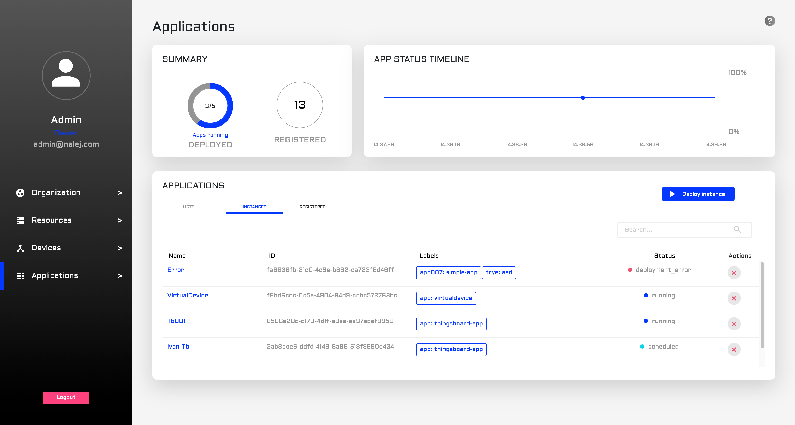

# Application deployment, management and removal

This section will have all the documents related to app deployment, management and removal. You will also find what you need about application descriptors: what they are, how to create one, and how to use one in the system.

Now that we know how the clusters work, it's time to start deploying applications in the system. Let's see how to do this.

_The CLI responses are shown in text format, which can be obtained adding_ `--output="text"` _to the user options. If you need the responses in JSON format, you can get them by adding_ `--output="json"` _at the end of your requests, or as a user option._

## Application management through web interface

If we click on the "Application" option at the left column of the screen, a screen similar to this one will appear:



This screen has the following areas:

* A **summary**, where the number of deployed instances and registered applications are shown.
* An **app status timeline**, where the down time of the different instances is displayed.
* An **app list**, where we can see all the info regarding the registered apps and the deployed instances in the system.

We will talk about this deployed app list later in the document, and explain its use thoroughly.

## Application deployment

The process of deploying an application is as follows:


So, first you need to create an application descriptor. The documentation for doing so is [over here](app_descriptors.md), but by now let's just say that it should be a JSON file with more or less this aspect:

```javascript
{
  "name": "Sample application",
  "labels": {
    "app": "simple-app"
  },
  "rules": [
    {
      "rule_id": "001",
      "name": "allow access to wordpress",
      "target_service_group_name": "g1",
      "target_service_name": "2",
      "target_port": 80,
      "access": 2
    }
  ],
  "groups": [
    {
      "name": "g1",
      "services": [
        {
          "name": "simple-mysql",
          "image": "mysql:5.6",
          "specs": {
            "replicas": 1
          },
          "configs": [
        {
          "config_file_id": "1",
          "content": "SG9sYQo=",
          "mount_path": "/config/saludo.conf"
        },
        {
          "config_file_id": "2",
          "content": "QWRpb3MK",
          "mount_path": "/config/despedida.conf"
        }
      ],
          "storage": [
            {
              "size": 104857600,
              "mount_path": "/tmp"
            }
          ],
          "exposed_ports": [
            {
              "name": "mysqlport",
              "internal_port": 3306,
              "exposed_port": 3306
            }
          ],
          "environment_variables": {
            "MYSQL_ROOT_PASSWORD": "root"
          },
          "labels": {
            "app": "simple-mysql",
            "component": "simple-app"
          }
        },
        {
          "name": "simple-wordpress",
          "image": "wordpress:5.0.0",
          "specs": {
            "replicas": 1
          },
          "storage": [
            {
              "size": 104857600,
              "mount_path": "/tmp"
            }
          ],
          "exposed_ports": [
            {
              "name": "wordpressport",
              "internal_port": 80,
              "exposed_port": 80,
              "endpoints": [
                {
                  "type": 2,
                  "path": "/"
                }
              ]
            }
          ],
          "environment_variables": {
            "WORDPRESS_DB_HOST": <db_host>,
            "WORDPRESS_DB_PASSWORD": <db_password>
          },
          "labels": {
            "app": "simple-wordpress",
            "component": "simple-app"
          },
          "deploy_after": [
            "1"
          ]
        }
      ],
      "specs": {
        "num_replicas": 1
      }
    }
  ]
}
```

This is the descriptor of a WordPress server with an associated MySQL database. Yours should look similar, depending on the services you want to deploy.

### Adding the application to the system

#### Public API CLI

Let's suppose you have the application descriptor already covered, and you want to deploy your application now. As stated before, the next step of the process is adding the application to the system. That will be done with the command:

```bash
./public-api-cli app desc add /pathtodescriptor
```

It returns a table like this:

```bash
DESCRIPTOR                  ID          LABELS
SARA - simple application   <desc_id>   <label:value>

NAME                  IMAGE            LABELS
[Group] application   ===
simple-mysql            <serv1_img>      <l1:v1>,<l2:v2>
simple-wordpress      <serv2_img>      <l3:v3>,<l4:v4>
```

with an application **descriptor ID** inside, which we will need for deploying an instance of this application.

#### Web Interface

So, the descriptor is ready and you are already in the Application view of the web interface. Where to go from here? Great question!


In the Application view, we can see the already deployed applications in the lower part of the screen, in the Applications list. There, we need to click on the **Registered** tab, and then we can see the **Register application** button. Please click on it.


What we can see now is a special dialog where we can upload our application descriptor, so the application gets registered in the system. We can click on it to search the file in our file system, or we can just drag it and drop it in the designed area. After that, just clicking on the **Register** button will register the application in the system.

### Deploying the application

#### Public API CLI

Now the application is ready to be deployed! We can do this with:

```bash
./public-api-cli app inst deploy 
	<descriptor_id>
	<name-app>
```

Here, as you may have noticed, is also the moment where we name the app with a human-readable name. When this command exits, it returns a JSON with an application **instance ID**, which is what we will use to work with the deployed instance.

#### Web Interface

Now that the application is registered \(and thus appears in the list at the **Registered** tab\), we can deploy an instance of it! There are two ways to access the deploying dialog, so let's see both.


One of the ways to do that is by clicking the blue _play_ button in the **Actions** column of the **Registered** tab.


The other way is to go from the **Registered** tab to the **Instances** tab. To deploy our application we only need to click on the **Deploy instance** button on the right part of the screen.

With both actions we arrive to the same dialog, which looks like this:


Here we need to write the name of the instance and choose the application we want an instance of \(if we clicked on the "deploy" button in the **Registered** list, the instance is already established, and we only have to write the name of the instance\). Then, the instance will appear in the list under the **Instances** tab.

## Application management

### Public API CLI

We can interact with the application in several ways, now that it's deployed. One of the actions we can take is getting its related info, which can be done with:

```bash
./public-api-cli app inst get 
	<instance_id>
```

This will return a table with some information related to the instance we are checking:

```bash
NAME                  REPLICAS           STATUS            
[Group] application   <num_replicas>    SERVICE_RUNNING   
<service_1>           <num_replicas>    SERVICE_RUNNING
<service_2>              <num_replicas>    SERVICE_RUNNING   

ENDPOINTS
"xxxx.xxxxx.appcluster.<yourcluster>.com"

simple-"xxxx.xxxxx.appcluster.<yourcluster>.com"
```

For example, a status like:

```javascript
STATUS
SERVICE_RUNNING
```

in the `[Group] application` row \(which is the info related to the whole instance\) will tell us that the application is running correctly, and

```javascript
ENDPOINTS
"xxxx.xxxxx.appcluster.<yourcluster>.com"
```

will tell us where the instance is deployed, so we can navigate to it and start working.

### Web Interface

We can see the status of an instance directly in the **Instances** tab, in the colored button in the **Status** column of the list. We can also click on the instance to see all the information related to that specific instance. This takes us to a new view:


This view has several sections:

* First, we have the **summary** \(upper-left part of the screen\). This part will tell us the status of the instance, its application of origin, its ID, the service groups it has, and the service instances it has deployed. We have an **Undeploy application** button to undeploy the instance directly from here \(we will talk about this later in this document\).
* Then we have the **services** section. First we can see a diagram that shows us the relationship between the services in the instance, where we can zoom in in case it's necessary \(the color of each service depends on its status\). On the upper left part of this section we have the two perspectives we can toggle between. The other perspective is a text view with all the info about the service instances related to this application instance \(there is a tab with all the services, and then there is a tab for each service group\).
  * For each service we can see the number of **replicas** that are deployed, the general **status** of the service, the **endpoints** it has, and more info.
  * When we click on the **Info** button we open a dialog where we can see even more information, like the environment variables, the labels assigned to the service or the cluster it's deployed in. 


* Under the summary we have the **Tags** section, where we can see the tags associated to this app instance.
* Beside it, there's the **Rules** section, where the rules for the different service groups in the application are displayed. We can click on any of them and the full disclosure of the rule will appear.


* And finally, in the lower right corner of the screen, we can see the **Configuration** section, where we can find the environment variables and other settings.

## Getting logs from the instance

Once the application is running, it's generating logs and storing them in the system. To access these logs, we can use:

```bash
./public-api-cli log search 
	--instanceID=xxxx > appLogs.json
```

This will return a \(most likely\) very long response, with the following format:

```javascript
TIMESTAMP           MSG
<msg_timestamp>        <logged_info>
```

Where each **entry** has a **timestamp** and a **msg** with the logged info related to the instance, which is completely dependant on the application that generates the log. Typically, the logged info contains the **log\_level**, which can be useful to differentiate an informative log from an error one. Please check the log message format of the application you're consulting before diving in this file.

## Application removal

### Undeploying the instance

#### Public API CLI

OK, so we finished working with this instance, and don't want it to be in the system anymore. In this case, we need to undeploy it. For this, we will need its instance ID.

```bash
./public-api-cli app inst undeploy 
	<instance_id>
```

That may be all the cleanup needed if this application is something we will use again in the system, since we can deploy it again tomorrow with the same application descriptor.

This, if executed successfully, will return an acknowledgment:

```javascript
RESULT
OK
```

#### Web Interface

To undeploy an instance we just have to hit the red X in the **Actions** column in the far right of the Application instances list. This will delete the instance from this list, which will mean that it's no longer in the system.


### Deleting the app

This last step is optional, only needed if we want to delete a specific app from the system, and doesn't need to be done every time we undeploy an instance.

Also, the system won't let you delete an application while it has deployed instances of it in the system, so first we need to undeploy all the instances first and then delete the application from the system.

#### Public API CLI

What if we just don't want the application to be available again? In that case, we need to delete the application from the system, undoing the `add` we executed before. This needs the descriptor ID we got as a response when we added the application to the system.

```bash
./public-api-cli app desc delete  	
	<descriptor_ID>
```

This, if executed successfully, will return an acknowledgment:

```javascript
RESULT
OK
```

#### Web Interface

To delete the application from the system, thus avoiding the generation of instances from it in the future, we just need to go to the **Registered** tab in the Application list, and look for the application. Then, we need to click the red bin under the **Actions** column.


