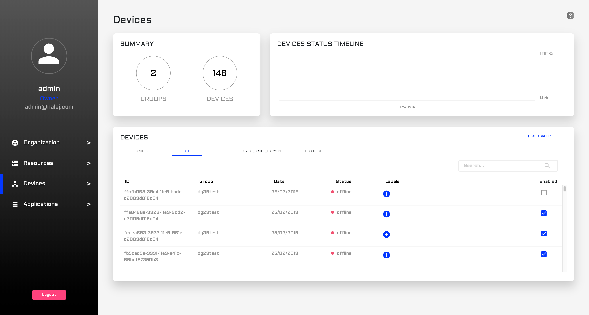
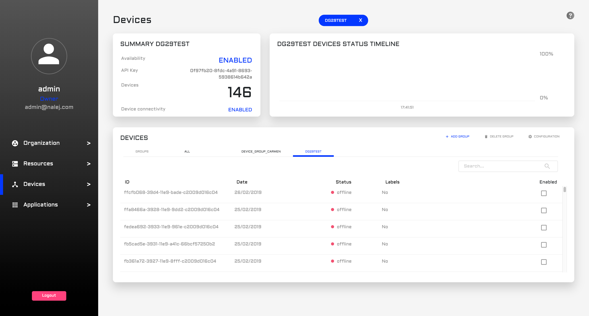
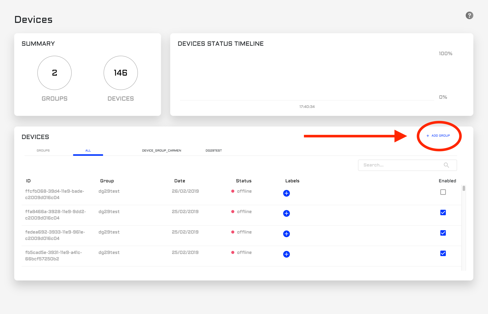
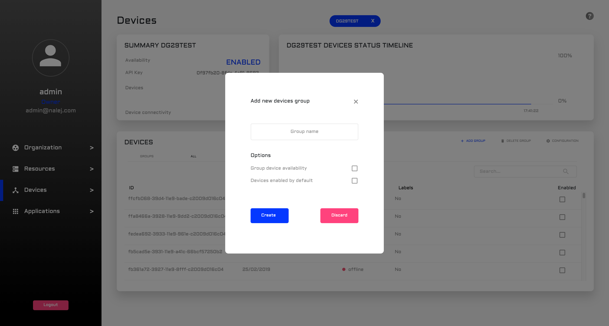
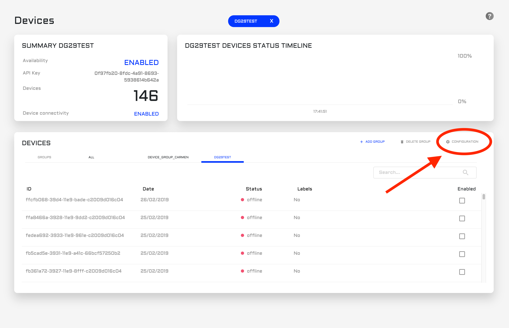
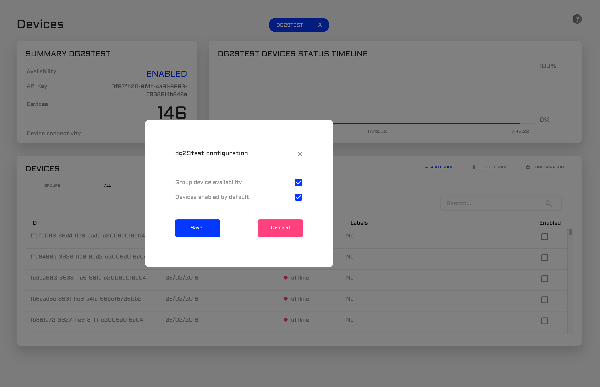
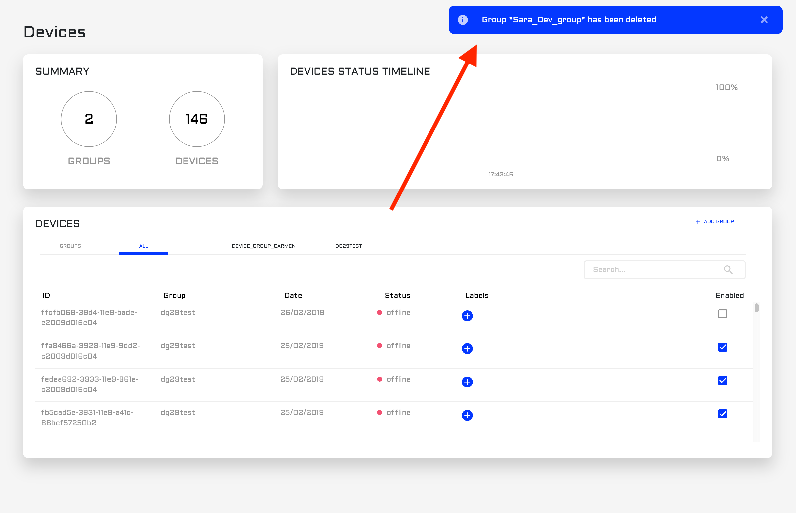

# Devices in Nalej

This section will talk about devices in Nalej.

> TODO write intro. What is a device? What does it do? Why do we need it?

## Getting device information

### Web Interface

As with the rest of the sections, we can find the Device view in the left-hand column.



The upper part of the screen displays the following:

- a **summary**, where we can see the total number of devices in the system, and the number of groups that contain them.
- a **status timeline**, where we can see the percentage of online devices in a given time.

The lower part of the screen is a list of devices divided by groups. The default group is `ALL`, and it shows all the devices in the system. But the rest of the groups appear there, easily clickable, and so when we click on one of them...



The view slightly changes. Now, the summary displays the information of only this group, like:

- its **availability**, with values like `ENABLED`or `DISABLED`.
- its **API_Key**.
- the **number of devices** in it.
- the **device connectivity**.

The status timeline is still there, but now it only refers to the devices in this group.

The list of devices also displays the devices in this group, with the following information for each one:

- its **ID**.
- the **date** it was added to the system.
- its current **status**.
- any associated **labels** it may have.
- an **`ENABLED`** flag, which allows us to quickly disable a given device.

We can also search by any `string` included in any part of the device information (for example, we can search `online` to see which devices are online at any given moment, or a specific date of inclusion in the system).

### Public API CLI

The commands we can use to manage device groups and devices are `devicegroup` and `device`, respectively.

So, to chech the device groups in the system, the command is:

```bash
./public-api-cli devicegroup list
```

And it returns a JSON document with the following structure:

```json
{
  "groups": [
    {
      "organization_id": <org_id>,
      "device_group_id": <devgroup_id>,
      "name": <devgroup_name>,
      "created": 1551775603,
      "enabled": true,
      "default_device_connectivity": true,
      "device_group_api_key": <devgroup_API_key>
    },
    ...
  ]
}

```

Where we can see:

- the **organization_id**.
- the **device_group_id**.
- the human readable **name** we give the device group.
- a timestamp registering when it was **created**.
- whether it is **enabled** or not.
- a **default_device_connectivity** flag, which indicates whether the devices are connected by default or not.
- the **device_group_api_key**.


Once we have obtained the list of device groups with their IDs, we can list the devices contained in each of them. To do so, we would use the command:

```bash
./public-api-cli devices list --deviceGroupId=<devgroup_id>
```

The response to this command is a JSON document similar to this one:

```json
{
  "devices": [
    {
      "organization_id": <org_id>,
      "device_group_id": <devgroup_id>,
      "device_id": "device1",
      "register_since": 1552295026,
      "enabled": true,
      "device_status_name": "OFFLINE"
    },
    ...
  ]
}
```

Where we can see the timestamp where the device was registered (in **register_since**), whether or not it is **enabled**, and the **device_status_name**, which can be `ONLINE` or `OFFLINE`. 


## Adding a device group

### Web Interface

We can add a new device group easily, clicking on the option **"Add group"** in the main view (or in a group view).




This opens a dialog like the one below:



To create a device group, we need:

- A **group name**.
- The **group device availability**.
- If the **devices** are **enabled by default**.

### Public API CLI

To add a device group through the CLI, the command needed is:

```bash
./public-api-cli devicegroup add
	--name <devgroup_name>
	--disabled
	--enabled
	--disabledDefaultConnectivity
	--enabledDefaultConnectivity
```

We don't need all these parameters, but we need:

- the **name** of the group.
- a flag indicating if the group is **enabled** or **disabled**.
- a flag indicating the default connectivity for the devices joining the group, whether it is enabled (**enabledDefaultConnectivity**) or disabled (**disabledDefaultConnectivity**).

The response to this command is something like this:

```json
{
  "organization_id": <org_id>,
  "device_group_id": <devgroup_id>,
  "name": <devgroup_name>,
  "created": 1552389164,
  "device_group_api_key": <devgroup_API_key>
}
```

This includes all the information related to the device group, which is, its **id**, its **name**, when it was **created**, and its **API key**.

## Configuration of a device group

### Web Interface

In the device group view, we can easily access its configuration by clicking on the link highlighted below.




The only options that can be changed in a group are:

- The **group device availability**.
- If the **devices** are **enabled by default**.



### Public API CLI

To update the configuration of a device group, the command to use is:

```bash
./public-api-cli devicegroup update
	--deviceGroupId <devgroup_id>
	--disable
	--enable
	--disableDefaultConnectivity
	--enableDefaultConnectivity
```

This information is very similar to what we need to create the group.

- **deviceGroupId** (when we create a group we need a **name** instead).
- a flag indicating if we want to **enable** or **disable** the group.
- a flag indicating how to change the default connectivity for the devices joining the group, whether we want to enable it (**enableDefaultConnectivity**) or disable it (**disableDefaultConnectivity**).

The result of executing this command is the same as with the `devicegroup add` command, which is:

```json
{
  "organization_id": <org_id>,
  "device_group_id": <devgroup_id>,
  "name": <devgroup_name>,
  "created": 1552389164,
  "device_group_api_key": <devgroup_API_key>
}
```


## Deleting a device group

### Web Interface

Now, we want to delete an entire device group. From that group view, we can click on "Delete group"...


And the system will confirm the deletion with a notification in the upper right part of the screen.




### Public API CLI

> TODO find appropriate commands

