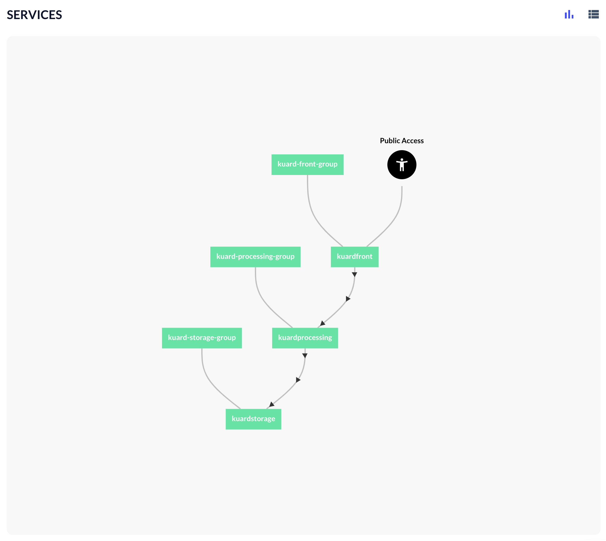

# The Application Graph, explained

The Application Graph, in the Application Instance screen, can be daunting. Fear not, dear user, for we are here to shed some light on your doubts about it and make you an expert. Let's begin.

## Service instances

Let's begin with the service instances. Each instance has a different color depending on its status:

* Teal means it's _RUNNING_.
* Yellow means it's _IN TRANSITION_ \(which can mean it's queued, or scheduled, or deploying...\).
* Red means it has an _ERROR_.

In some cases you can find service instances that can be repeated. Remember the replicas we can specify in the [application descriptor](app_descriptors.md)? This is how those replicas are represented visually.

As we know, we can ask for replicas of a single service or of an entire service group. Both are represented separately, since each replica is a service instance, and each instance can be running or have errors independently. Each instance, also, depending on the service group it belongs to, can have different rules and permissions. But let's get to that later.

You can \(in fact, we encourage you to\) use the rest of the information in the screen to decipher what we are seeing. Over the graph, on the upper right corner of its section in the screen, there are two icons, so we can toggle between the graph view and the text view. The text view describes every service that can be seen in the graph with extra information \(like how many replicas it has, its endpoints, its status, and more info like tags, credentials or the ID of the cluster it is deployed in\).

## Connections

The arrows pointing from one service to another represent the connections between the services, and the relationships created because of that.

In the image above, the "deepdetectserver" service is the target of the connection of "deepdetecttui". Those are grouped in the "core" services group.

