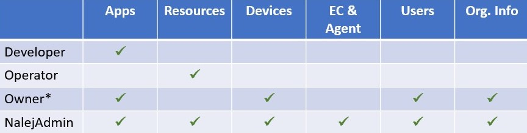

# Organization and user management

The Organization area contains all the information related to the organization and the management of its members. In this area you will be able to create, manage and delete users, as well as assign them different roles in the platform and create new roles if necessary.

!!! note
    The CLI responses are shown in text format, which can be obtained adding `--output="text"` to the user options. If you need the responses in JSON format, you can get them by adding `--output="json"` at the end of your requests, or as a user option.

## Getting the organization information

We can see the organization info through the Public API CLI with the command:

```bash
./public-api-cli org info
```

which returns the following:

```bash
ID         NAME         EMAIL
<org_id>   <org_name>   info@myorganization.com

ADDRESS                 CITY          STATE        COUNTRY   ZIP CODE
1234 Mulholland Drive   Los Angeles   California   USA       90077

NUM.USERS   NUM.ROLES   NUM.SETTINGS
3           4           1
```

Here we can find the same information displayed in the web interface, plus the ID: the name, email, complete address, the number of users in the organization, the number of roles available, and the default settings established for the applications in this company.

## System roles

There are four default roles in the system:

* **Developer**: can add, deploy, manage and remove apps from the system, as well as use the Unified Logging feature. 
* **Operator**: can manage assets and devices using the Inventory feature, and can also list and update the available clusters.
* **Owner**: can manage apps, devices and resources, as well as update the organization information.
* **NalejAdmin**: has almighty powers in the system. This role is reserved for the Nalej field engineer associated to your organization. They can do whatever the owner can, and also add or delete users, deal with cluster provision tasks, and manage ECs and Agents.

Below you can see a chart with the managing permissions of each of the user roles in the system.



*This role is not available through the Web Interface.

Now that you know about the roles, let's see how the users are created in the system.

## Creating users

You need to be a **NalejAdmin** to be able to create or delete a user in the system. An **Owner** can update users and change passwords, but not create or delete users. 

Once you log in the system, the command you need is `users`. These are the actions you can take with it:

* **Add**: creates a new user.
* **Info**: gets user info.
* **List**: lists users.
* **Reset-password**: resets user's password.
* **Update**: updates user info.
* **Del**: deletes a user. 

To create a new user, the command you need would look like this:

```bash
./public-api-cli users add <newuser_email> <newuser_name> <newuser_password> <newuser_lastname> <newuser_role_name> <newuser_title> --location <newuser_location> --phone <newuser_phone> --photoPath <newuser_photopath>
```

The response to this command would look like this:

```bash
EMAIL            TITLE        NAME   LAST NAME   ROLE       LAST LOGIN   MEMBER SINCE
user@myorg.com   BetaTester   User   Smith       Operator   never        2020-03-03 12:47:31.563322369 +0100 CET
```

where the **email** is the parameter we will use to locate the user in future interactions. For example, if we want to obtain the info related to a specific user, we would need to know their email, like so:

```bash
./public-api-cli users info 
    --email=<email-name>@<email-domain>
```

The response to this command would be the same we received when creating the user, with their current information. If we don't add the `--email` parameter, the info returned would be our own.

## Editing users

There are several operations you can do with the members who belong to your organization, if you're the Owner.

As you don't have an accessible list of users in plain view, the first thing you may want to do is to get one, so you know which users are actually in your organization. To do so, we will use the `users` command again:

```bash
./public-api-cli users list
```

The response to this is a JSON with a list of the users in your organization, and their info:

```shell
EMAIL                  TITLE       NAME         LAST NAME   ROLE         LOCATION           LAST LOGIN                                MEMBER SINCE
admin@myorg.com        Boss        Admin        García      Owner        Madrid, Spain      2020-03-03 12:30:47.598121981 +0100 CET   2020-02-28 10:41:37.994411567 +0100 CET
nalejadmin@myorg.com   Superboss   NalejAdmin   de Lope     NalejAdmin   Madrid, Spain      2020-03-04 07:12:35.087768309 +0100 CET   2020-02-28 10:41:37.828527405 +0100 CET
sara@myorg.com         Tester      Sara         Tester      Operator     Madrid, Spain                                             2020-03-03 12:47:31.563322369 +0100 CET
```

To edit a specific user's information, we need their email. With that we can:

Update their information:

```bash
./public-api-cli users update <email-name>@<email-domain> --lastName lastName --location NewCity, NewCountry --name newName --phone +00 123 456 789 --photoPath /path/to/new/photo --title newTitleInTheCompany
```

Reset their password \(we also need the current password for this\):

```bash
./public-api-cli users reset-password <email-name>@<email-domain> <newpassword>
```

For this to work, the new password must not be empty.

When these operations are successful, the return is an acknowledgment that the operation is done, like:

```bash
RESULT
OK
```

## Deleting users

To delete a user, execute the following command:

```bash
./public-api-cli users delete 
    --email=<email-name>@<email-domain>
```

When this operation exits successfully, the return is:

```text
RESULT
OK
```

