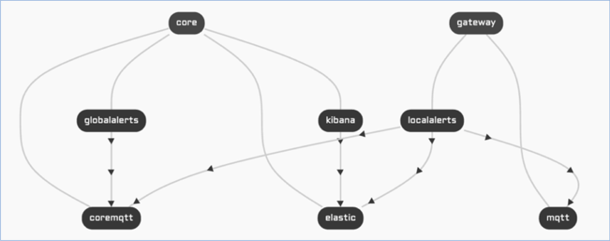

# Descriptor Creation Course

## Session 4: Knowledge review

The application we're going to be working with in this session is the Drone Scenario. Please download the required files and work on them to complete the exercises below.

------

In this session we will use the skills that we learned before and complete a drone deployment scenario, where we will be able to monitor some virtual drones, communicate with them, and display the relevant information they send us in a web interface.

In this scenario there will be two main service groups: the **core** group, which will be in the cloud, and the **gateway** group, which will be nearer the drones (it can be deployed in a machine inside a truck, for example, so that truck can follow the drones' flight). We can deploy different gateways, so that drones can connect to the best one in terms of latency. This scenario allows bidirectional communication between the drones and the supporting services, and the information will be stored in ElasticSearch and displayed via Kibana.



### Data Flow 

#### Drones to GlobalAlerts

1. A **drone** sends an MQTT message with all the telemetry data to an MQTT broker of the gateways group.
2. A **localalerts** **service** that is subscribed to that broker receives the message.
3. The **localalerts** **service** resends the telemetry data to ElasticSearch, so it can be displayed an accessible in Kibana.
4. At the same time, the **localalerts** **service** creates an MQTT message with only the acceleration information and sends it to the MQTT broker of the core group (coreMQTT).
5. The **globalalerts** **service**, which is subscribed to the coreMQTT broker, receives the information of the drone acceleration.
6. Now the **globalalerts** **service** can analyze the acceleration information.

#### GlobalAlerts to Drones

7. The **globalalerts** **service** analyzes the acceleration data, creates a self destruction action, and sends that action in an MQTT message to the coreMQTT broker.
8. The **localalerts** **service**, being subscribed to the coreMQTT broker, receives the action.
9. The **localalerts service** publishes the action in the gateway MQTT broker.
10. The **drone**, which is subscribed to the mqtt broker, receives the action and executes it.


### Components of the descriptor

#### App information

This component is very straightforward, with the name of the application, the description, and the labels that allow us to identify the app in the system.

#### Rules

For this scenario to work we need three types of rules.

- Rules to give public access to a service (so we can access the information published in Kibana through a browser).

```json
    {
      "name": "Allow public access to kibana",
      "target_service_group_name": "core",
      "target_service_name": "kibana",
      "target_port": 5601,
      "access": 2
    },
```


- Rules that allow communication between two services (for example, the globalalerts service sending information to coreMQTT).

```json
    {
      "name": "Allow global alerts to access core mqtt",
      "target_service_group_name": "core",
      "target_service_name": "coremqtt",
      "target_port": 1883,
      "access": 1,
      "auth_service_group_name": "core",
      "auth_services": [
        "globalalerts"
      ]
    },
```


- Rules that allow devices to send data to services (so the drones can communicate with the gateway MQTT broker).

```json
    {
      "name": "allow access to mqtt from device groups",
      "target_service_group_name": "gateway",
      "target_service_name": "mqtt",
      "target_port": 1883,
      "access": 3,
      "device_group_names": [
        "drone"
      ]
    },
```


### Service Groups

There are two main service groups:

- **Core**, which contains the services needed for data displaying (Kibana and ElasticSearch, in a separate json) and the ones needed for drone management.
- **Gateway**, which contains more services needed for drone management.

In this case, the Gateway service group has an extra attribute, which is the `multi_cluster_replica` flag set to `true`, stating that the service group is to be deployed in all clusters available. As we said before, the services in this group need to be deployed in several clusters, so the drones can communicate with the one with the best latency.

```json
      "specs": {
        "multi_cluster_replica": true
      }
```


### Services

The services related to drone management in each service group are:

- Core: Globalalerts and coreMQTT.
- Gateway: Localalerts and MQTT.

To define these services the auto created environment variables need to be considered, as well as the following attributes: name, description, image, run_arguments, credentials, specs (replicas), exposed_ports, environment_variables, deploy_after, config, storage.

An example for this would be the localalerts service:

```json
{
    "name": "localalerts",
    "image": "nalejdemo/local-alerts:v0.0.2",
    "run_arguments": [
        "run",
        "--debug",
        "--DroneMQTTAddress",
        "$(NALEJ_SERV_MQTT):1883",
        "--DroneMQTTUsername",
        "localalerts",
        "--DroneMQTTPassword",
        "$(NALEJ_SERV_LOCALALERTS)",
        "--GlobalMQTTAddress",
        "$(NALEJ_SERV_COREMQTT):1883",
        "--GlobalMQTTUsername",
        "globalalerts",
        "--GlobalMQTTPassword",
        "$(NALEJ_SERV_GLOBALALERTS)",
        "--ESAddress",
        "$(NALEJ_OUTBOUND_PLELASTIC):9200",
        "--clientID",
        "$(CLUSTER_ID)-localalerts"
    ],
    "specs": {
   		 "replicas": 1
    },
    "deploy_after": [
    		"mqtt"
    ],
    "exposed_ports": [
      {
        "name": "default",
        "internal_port": 40123,
        "exposed_port": 40123
      }
    ]
},
```


## Exercises

Download the following files: [drone-backend.json](desc101-drone-backend.json){target=_blank}, [drone-backend-data.json](desc101-drone-backend-data.json){target=_blank}, [drone.json](desc101-drone.json){target=_blank} and [kibana-dashboard.json](desc101-kibana-dashboard.json){target=_blank}. We will be working with the first file, and you will need all of them to deploy the scenario in the platform.

### Rules

Create the rules needed for this application based on the graph and the description of the data flow.

### Services

Complete the definition of the rest of the drone management services needed for this scenario.

### Deployment

Follow the [DroneDemo](desc101-dronedemo.pdf) tutorial with the descriptor you have completed and the rest of the files you downloaded before.