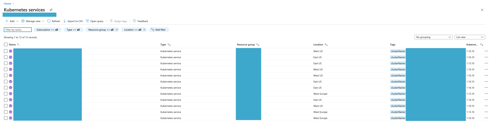
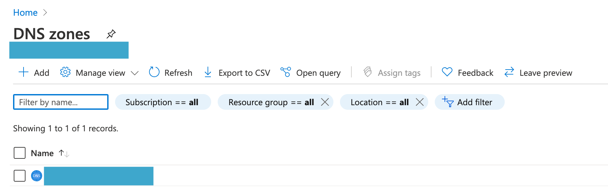
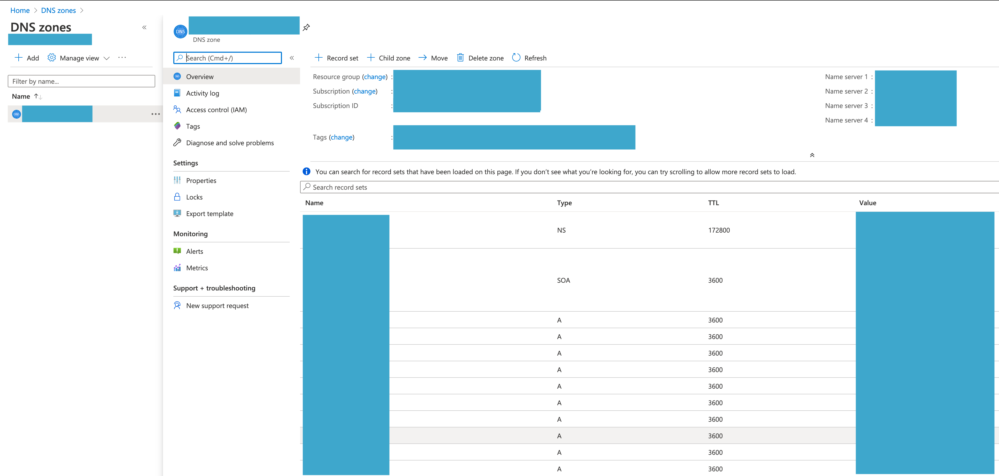

# Uninstalling Nalej

Sometimes things don't go as expected and we need to uninstall the platform, for whatever reason. Let's see the possible scenarios for this.

## After a successful installation

We installed the platform in several clusters and everything went well. We have been working on our application clusters and management cluster for a while, and now we want to uninstall everything and free our resources.

To uninstall the platform from an application cluster (which will be referred as *decommission* a cluster), you need to execute:

```bash
public-api-cli cluster decommission 00630f9c-59fe-408a-829c-6dc67c2b98e7 
		--targetPlatform AZURE 
		--azureCredentialsPath azure/credentials.json 
		--azureResourceGroup dev
		--clusterType KUBERNETES
```

Where the parameter is the cluster ID of the cluster we want to decommission, and:

- `target_platform` indicates the cloud provider where the cluster is hosted.
- `azureCredentialsPath` is the path for the Azure credentials file.
- `azureResourceGroup` is the resource group the cluster belongs to in Azure.
- `clusterType` is the type of the cluster (the default value is `KUBERNETES`). 

After decommissioning all the application clusters, the management cluster is next. For this we need to use the `provisioner-cli`, executing:

```bash
provisioner-cli decommission
      --azureCredentialsPath azure/credentials.json
      --name mgmt_cluster
      --platform AZURE
      --resourceGroup dev
```

Where:

- `azureCredentialsPath`  is the path for the Azure credentials file.
- `name` is the name of the management cluster we want to decommission.
- `platform` indicates the target platform determining the provider (which can be AZURE or BAREMETAL).
- `resourceGroup` is the resource group of the cluster (only for Azure).

And that should do it. After these two commands end their execution, the platform will be uninstalled from your system.


## After a failed installation 

This is another story. You have tried to install the platform but something failed. As you want to try again, you have to delete what was previously registered in the failed installation in the cloud provider. 

The order in which these steps must be executed is mandatory. It's also important to acknowledge that every action in the cloud provider may take some time to execute, so in case any of these steps fails, please wait a minute or two and try again.

Before starting with this process, write down the names and IDs of all the clusters you want to take down. You will need that information along the way.

### In Azure

We will access to the **Kubernetes Services** section and the **DNS zone** section.

#### Step 1: take down the clusters

If you click on **Kubernetes Services**, you can see a list of the clusters currently installed.



Select the clusters that you want to get rid of, and click delete.

#### Step 2: delete the DNS records

After you've done that, go to the **DNS zone** section.



Here you select the zone where the clusters were, and the list of records associated to those clusters will appear.



Select the ones that you want to delete (you will know which ones because they have the names and IDs of the clusters associated to them in the tags), and delete them.

And that's it. The rest of the configuration should be cleaned up automatically, so after this process give the provider a few minutes before trying to install the platform again.