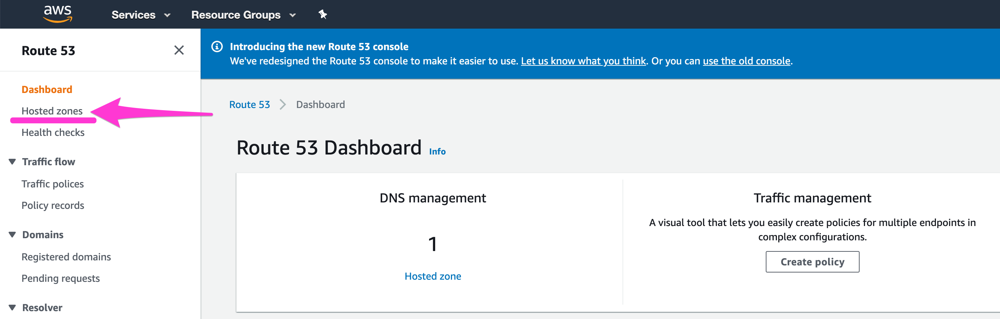

# Uninstalling Nalej

Sometimes things don't go as expected and we need to uninstall the platform, for whatever reason. Let's see the possible scenarios for this.

## After a successful installation

We installed the platform in several clusters and everything went well. We have been working on our application clusters and management cluster for a while, and now we want to uninstall everything and free our resources.

### In Azure

To uninstall the platform from an application cluster (which will be referred as *decommission* a cluster), you need to execute:

```bash
public-api-cli cluster decommission 00630f9c-59fe-408a-829c-6dc67c2b98e7 
		--targetPlatform AZURE 
		--azureCredentialsPath azure/credentials.json 
		--azureResourceGroup dev
		--clusterType KUBERNETES
```

Where the parameter is the cluster ID of the cluster we want to decommission, and:

- `target_platform` indicates the cloud provider where the cluster is hosted.
- `azureCredentialsPath` is the path for the Azure credentials file.
- `azureResourceGroup` is the resource group the cluster belongs to in Azure.
- `clusterType` is the type of the cluster (the default value is `KUBERNETES`). 

After decommissioning all the application clusters, the management cluster is next. For this we need to use the `provisioner-cli`, executing:

```bash
provisioner-cli decommission
      --azureCredentialsPath azure/credentials.json
      --name mgmt_cluster
      --platform AZURE
      --resourceGroup dev
```

Where:

- `azureCredentialsPath`  is the path for the Azure credentials file.
- `name` is the name of the management cluster we want to decommission.
- `platform` indicates the target platform determining the provider (which can be AZURE, AWS, AWS_GOV_CLOUD or BAREMETAL).
- `resourceGroup` is the resource group of the cluster (only for Azure).

And that should do it. After these two commands end their execution, the platform will be uninstalled from your system.

### In AWS

To uninstall the platform from an application cluster (which will be referred as *decommission* a cluster), you need to execute:

```bash
public-api-cli cluster decommission 00630f9c-59fe-408a-829c-6dc67c2b98e7 
      --targetPlatform AWS 
      --awsRegion eu-west-1 
      --awsDnsName aws.company.com
      --awsHostedZoneId X00000000X000XX00XXXX
```

Where the parameter is the cluster ID of the cluster we want to decommission, and:

- `target_platform` indicates the cloud provider where the cluster is hosted.
- `awsRegion` is the region/zone where the cluster is deployed (required for AWS or AWS_GOV_CLOUD).
- `awsDnsName` is the name of the DNS zone where the entries are stored.
- `awsHostedZoneId` is the Identifier associated with the DNS name. 

After decommissioning all the application clusters, the management cluster is next. For this we need to use the `provisioner-cli`, executing:

```bash
provisioner-cli decommission 
      --name management-cluster 
      --awsHostedZoneId X00000000X000XX00XXXX 
      --awsRegion eu-west-1 
      --platform AWS  
      --dnsZoneName aws.company.com
```

Where:

- `name` is the name of the management cluster we want to decommission. Bear in mind that this name may include a prefix (`mngt-`) that must not be included here. Please use the name given to the cluster in the provisioning phase.
- `awsHostedZoneId` is the Identifier associated with the DNS name.
- `awsRegion` is the region/zone where the cluster is deployed (required for AWS or AWS_GOV_CLOUD).
- `platform` indicates the target platform determining the provider (which can be AZURE, AWS, AWS_GOV_CLOUD or BAREMETAL).
- `dnsZoneName` is the name of the DNS zone where the entries are stored.

And that should do it. After these two commands end their execution, the platform will be uninstalled from your system.


## After a failed installation 

This is another story. You have tried to install the platform but something failed. As you want to try again, you have to delete what was previously registered in the failed installation in the cloud provider. 

The order in which these steps must be executed is mandatory. It's also important to acknowledge that every action in the cloud provider may take some time to execute, so in case any of these steps fails, please wait a minute or two and try again.

Before starting with this process, write down the names and IDs of all the clusters you want to take down. You will need that information along the way.

### In Azure

We will access to the **Kubernetes Services** section and the **DNS zone** section.

#### Step 1: take down the clusters

If you click on **Kubernetes Services**, you can see a list of the clusters currently installed.


Select the clusters that you want to get rid of, and click delete.

#### Step 2: delete the DNS records

After you've done that, go to the **DNS zone** section.


Here you select the zone where the clusters were, and the list of records associated to those clusters will appear.


Select the ones that you want to delete (you will know which ones because they have the names and IDs of the clusters associated to them in the tags), and delete them.

And that's it. The rest of the configuration should be cleaned up automatically, so after this process give the provider a few minutes before trying to install the platform again.


### In AWS

Once you log in, this is the main view. We will be working with the **Elastic Kubernetes Service**, the **Route 53** section in the **Services** view, and the **EC2** section.

#### Step 1: take down the clusters

In the **Elastic Kubernetes Services** view, go to the **Clusters** option.


Once there, you will see a list of the clusters. To take down the clusters, you will first need to delete the nodegroups in them. Choose a cluster, and click on it to see the detailed view.


Once in this view, choose the **Compute** tab. Here you will find a list of the node groups that belong to the cluster. Select them all and delete them.

After that, go back to the **Clusters** view, select the (now empty) cluster, and delete them.

Repeat this process with each cluster you want to take down.

#### Step 2: delete the DNS records

After that, it's the turn of the DNS records. Go to **Services**, and find the **Route 53** section.




Here you select the zone where the clusters were, and the list of records associated to those clusters will appear.


Select the ones that you want to delete (you will know which ones because they have the names and IDs of the clusters associated to them in the tags), and delete them.

#### Step 3: delete the Load Balancers

Now go to the **EC2** section. The next steps will be executed here. The views we will need are **Load Balancer**, **Elastic IPs** and **Security Groups**.

To delete the **Load Balancers**, we first go to the corresponding view.


The cluster names are in tags, so you can search by tag and find the Load Balancers that were assigned to the clusters you have already deleted. Select them and delete them. 

#### Step 4: get rid of the Elastic IPs

After that, it's time to clean up the Elastic IPs. Go to the main view:


Here you have a list of IPs, which are tagged with cluster names. As we've done before, look for the ones associated with the clusters you want to delete, and select and delete them.

Please take into account that when you delete a Load Balancer it may take a while for the system to execute the order. You might come across an error saying that there's a Load Balancer associated to the IP you want to delete, even though you have deleted the Load Balancer before. If this happens, just wait a few minutes and try again. 

#### Step 5: look for (and delete) Security Groups

As a last step, there may be Security Groups associated to the clusters you deleted, so you have to clean them up too. For that, go to the main view of the Security Groups and do the same thing we've been doing. Check if there are any Service Groups associated to the clusters you deleted, and if there are, select and delete them.


Finally, you have a clean system and can retry the installation. Good luck!