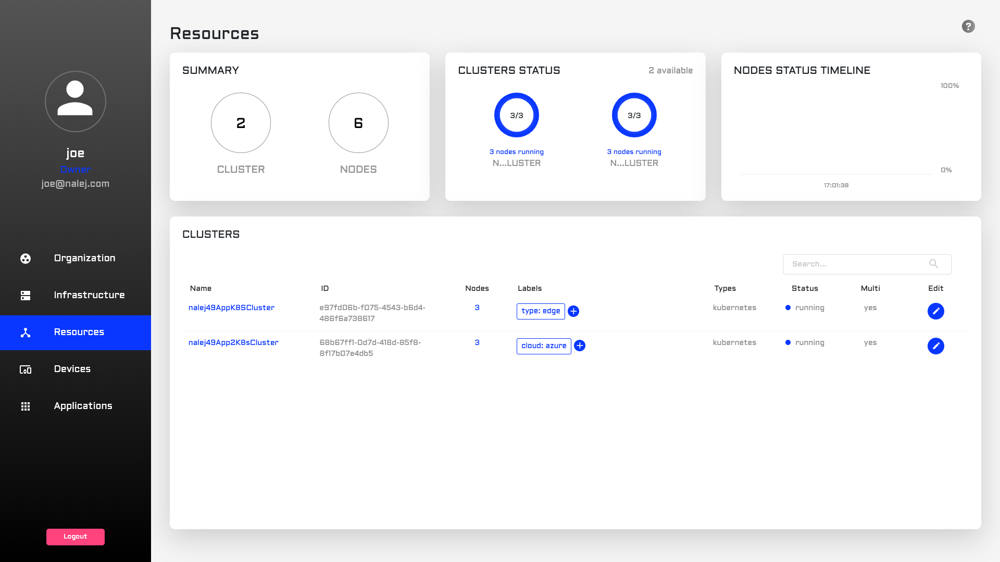

# Application cluster installation

## Previous structure in the system

This installation requires that there is already:

* a Kubernetes cluster available, where the structure for a Nalej application cluster will be installed.
* working connectivity between the Nalej management cluster and this brand new Kubernetes cluster.

The management cluster must know that an application cluster will be installed, and the user must log in the system with a role that allows them to execute the required actions.

Currently the platform supports adding Azure Kubernetes clusters as application clusters.

## Installation of an application cluster

For this process, we need some information from the Nalej management department, which is a configuration file for the Kubernetes cluster. This configuration file is commonly called **kubeconfig**, it's a YAML file, and it contains all the information the cluster needs to be configured as an application cluster.

Once we have this file, we can execute the installation command, which is:

```bash
./bin/public-api-cli cluster install 
    --targetPlatform=AZURE 
    --ingressHostname=<new_appcluster_url> 
    --kubeConfigPath=/path/to/kubeconfig_file.yaml 
    --useStaticIPAddresses 
    --ipAddressIngress=<static_ip_address>
    --output=json
```

Which uses these parameters:

* **targetPlatform** indicates the platform of the cluster, between `minikube` and  `azure` \(default `minikube`\). By now, it must be set to `azure`.
* **ingressHostname** states the new URL for the application cluster. This URL must be unique in the system.
* **kubeConfigPath** indicates the path to the configuration file mentioned above. Notice that the kubeconfig file must contain a single entry for the new cluster.

These are the mandatory parameters. There are two more optional ones:

* **useStaticIPAddresses**, which is a flag stating that static IP addresses will be used in the installation.
* **ipAddressIngress**, which establishes the static IP address for the URL indicated in the _ingressHostname_ parameter.

  This static IP address, if it exists, must be provided by the Nalej management department. If it's not given, the Kubernetes cluster will ask for an IP while executing this command, and then tell the management cluster about the obtained IP.

Lastly, we use **--output=json** to receive the response in JSON format.

The response to this command looks like this:

```javascript
{
  "install_id": <installation_id>,
  "organization_id": <org_id>,
  "cluster_id": <cluster_id>,
  "state": 1
}
```

## Is the cluster running?

We can check if the installation was successful and the cluster is up and running through the Web Interface and through the CLI.

### Web Interface

We just have to navigate to the Resources view.



clusters in the system, and our brand new cluster should appear on the list.

### Public API CLI

To check the availability through the CLI we just have to list the clusters in the system with the command:

```bash
./public-api-cli cluster list
```

This will print a response similar to this one:

```bash
NAME                   ID                  NODES   
<cluster_name_1>       <cluster_id_1>     <total_num_nodes>
<cluster_name_2>       <cluster_id_2>     <total_num_nodes>
<cluster_name_3>       <cluster_id_3>     <total_num_nodes>

LABELS                                        STATUS
<label11>:<value11>,<label12>:<value12>        RUNNING
<label13>:<value13>,<label14>:<value14>        RUNNING
<label15>:<value15>,<label15>:<value15>        RUNNING
```

which is already analyzed in [this page of the documentation](https://github.com/nalej/docs/tree/49a718688dcaf3fe23ef055ef37104c47c9c8328/resources/resources.md), and it should show the information of the newly installed cluster.

