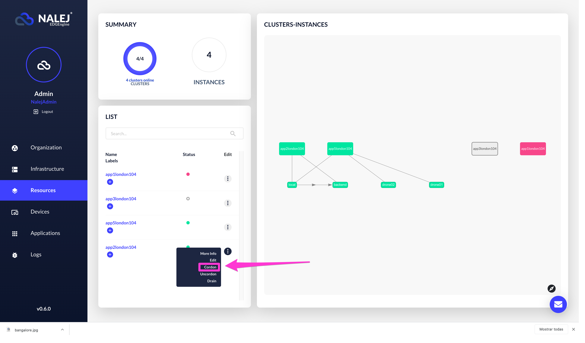
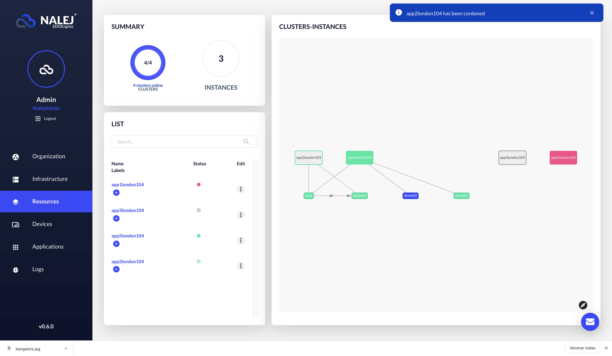

# Cluster management: how to isolate, empty and reserve clusters for certain apps

As far as we know, we can monitor clusters that belong to our organization, we can install them... but how do we manage them? Is there a way to decide which applications go to which clusters?

Well, of course there is, you know your wish is our feature. Just ask nicely.

## Commands

There are three CLI commands that will help you with the management, and you can get the most of them by combining them. They are:

### `cordon`

This command will isolate a specific cluster, and no new applications will be able to deploy in it while in this state. 

### `uncordon`

This command is to be used in a cordoned cluster, and as you may have guessed, it allows the applications to deploy in the cluster again.

### `drain`

This command moves the deployed services in the cluster to other clusters \(if it's possible\), leaving it empty.

For this to work it's **mandatory** that the **cluster is in the `cordon` state**. If it is not, the command will return with an error reminding you that you have to cordon the cluster first. This restriction helps us avoid situations like the draining of a cluster where there's a deployment in process, for example.

## Managing the cluster

### Web Interface

All these operations are done from the Resources view.

To **cordon** a cluster, choose the cluster from the cluster list, and chooose "Cordon" from the contextual menu.



After a confirmation dialog, you will see a message on the upper right part of the view acknowledging the operation. There are visual cues that indicate the user that the cluster is cordoned: in the graph, the cordoned cluster is colored in grey with a green border, instead of completely green; also, in the cluster list, the Status button of the cordoned cluster is grey with a green border, instead of green.



To **uncordon** a cordoned cluster, you should choose the "Uncordon" option from the contextual menu, as we did when cordoning it. This will trigger, again, a confirmation dialog, and after that a message will appear to announce that the operation has been executed.


The cluster goes back to being fully green, since it is uncordoned and online, instead of grey with a green border.

To **drain** a cordoned cluster, again you choose the option in the contextual menu, and again a confirmation dialog appears and a message saying the operation has been executed is shown.


The state of the cluster doesn't change (it is still cordoned), but the applications deployed in it are undeploying and deploying in another cluster. This process takes some time, and while it happens the state of the applications will vary in the graph.

After some time, the graph will look like this:


The cordoned cluster is empty, and the applications that once were deployed in it have been moved to another one.

### Public API CLI

To **cordon** a cluster, please execute:

```bash
./public-api-cli cluster cordon 
    [clusterID]
```

The only thing we need is the **cluster ID** of the cluster we want to isolate. The platform will return a `RESULT OK` if the instruction executed successfully, or if the cluster was already cordoned.

To **uncordon** a cluster, the command is used as follows:

```bash
./public-api-cli cluster uncordon 
    [clusterID]
```

As before, the **clusterID** is the only information we need to uncordon a cluster, and the platform will return a `RESULT OK` if the instruction executed successfully, or if the cluster wasn't cordoned in the first place.

And finally, to **drain** a cluster, you will need to execute:

```bash
./public-api-cli cluster drain 
    [clusterID]
```

Again, we need the **clusterID** to execute the command, and once we do, it will move the services to other clusters if possible. The users will be completely unaware of this process, since they won't stop executing.

## Deployment restrictions

Apart from technical reasons like a connection failure, there are several reasons why the services may not be able to deploy in other clusters after we drain the cluster they were in. For example:

* There are no more clusters available.
* The application has a **cluster selector** in its descriptor, and no other cluster matches with it.

What is a **cluster selector**, you ask? It is a parameter that can be included in the application descriptor, which contains a label that the cluster must have in order to be able to deploy a specific service. It looks like this:

```javascript
...
cluster_selector = “key1:value1”
...
```

If we try to deploy this application \(with these services\) and there are no clusters with that label, the deployment will end up in an error. The same will happen if, when we try to drain a cluster, there are no other clusters with that label.

## Examples of use cases

Let's imagine situations where these commands can be useful.

### Something goes wrong in the cluster

Everything is going smoothly, but suddenly something looks weird in a specific cluster. Maybe you monitor the cluster and there's an unexpected peak in the CPU usage, or the services in it are behaving in a strange way. What to do then?

First you should `cordon` the cluster, so it is isolated and no more services will be deployed there for now. After this, we could check the cluster as is, to see if we can detect what is happening.

If what we detect is not a service malfunction, but a malicious attack, the next step would be to `drain` the cluster, so the services are safe in another place, and then take the appropriate steps to protect that cluster.

Once the cluster is safe \(and/or the problems are fixed\), we could `uncordon` the cluster so it is available for other services to be deployed there.

### Reserving a cluster for some specific services

The first thing we must do is to assure that the cluster is labeled with the **deployment selectors** that we're going to register in the application descriptor. The paramenter **`deployment_selectors`** is a collection of labels and values in the definition of a service group that is checked against the available clusters. Only those clusters with all the labels and values indicated in it are considered to be candidates for the deployment of the services in the service group.

Once that is done, the next step is to `cordon` the cluster and `drain` it of the services that are already running there. We want it to be exclusive for our new services that we're about to deploy.

Then we `uncordon` the cluster and deploy the services as usual.

And the last thing we should do is `cordon` the cluster again, so our services keep on running there but no more new ones can be deployed.

