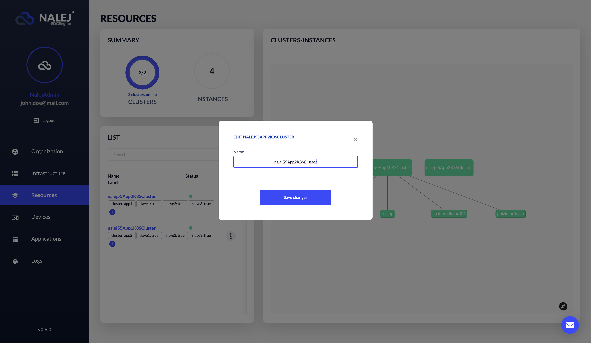
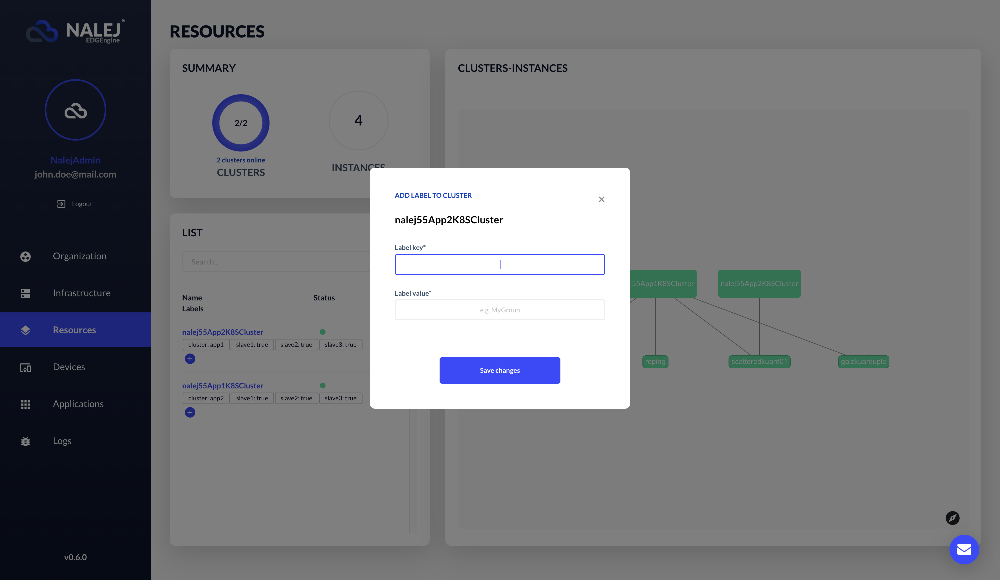
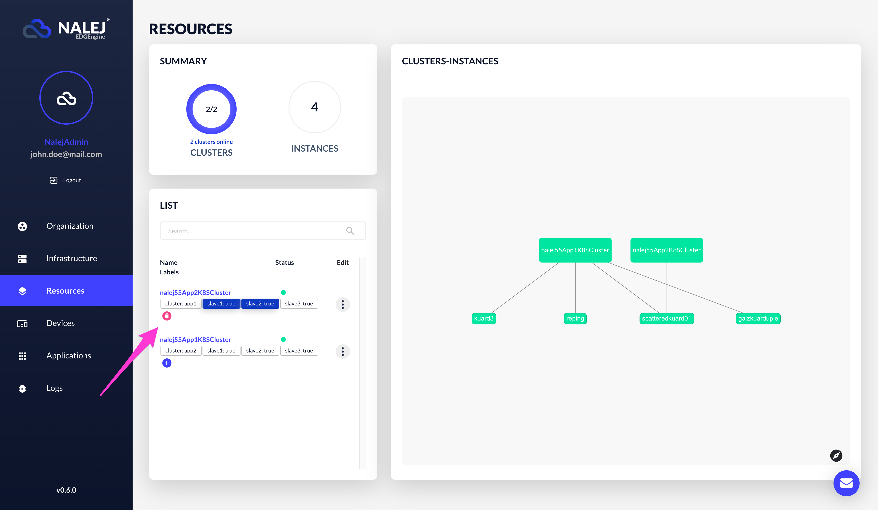

# Cluster monitoring

The application you're deploying will be deployed in a **cluster**. A cluster is a logical group of **nodes**, which are physical devices. When an application is deployed, the cluster will decide if there is a need to deploy it in one or several nodes, and will manage it accordingly.

### _Label-related warning_

_In this document there will be references to **labels** in clusters and nodes. A label is a string that describes the component and helps the system manage them more efficiently._

_These labels have internal meaning, and deleting labels from a node or a cluster may produce collateral damage. Also, Kubernetes uses labels for management, so adding new ones could be potentially dangerous too, since we could unknowingly add a label that Kubernetes interprets wrongly._

_So, the general rule for labels is: DO NOT touch them unless you really know what you're doing._

## Cluster monitoring

### Web Interface

On the web interface, you can display the Resources view by clicking on Resources on the far left column.


The right section displays a **clusters-instances graph**. On the left part of the screen we can see a **Summary card** that shows the number of clusters and instances, and a **List card** that shows a list of available clusters.


Each row of the list refers to a different cluster, with some information about it:

* **Name**.
* Its **status**. Clicking on the compass icon on the lower right corner of the screen will show the user the color code this information follows.
* A list of **labels** associated to each cluster, which we can manage (more on this below in the "[Managing labels](#managing-labels)" section). In the image, this cluster has no labels yet.

In the same list, on the far right, each cluster has an **Edit** button. When clicked, a menu appears, with the options **More Info**, **Edit**, **Cordon**, **Uncordon** and **Drain**.


In this document we will only see the first two options. The other three are related to cluster management, and they are explained in [this document](cluster_management.md). 

When the **Edit** option is clicked, a dialog appears where we can change the name of the cluster.



When we click on the **More info** option, or on the name of a cluster in the list, the view changes, and the information displayed refers to that specific cluster and its nodes.


In the upper part of the screen we can see the **status** of the cluster \(which is "ONLINE" only if all the nodes in it are running, and if not it shows the most serious problem in the clusters\), and a **summary** of the cluster information we saw in the previous list.

In the lower part of the screen we can see another list, this time of nodes. The information displayed is as follows:

* The **node ID**.
* The **IP** associated to it.
* The current **state** of the node.
* Its current **status**.
* The **labels** it has.

### Public API CLI

_The CLI responses are shown in text format, which can be obtained adding_ `--output="text"` _to the user options. If you need the responses in JSON format, you can get them by adding_ `--output="json"` _at the end of your requests, or as a user option._

We can also obtain information about our clusters and their nodes through the CLI. For example, a list of clusters can be obtained by executing:

```bash
./public-api-cli cluster list
```

This command will return, as usual, a table with some of the information the system has about the clusters in it:

```bash
NAME               ID                                     NODES   LABELS                    STATE       STATUS
<cluster_name_1>   xxxxxxxx-xxxx-xxxx-xxxx-xxxxxxxxxxxx   3       key1:value1,key2:value2   INSTALLED   ONLINE
<cluster_name_2>   xxxxxxxx-xxxx-xxxx-xxxx-xxxxxxxxxxxx   1       key3:value3,key4:value4   INSTALLED   ONLINE
<cluster_name_3>   xxxxxxxx-xxxx-xxxx-xxxx-xxxxxxxxxxxx   4       key5:value5,key6:value6   INSTALLED   ONLINE
```

This information consists of:

* **NAME**, the name given to the cluster.
* **ID**, the cluster identifier.
* **NODES**, the number of nodes in the cluster.
* **LABELS**, the labels of the cluster.
* **STATE**, the state of the cluster. It depends on where it is in the installation process.
* **STATUS**, the status of the cluster. It depends on the operations that are supported by it.

The different **states** a cluster can have are:

- *Provisioning*: The cluster doesn't have infrastructure associated to it yet. 
- *Installing*: The cluster has infrastructure attached to it, but the Nalej platform needs to be deployed. 
- *Installed*: The cluster has been installed and can be used to deploy user applications.
- *Scaling*: The cluster is being scaled by adding or removing nodes to adapt infrastructure to capacity requirements. No new applications will be deployed on the cluster while the scaling is being done.
- *Error*: A process executed from one of the Nalej components failed. From this state, the user can only remove the cluster and try again.
- *Uninstalling*: The user has requested to uninstall a cluster
- *Decommissioning*: The infrastructure associated to this cluster is being liberated.

However, the different **status** a cluster can have are **Online**, **OnlineCordon**, **Offline** and **OfflineCordon**. To read more about the cordoning and uncordoning of a cluster, please go to [Cluster management](cluster_management.md).

We can also choose a cluster and ask for its information with:

```bash
./public-api-cli cluster info
    [clusterID]
```

Once we know the cluster ID, we can list the nodes belonging to it.

```javascript
./public-api-cli nodes list 
    [clusterID]
```

This is the response to the command above:

```bash
ID                                     IP                         STATE      LABELS                        STATUS
xxxxxxxx-xxxx-xxxx-xxxx-xxxxxxxxxxxx   xxx-nalejpool-xxxxxxxx-1   ASSIGNED   label1:value1;label2:value2   INSTALLING
xxxxxxxx-xxxx-xxxx-xxxx-xxxxxxxxxxxx   xxx-nalejpool-xxxxxxxx-2   ASSIGNED   label3:value3;label4:value4   INSTALLING
xxxxxxxx-xxxx-xxxx-xxxx-xxxxxxxxxxxx   xxx-nalejpool-xxxxxxxx-0   ASSIGNED   label1:value1;label6:value6   INSTALLING
```

The new variables are:

* **ID**, the node identifier.
* **IP**, the IP address of the node.
* **STATE**, the current state of the node regarding its use. The values can be: *UNREGISTERED* (the details of the node are in the platform, but we haven't perfomed any action with them yet), *UNASSIGNED* (the node has been prepared, but has not yet been asigned to a cluster), or *ASSIGNED* (the node has been installed and is part of a cluster).
* **LABELS**: the labels of the node.
* **STATUS**, the status of this node, which can be _running_, _processing_, or _error_. If one or more nodes have values other than "_running_", the cluster will show the most serious problem in its _status\_name_ variable.

We can also monitor a specific cluster through the CLI with the command:

```bash
./public-api-cli cluster monitor 
    [clusterID]
    --rangeMinutes 10
```

This command offers us a quick summary of the cluster status in the last 10 minutes \(the `—rangeMinutes` flag is optional\), in this form:

```bash
CPU               MEM                             STORAGE
5617/6000 (93%)   15808368640/21851627520 (72%)   278702481408/322992291840 (86%)
```

Now we know the computing capacity and RAM that's being used, and the used storage in this cluster.

## Managing labels

Regarding the **labels** of the clusters and nodes, although adding and/or deleting them is not encouraged, we can do it easily, and the procedure for clusters and nodes is very similar.

### Web Interface

At the end of the label list there is a `+` button to **add** new labels.



After clicking on that button, we can see a form where we can enter the name and value of the label, and we can save or discard this new information.

If, however, in the list of labels we click on one or more labels \(thus selecting them\), this `+` button changes its function to **delete**, and its image to one of a bin, so we can delete the selected labels.



As stated above, please handle these features with care.

### Public API CLI

To add a label to a cluster, the appropriate command is:

```bash
./public-api-cli cluster label add 
    [clusterID] 
    --labels "k1:v1"
```

As you can see, the **clusterID** is included as a parameter \(you can find this ID executing the `cluster list` command\), and the labels to add are preceded by the flag `—label`, between `""` and with the format `key:value;key2:value2`.

When executed, this command responds like this:

```text
NAME           ID                                     STATE       STATUS   SEEN
carmen07app3   4252ab11-1d13-4014-8926-41b4a0aabcff   INSTALLED   ONLINE   2020-04-01 18:24:50 +0200 CEST
NODES          LABELS                                 MCF
3              key:value,key1:value1,key2:value2      1
```

Here we can see all the information of a cluster, which is its **name**, its **ID**, the number of **nodes** it has, the **labels** attached to it \(which will include the recently added\), the last time it has been consulted (under the **seen** column), its **state** and its **status**. The values in these last two parameters are the same as discussed before in this document.

To delete a label, the procedure is very similar, as well as the command to use:

```bash
./public-api-cli cluster label delete 
    [clusterID] 
    --labels "k1:v1"
```

The response to it will be the same as before, but the labels won't show the ones that have been deleted.

The process to add and remove labels from nodes is exactly the same, but changing the `[clusterID]` parameter for the corresponding `[nodeID]`. The results would be the information of the specific node with the `labels` field modified accordingly.

