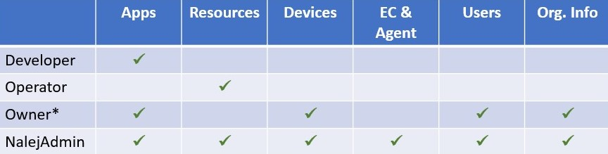

# Adding users in the system

As a system owner, you probably have to add new users to the system. First we need to explain the different roles that are available in the system, and then how to assign them to new users.

## System roles

There are four default roles in the system:

* **Developer**: can add, deploy, manage and remove apps from the system, as well as use the Unified Logging feature. 
* **Operator**: can manage assets and devices using the Inventory feature, and can also list and update the available clusters.
* **Owner**: can manage apps, devices and resources, as well as update the organization information.
* **NalejAdmin**: has almighty powers in the system. This role is reserved for the Nalej field engineer associated to your organization. They can do whatever the owner can, and also add or delete users, deal with cluster provision tasks, and manage ECs and Agents.

Below you can see a chart with the managing permissions of each of the user roles in the system.



*This role is not available through the Web Interface.

Now that you know about the roles, let's see how the users are created in the system.

## Creating users

### Web Interface

In the Organization view, under the "Member list" there is an **"Add user"** button. If we click on that, a form appears.


 You can save the information \(thus creating a user\) or discard it. You can also discard the information by clicking the cross in the upper right corner.

### Public API CLI

Once you log in the system, the command you need is `users`. To create a new user, the command you need would look like this:

```bash
./public-api-cli users add 
    --name=<newuser_name> 
    --password=<newuser_password> 
    --role=<newuser_role> 
    --email=<newuser_email-name>@<email-domain>
```

This command will return something like:

```javascript
NAME            ROLE               EMAIL
<user_name>   <user_role_name>   <user_email>
```

where the **role\_name** is one of the roles we saw in the first section of this document, and the **email** is the parameter we will use to locate the user in future interactions. For example, if we want to obtain the info related to a specific user, we would need to know their email, like so:

```bash
./public-api-cli users info 
    --email=<email-name>@<email-domain>
```

The response to this command would be the same response we received when creating the user, with their current information. If we don't add the `--email` parameter, the info returned would be our own.

For more information on how to manage and delete users, please go to [this document](../organization/organization-1.md), where those situations are explained in depth.

