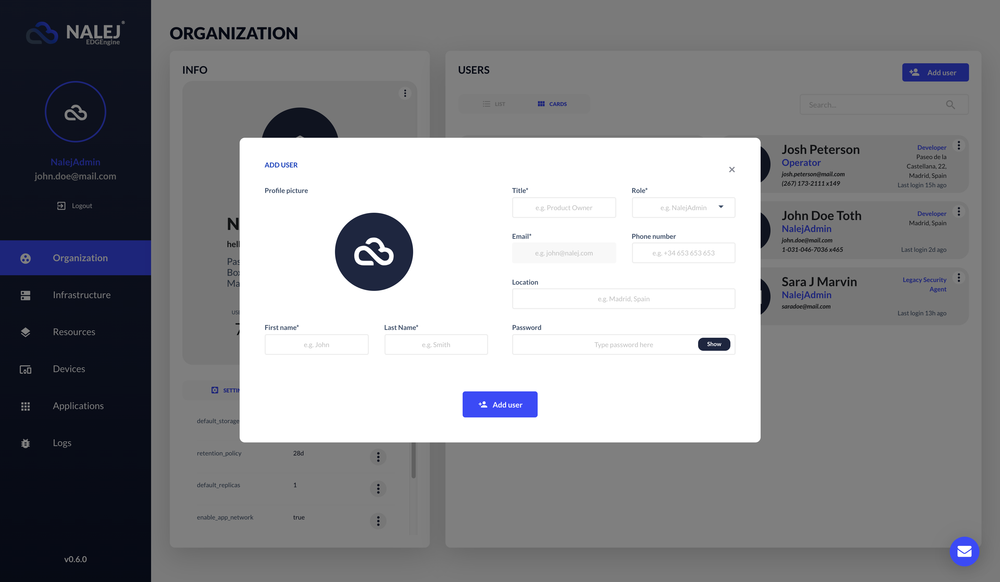

# Adding users in the system

As a system owner, you probably have to add new users to the system. First we need to explain the different roles that are available in the system, and then how to assign them to new users.

## Creating users

### Web Interface

In the Organization view, under the "Member list" there is an **"Add user"** button. If we click on that, a form appears.



 You can save the information \(thus creating a user\) or discard it. You can also discard the information by clicking the cross in the upper right corner.

### Public API CLI

Once you log in the system, the command you need is `users`. To create a new user, the command you need would look like this:

```bash
./public-api-cli users add 
    --name=sara.v
    --password=123pass 
    --role=Developer 
    --email=sara.v@company.com
```

This command will return something like:

```bash
NAME            ROLE               EMAIL
sara.v    			Developer					 sara.v@company.com
```

where the **role\_name** is one of the roles available in the platform (to know more about these roles, [go to the Organization documentation](../organization/organization-1.md#system-roles)), and the **email** is the parameter we will use to locate the user in future interactions. For example, if we want to obtain the info related to a specific user, we would need to know their email, like so:

```bash
./public-api-cli users info 
    --email=sara.v@company.com
```

The response to this command would be the same response we received when creating the user, with their current information. If we don't add the `--email` parameter, the info returned would be our own.

For more information on how to manage and delete users, please go to [the Organization documentation](../organization/organization-1.md), where those situations are explained in depth.

