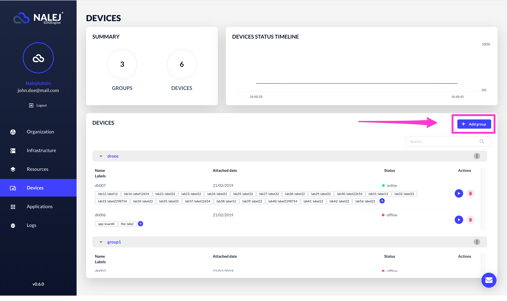

# Application with devices

So you have an application that needs some extra devices \(let's say, for example, an app that measures the temperature of a building, and has sensors in every floor of the building\).

_The CLI responses are shown in text format, which can be obtained adding_ `--output="text"` _to the user options. If you need the responses in JSON format, you can get them by adding_ `--output="json"` _at the end of your requests, or as a user option._

## Creating a new device group in the system

The first thing you need to do is create the device group where our devices are going to be.

### Web Interface

You can add a new device group easily, clicking on the option **"Add group"** in the main view.



This opens a dialog like the one below:


To create a device group, you need:

* A **group name**.
* The **group device availability**.
* If the **devices** are **enabled by default**.

### Public API CLI

To add a device group through the CLI, the command needed is:

```bash
./public-api-cli devicegroup add
    <devgroup_name>
    --disabled or --enabled
    --disabledDefaultConnectivity or 
    --enabledDefaultConnectivity
```

Where you have:

* the **name** of the group.
* a flag indicating if the group is **enabled** or **disabled**.
* a flag indicating the default connectivity for the devices joining the group, whether it is enabled \(**enabledDefaultConnectivity**\) or disabled \(**disabledDefaultConnectivity**\).

The response to this command is something like this:

```javascript
ID      NAME              API_KEY        ENABLED   DEV_ENABLED
<id>    <devgroup_name>   <id_api_key>   true      true
```

This includes all the information related to the device group, which is, its **id**, its **name**, its **API key**, if it's **enabled**, and if the devices will be **enabled** by default when joining the group.

## Registering the devices in the system

Now that you have the device group where your devices will be, it's time to register said devices.

Each device will register automatically through the installed Nalej SDK, but they need to know which group to register to. The information needed is:

* the **organization\_id**,
* the **device\_group\_id**, and
* the **device\_group\_API\_key**.

As we just saw, this data can be easily obtained asking for the device group information through the CLI or the Web Interface. Once it is in the SDK, the devices will register in the correct device group, and the structure for our app will be in place.

To see if the devices are up and running, you can check their status through the web interface or the public API CLI, as explained [in this document](../devices/devices-1.md).

## Creating the application descriptor

Your app will need to specify which device groups are allowed to interact with its services, so the application descriptor needs an extra rule. The _rules_ section of your app descriptor should look like this:

```javascript
"rules": [
    {     
          "name": "this is what this rule does",       
          "target_service_group_name": <service_group_name>,       
          "target_service_name": <service_name>,
          "target_port": <port>,       
          "access": 3
          "device_group_names": [
                <device_group_name_1>,
            <device_group_name_2>,
            ...
        ]
    },    
    ...
]
```

Here, the **access** parameter has the value of **3**, which means that one or more device groups have access to the service in **target\_service\_name**. Then, in **device\_group\_names**, you can include one or more device groups to which this service is available. In the case exposed in this document, you would only need one device group name, which would be the device group you already created in the first step, and the one where all the devices are registered into.

As you can see, each service using the device group will need a new rule, specifying the service group and the service inside it that has access to the device group \(or groups\) described in the document. So, if there were more services that used our temperature sensors, we would need to declare them with a new rule for each.

## Adding & deploying the app to the system

Once this is done, the only thing left to do is adding the application to the system and deploying an instance of it. These steps are the same for every application, so our suggestion is to check out our [Application deployment](appdeployment_wclusters.md) tutorial to see how to do it.

