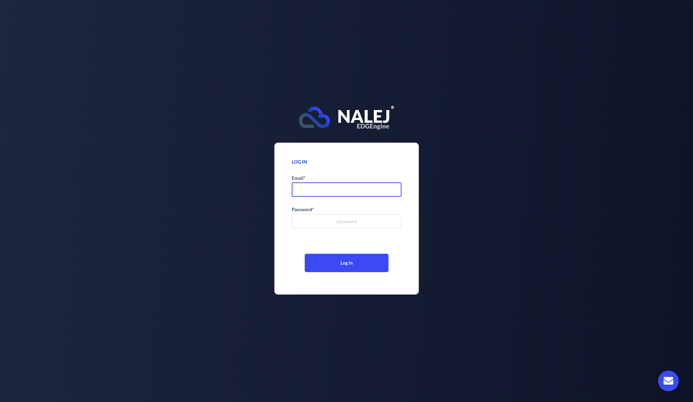

# Initial login in the system

Before getting started with the different parts of the platform, we're going to tackle the very first step of the way: the first time we log in the platform. There are two ways we can log in: through the command line interface \(CLI\) and through the web management interface.

## Web Platform login

With a browser, we can go to the login page provided by the Nalej administration team, and use our Nalej user and password to get in the system.



Once you enter, you can see the platform structure at a glance, and start interacting with it.

### Web interface views

The different views of the system are accessible through the column in the far left part of the screen (with a dark background). The views you can navigate to are:

- **[Organization](../web/organization/org_user_mgmt.md)**, which contains a view of all members of the organization and its subscription plan.
- **[Infrastructure](../web/infrastructure/inventory.md)**, where you can interact with the Inventory.
- **[Resources](../web/resources/cluster_monitoring.md)**, where you can manage the clusters in the system, and the nodes associated to them.
- **[Devices](../web/devices/dev_deploy_mgmt_removal.md)**,  where you can see all the devices in the system and the device groups that contain them.
- **[Applications](../web/applications/app_deploy_mgmt_removal.md)**, where you can interact with the registered and deployed apps.
- **[Logs](../web/logs/unified_logging.md)**, where you can access the logs generated by the applications deployed in the platform.

For more information on any of these views, please go to the corresponding section of this documentation, where the different views are described in detail.

## CLI Login

### Setting your user options

The very first time you log in the system there are some variables that need to be established. They are needed for each interaction, so setting them up before starting lets us omit them in each request. These variables are the **certificate** you received, and the addresses of the **Nalej login server** and the **Nalej API server**. Gather all data \(from the information the Nalej administration provided when signing up for the service\), go to the folder in your computer where you saved the `public-api-cli` executable, and execute the following instructions:

```bash
./public-api-cli options set 
    --key=cacert 
    --value=/Users/youruser/.../certificate.crt

./public-api-cli options set 
    --key=loginAddress 
    --value=login.server.nalej.com

./public-api-cli options set 
    --key=nalejAddress 
    --value=api.server.nalej.com
```

To check if these commands have executed correctly and the options are in fact set, you can use the command:

```bash
./public-api-cli options list
```

By default, the responses to the CLI commands will be JSON-formatted documents. If you want to see them in a format that's easier to read, you should add this other option:

```bash
./public-api-cli options set 
    --key=output 
    --value=text
```

This will return the responses in a more human-readable format. If, however, you happen to need the response of a specific command in a JSON document, just adding --output="JSON" will override this option for that command.

### Login

After this, we can log in normally:

```bash
./public-api-cli login 
    --email=user@nalej.com 
    --password=password
```


## CLI Troubleshooting

### Invalid credentials

_I tried to log in and there is a fatal error saying_ `Invalid credentials`, _what is going on?_

The email or password you entered is wrong, or you are simply not in the system yet. Double-check the email and password you entered, and if you are sure that they are correct, then talk to an administrator to see if you're already registered.

### Error loading CA certificate

_Ok, I got the credentials right, but now there is another error saying_ `Error loading CA certificate`. _Does the system hate me?_

No, it doesn't \(remember, it doesn't know you exist, since you're not logged in yet\). The problem now is that it can't find the certificate. The most common reason for this is that the path is incorrect.

### Unable to login into the platform

_I finally got the credentials and the certificate right, and there's a new error:_ `unable to login into the platform`. _What is happening now?_

There's a problem with the server address. Is it correctly written?