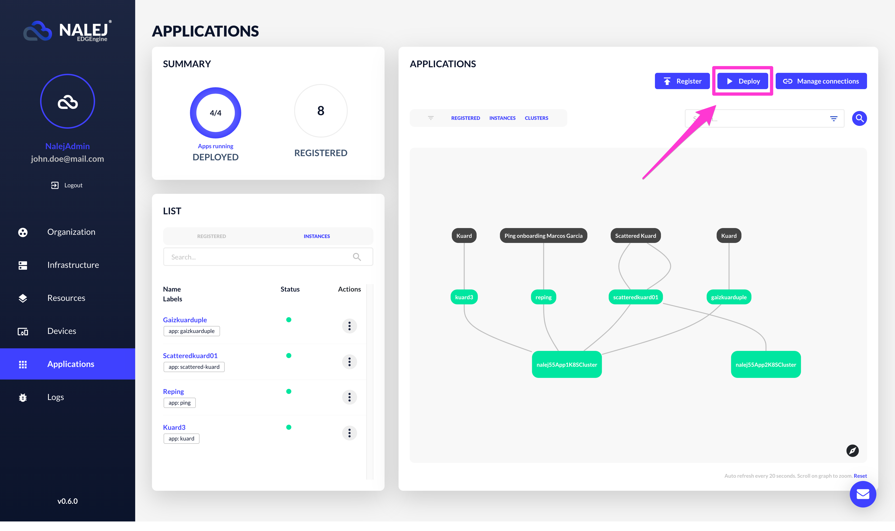
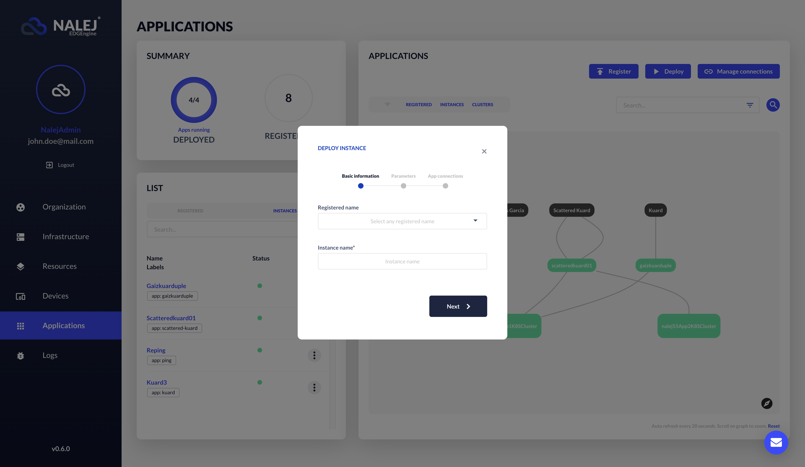
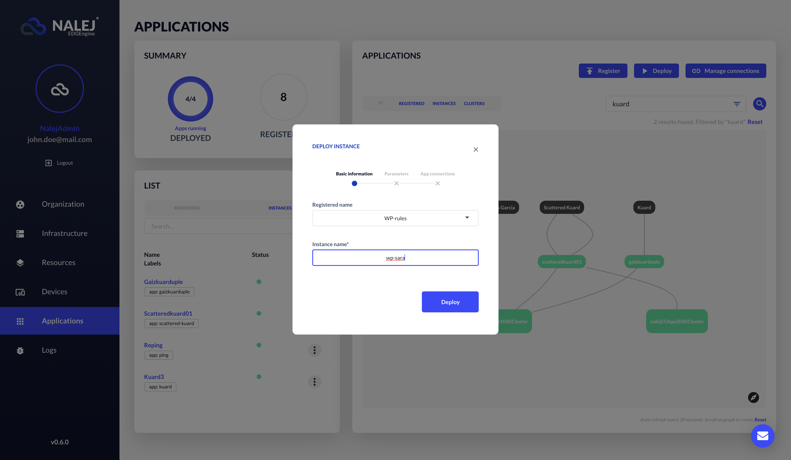
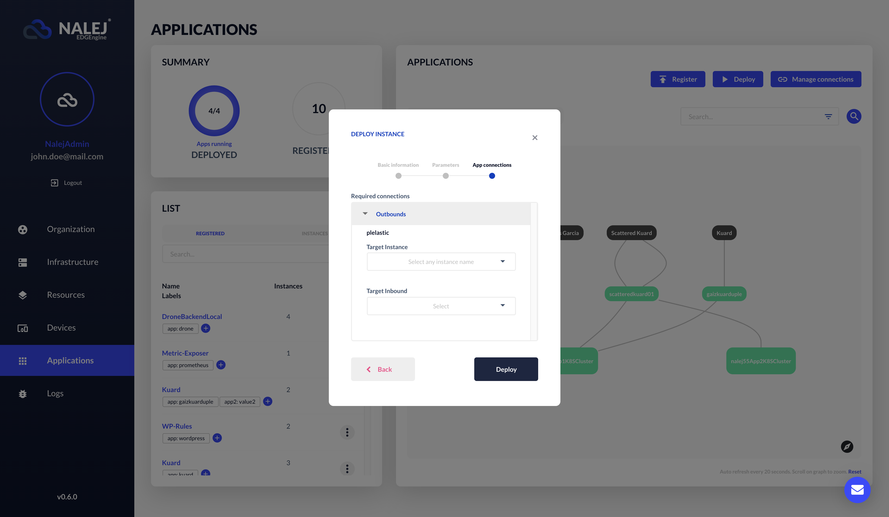
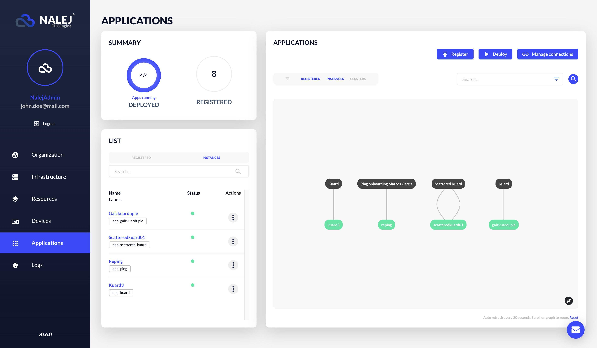
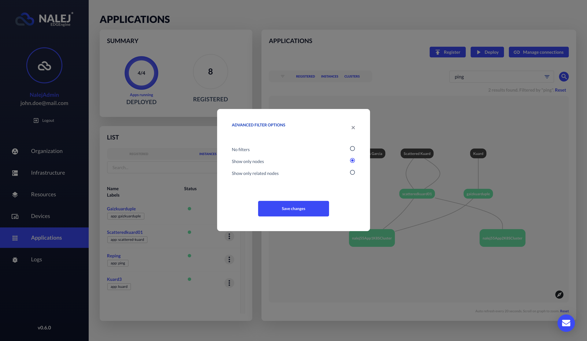
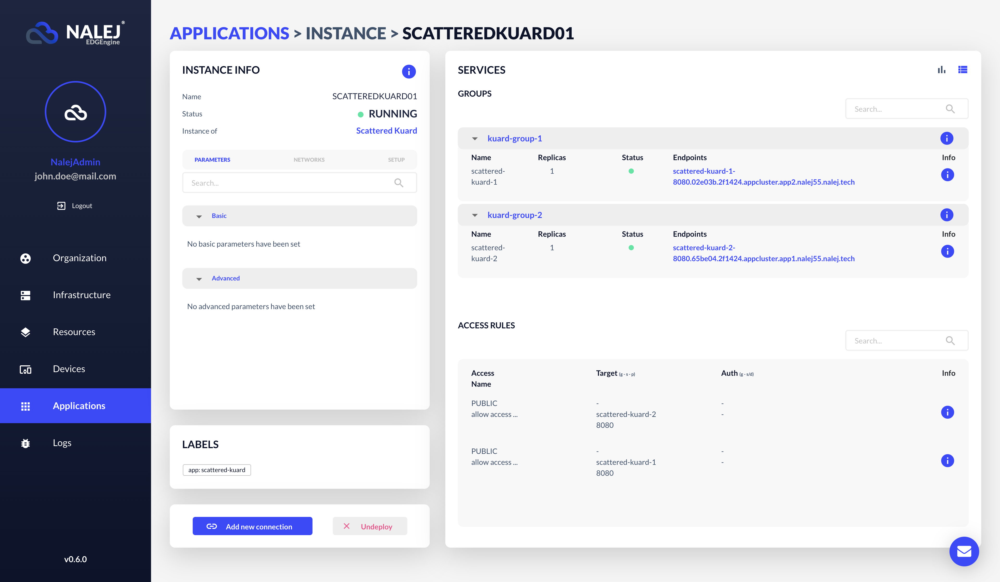
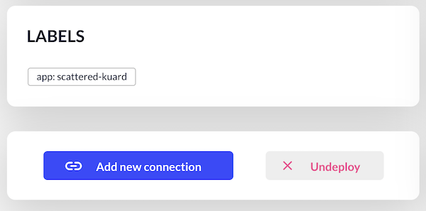
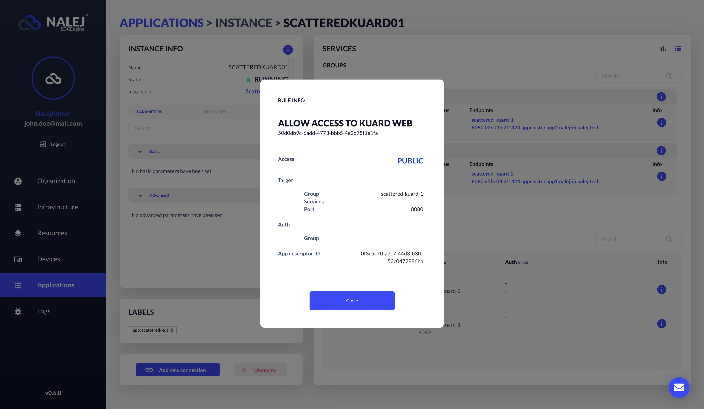
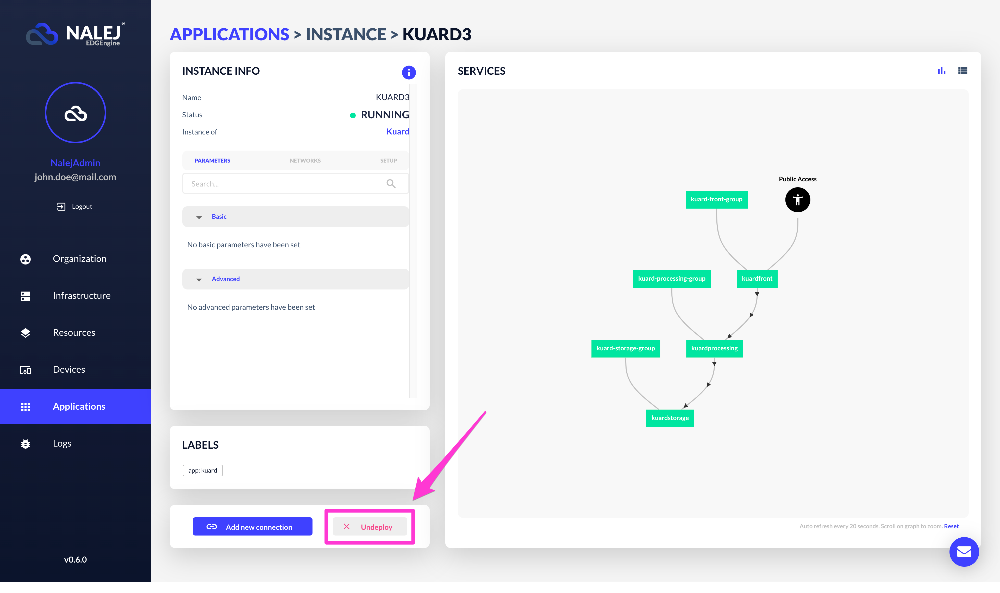

# Deploy, manage and remove apps

This section will have all the documents related to app deployment, management and removal. You will also find what you need about application descriptors: what they are, how to create one, and how to use one in the system.

Now that we know how the clusters work, it's time to start deploying applications in the system. Let's see how to do this.

## The Application View

If we click on the "Application" option at the left column of the screen, a screen similar to this one will appear:


This screen has the following areas:

* A **summary**, where the number of deployed instances and registered applications are shown.
* An **app list**, where we can see all the info regarding the registered apps and the deployed instances in the system.
* The **graph**, where we can see all the info regarding the clusters,  the registered apps and the deployed instances in the system and its connections. The instances can have different **states** (*deploying*, *running*, *queued* or *error*), which are represented with different colors. Also, the **connections** between apps are represented with directed arrows \(source to target\).

## Application deployment

The process of deploying an application is as follows:


First you need to create an application descriptor. The documentation for doing so is [over here](app_descriptors.md), but by now let's just say that it should be a JSON file with more or less this aspect:

```javascript
{
  "name": "Sample application",
  "labels": {
    "app": "simple-app"
  },
  "rules": [
    {
      "rule_id": "001",
      "name": "allow access to wordpress",
      "target_service_group_name": "g1",
      "target_service_name": "2",
      "target_port": 80,
      "access": 2
    }
  ],
  "groups": [
    {
      "name": "g1",
      "services": [
        {
          "name": "simple-mysql",
          "image": "mysql:5.6",
          "specs": {
            "replicas": 1
          },
          "configs": [
        {
          "config_file_id": "1",
          "content": "SG9sYQo=",
          "mount_path": "/config/saludo.conf"
        },
        {
          "config_file_id": "2",
          "content": "QWRpb3MK",
          "mount_path": "/config/despedida.conf"
        }
      ],
          "storage": [
            {
              "size": 104857600,
              "mount_path": "/tmp"
            }
          ],
          "exposed_ports": [
            {
              "name": "mysqlport",
              "internal_port": 3306,
              "exposed_port": 3306
            }
          ],
          "environment_variables": {
            "MYSQL_ROOT_PASSWORD": "root"
          },
          "labels": {
            "app": "simple-mysql",
            "component": "simple-app"
          }
        },
        {
          "name": "simple-wordpress",
          "image": "wordpress:5.0.0",
          "specs": {
            "replicas": 1
          },
          "storage": [
            {
              "size": 104857600,
              "mount_path": "/tmp"
            }
          ],
          "exposed_ports": [
            {
              "name": "wordpressport",
              "internal_port": 80,
              "exposed_port": 80,
              "endpoints": [
                {
                  "type": 2,
                  "path": "/"
                }
              ]
            }
          ],
          "environment_variables": {
            "WORDPRESS_DB_HOST": <db_host>,
            "WORDPRESS_DB_PASSWORD": <db_password>
          },
          "labels": {
            "app": "simple-wordpress",
            "component": "simple-app"
          },
          "deploy_after": [
            "1"
          ]
        }
      ],
      "specs": {
        "num_replicas": 1
      }
    }
  ]
}
```

This is the descriptor of a WordPress server with an associated MySQL database. Yours should look similar, depending on the services you want to deploy.

### Adding the application to the system

#### Public API CLI

Let's suppose you have the application descriptor already covered, and you want to deploy your application now. As stated before, the next step of the process is adding the application to the system. That will be done with the command:

```bash
./public-api-cli app desc add 
    /pathtodescriptor
```

It returns a table like this:

```bash
DESCRIPTOR                  ID          LABELS
SARA - simple application   <desc_id>   <label:value>

NAME                  IMAGE            LABELS
[Group] application   ===
simple-mysql          <serv1_img>      <l1:v1>,<l2:v2>
simple-wordpress      <serv2_img>      <l3:v3>,<l4:v4>
```

with an application **descriptor ID** inside, which we will need for deploying an instance of this application.

So, the descriptor is ready and you are already in the Application view of the web interface. Where to go from here? Great question!

In the Application view, we can see the already deployed applications in the lower part of the screen, in the Applications list. There, we need to click on the **Registered** tab, and then we can see the **Register application** button. Please click on it.


 What we can see now is a dialog where we can upload our application descriptor, so the application gets registered in the system. We can click on it to search the file in our file system, or we can just drag it and drop it in the designed area. 


After that, just clicking on the **Register** button will register the application in the system.


### Deploying the application

Now that our application is registered \(and so appears in the list at the **Registered** tab\), we can deploy an instance of it! There are three ways to access the deploying dialog, so let's see all of them.

1) The first option is to click on the **Deploy** button in the upper right part of the screen.



2) We can also find our app in the **Registered** list, hit the **Actions** icon in the same row, and once there click the grey **Deploy** option in the menu. 


3) Lastly, we can find our app in the **Registered** list and click on its name. To deploy our application we only need to click on the **Deploy** button on the bottom part of the screen.


With all these actions we arrive to the same dialog, which looks like this:



Here we need to choose the application we want an instance of (from the drop down menu), and write the name of the new instance. If we clicked on the **Deploy** button in the **Registered** list or in the **Actions** menu, now the instance will already be established.

- If the app does not require parameters or connections, after we complete this menu and hit **Next**, the buttons will change and a **Deploy** button will appear. Clicking on it will make the instance deploy and appear in the **Instance** list.



- If the app has parameters, once we hit **Next**, the next step in line (parameters) will be highlighted, and we will need to fill the basic and/or advance information required for this app. With an application that does not require additional connections, hitting **Next** will change the buttons again, and the **Deploy** button will appear.


- Lastly, if there is any required connection, we will have to fill the required information for them in the third step.




The **Deploy** button will be enabled when the information is completely added, allowing the user to finally deploy the instance.


### Quick filters

We can filter the different nodes by **registered** apps, deployed **instances** and **clusters**, and we can also combine the filter function with the search function. 

For example, here we can see the effect of the **Registered** quick filter.


We can combine quick filters to see elements from both categories. Here is the result of the combination of the **Registered** and **Instances** quick filters.



To see the difference, here we display the graph showing all the entities in the system.


There is an advanced filter options in the search box that opens a dialog, where we can choose to see only the **nodes** or only the **related nodes** to the current search.



## Application management

We can see the status of an instance directly in the **Instances** tab, in the colored button in the **Status** column of the list. We can also click on an instance to see all the information related to it, or click on the options button and select "More info". This takes us to a new view:


This view has all the information related to the instance we selected. The section labeled **Services** can toggle between displaying the information in a graph or in a list, like the image below. We will explain these two modes later.



This view has several sections:


First, we have the **summary** \(upper-left part of the screen\). This part will tell us the name of the instance, its status and its application of origin. Here we also have its parameters, its connections and the environment variables it needs to set up. If we click on the **Info** button (the blue round button with an `i` in the upper right part of the section), we can find its ID, the service groups it has, and the service instances it has deployed.



Under the summary we have the **Labels** section, where we can see the labels associated to this app instance.

Then we can see two buttons:
* **Add new connections**, which opens a dialog to add a new connection to this instance.
* **Undeploy**, to undeploy the instance directly from here \(we will talk about this [later in this document](#undeploying-the-instance)\).

Then we have the **Services** section. 


First we can see a graph that shows us the relationship between the services in the instance, where we can zoom in in case it's necessary. The color of each service depends on its status, and the connections are also painted according to their status (blue if they are active, dark grey if they are not). 


On the upper right part of this section we have the two perspectives we can toggle between. The other perspective is a text view with all the info about the service instances related to this application instance \(there is a tab with all the services, and then there is a tab for each service group\). 

- Each service group has an **Info** button. For each service group we can see the information that's associated to it: number of **replicas** that are deployed, the general **status** of the service group, the **endpoints** it has... 


* Each individual service inside a service group also has an **Info** button. Here we have the information related to this specific service, like the environment variables, the labels assigned to the service or the cluster it's deployed in. 


* Under the services section, there's the **Rules** section, where the rules for the different service groups in the application are displayed. We can click on any of them and the full disclosure of the rule will appear.




## Application removal

### Undeploying the instance

To undeploy an instance we have to locate it in the **Instances** list, open its **Actions** menu, and click on the **Undeploy** button. This will delete the instance from this list, which will mean that it's no longer in the system.


We can also undeploy an instance from its information view. There's an **Undeploy** button in the lower right part of the view, right under the "Add new connection" button. Clicking on it will undeploy the instance too.

### Deleting the app

This last step is optional, only needed if we want to delete a specific app from the system, and doesn't need to be done every time we undeploy an instance.

Also, the system won't let you delete an application while it has deployed instances of it in the system, so we need to undeploy all the instances first and then delete the application from the system.

To delete the application from the system, we just need to go to the **Registered** tab in the Application list, and look for the application. Then, in the **Actions** menu, we click on the **Delete** option.

<!-- imagen: borrado desde la lista de apps registradas --> 

We can also delete it from its information view. Once in it, we need to click the **Delete** button on the lower right part of the view, beside the "Deploy" button.



Any of those procedures will definitely delete the application from the system, thus avoiding the generation of instances from it in the future.