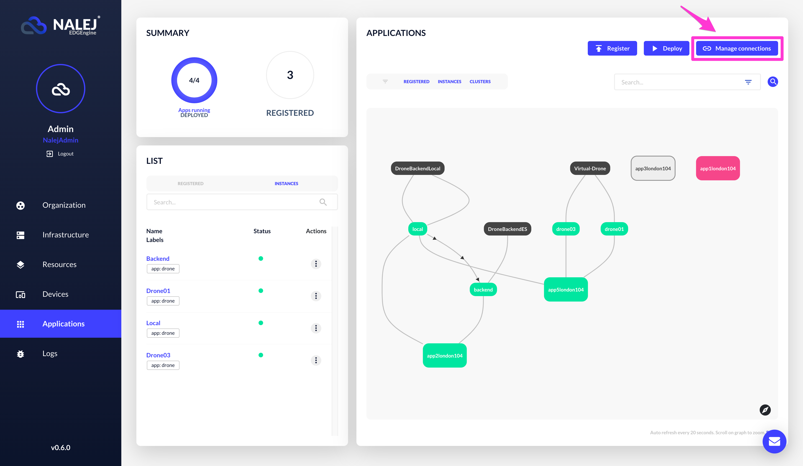
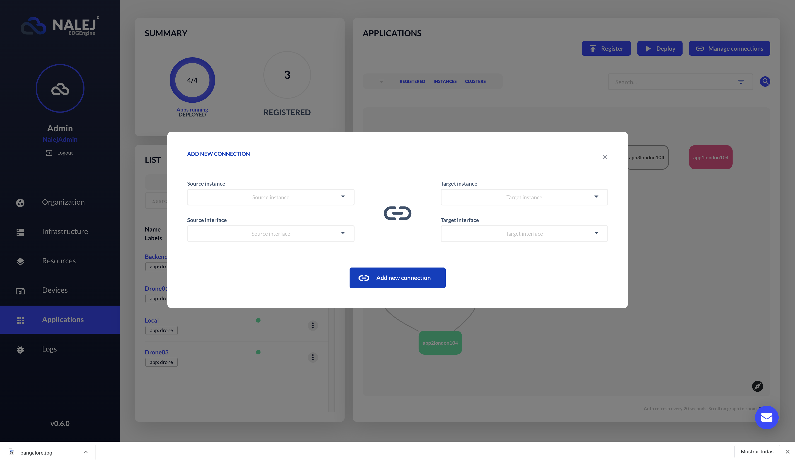

# Application networking

The Nalej platform allows the user to create point-to-point secure connections between deployed applications. If you want to connect applications, this is your section.

## How it works

To create a private connection between service applications, the Nalej platform provides the Application Network solution. With this, you can establish point-to-point secure connections between services dynamically. Let's introduce the important terms to ramp up:

* **Outbound network interface**: A way to connect your application to another service. Think about it as a USB socket connected to the application.
* **Inbound network interface**: A way to allow your application to accept connections from other applications. Think of it as a USB hub connected to the application.
* **Connection**: The link between the outbound and the inbound network interfaces. Think about it as a USB wire that you use to connect an outbound interface to an inbound interface.

Even if the connections can go on both directions, the concept of the application network is that the requests go **from outbound to inbound**. For example, you could connect multiple Wordpress servers to the same database, multiple Java applications to the same Redis cluster, or multiple IoT sensors to a data lake. 

You can also create a **service mesh** using outbounds and inbounds on all your applications. Imagine that you want to create a service discovery through all your clusters using Consul or any other tool; you could connect all your services using this feature through a secure and reliable network managed by Nalej.

## Know how

### Show connections

When you open the Applications view, the deployment graph will show the active connections as arrowed lines between applications.

If you click on the **Manage connections** button, it will show the **Manage connections** modal window.

The list will show all the connections. If the source interface name shows an asterisk `*`, that means that the outbound interface is marked as **required**.

### Create a new connection between applications

Some **rules** must be observed when creating a connection:

* A connection can only be created between an outbound network interface and an inbound network interface.
* An application instance can not be connected to itself.
* One outbound network interface can only be connected to one, and only one, inbound network interface.
* One inbound network interface can be attached to multiple outbound network interfaces.
* The target port listed in the rule that describes the interface will be the port opened for the connection.

#### Web interface

On the **Manage connections** window, click on the **Add new connection** button to open the **Add new connection** dialog.

Here you can define the source instance, the outbound network interface name, the target instance, and the inbound network interface name. Then just click on the button **Add new connection** to send an asynchronous message to the platform to create the connection.

When the connection is established, the main graph will show the connection with an arrowed edge between the instances.

### Remove a connection

#### Web interface

On the **Manage connections** window, click on the **Disconnect** button to remove that connection. The platform will show a confirmation popup to avoid accidental remotions.

