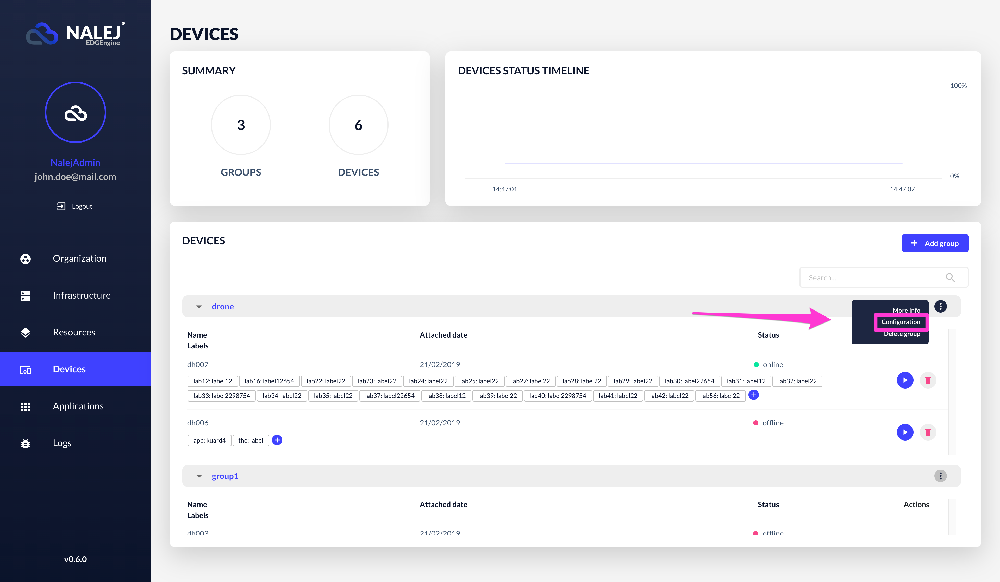
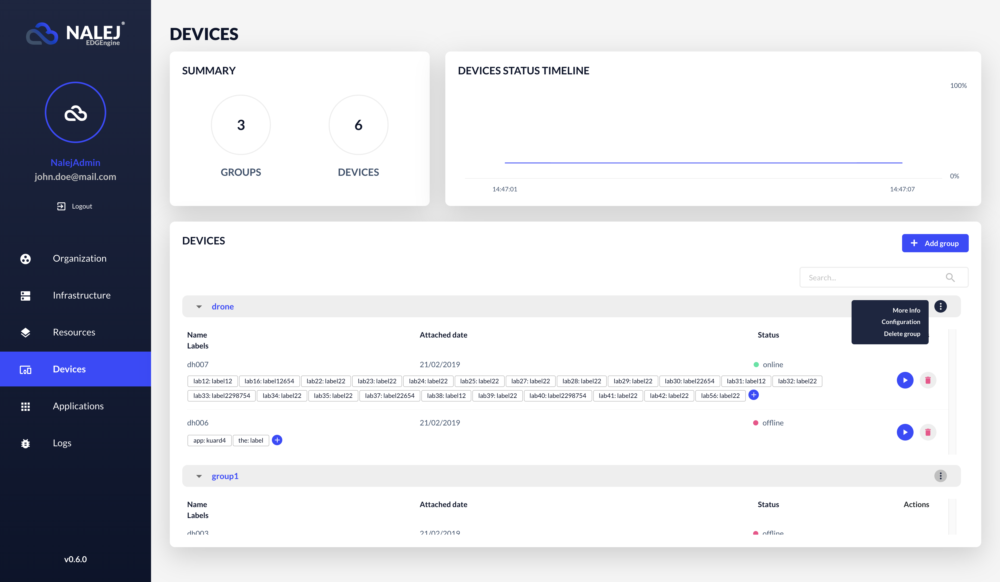
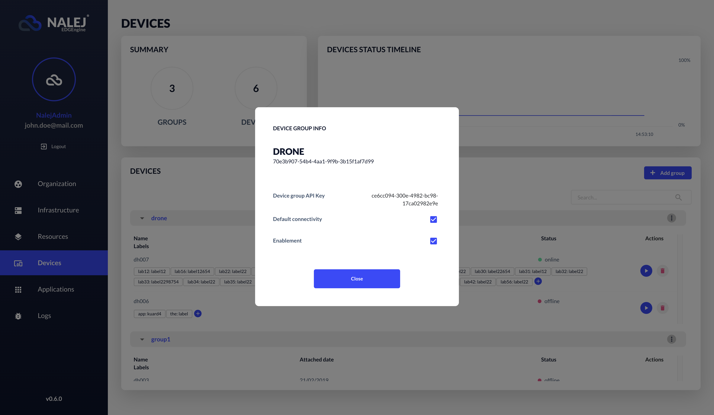
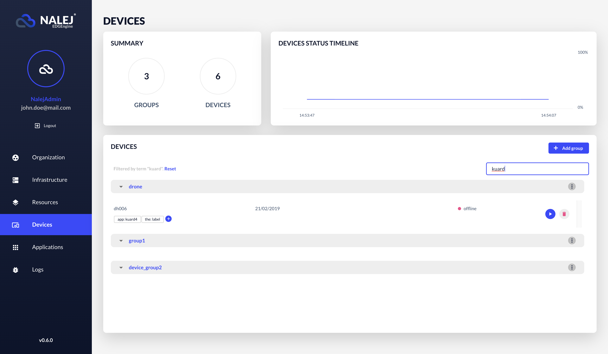
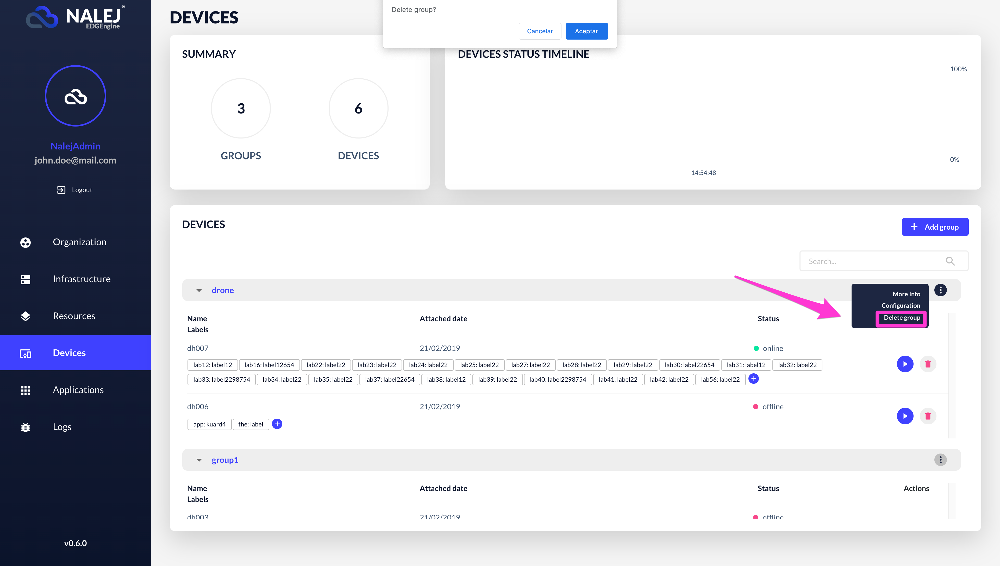

# Adding, managing and deleting devices

What is a device for Nalej? The system understands the concept of **device** as an abstract entity that the user can manage as part of the applications installed in the cluster. 

!!! note 
    The CLI responses are shown in this document with the text format, which can be obtain adding `--output="text"` to the user options. If you need the responses in JSON format, you can get them by adding `--output="json"` at the end of your requests, or as a user option.

## Adding a device group

As with the rest of the sections, we can find the Device view in the left-hand column. We'll analyze the parts of this view in the [Getting device-related information](#getting-device-related-information) section.

We can add a new device group easily, clicking on the option **"Add group"** in the main view \(or in a group view\).

This opens a dialog like the one below:

To create a device group, we need:

* A **group name**.
* The **group device availability**.
* If the **devices** are **enabled by default**.

Once the group is created, it will be displayed on the devices list, located in the main view.

## Configuration of a device group

In the main view, we can easily access the configuration of a specific device group by clicking on the **Configuration** button in the Options menu.

The only options that can be changed in a group are:

* The **group device availability**.
* If the **devices** are **enabled by default**.

## Getting device-related information

### Web Interface

This is the main page of the Device section:

The upper part of the screen displays the following:

* a **summary**, where we can see the total number of devices in the system, and the number of groups that contain them.
* a **status timeline**, where we can see the percentage of online devices in a given time.

The lower part of the screen is a list of devices divided by groups, with the following information for each device:

* its **name**.
* the **attached date** it was added to the system.
* its current **status**.
* any associated **labels** it may have.

Each group, in the grey background row, has its own **Options** button. Clicking on it we can see more information related to the group, we can access its configuration settings (as we saw in the [Configuration of a device group](#configuration-of-a-device-group) section of this document), or we can delete it.

When we choose the **More info** option, a dialog appears, where we can find the device group API key, its default connectivity and if it's enabled or not.

We can also search by any text string included in any part of the device information \(for example, we can search the term "`online`" to see which devices are online at any given moment, or a specific date of inclusion in the system\).

## Deleting a device group

Let's say we want to delete an entire device group. From that group view, we can click on the Options menu, and then choose the **Delete group** option.

And the system will confirm the deletion with a notification in the upper right part of the screen.
