# Edge Controllers and Agents

The Edge Controllers and the Agents are both Nalej components that are installed in your side of the organization so the Nalej platform can have access to the assets there. Let's start with some basic definitions.

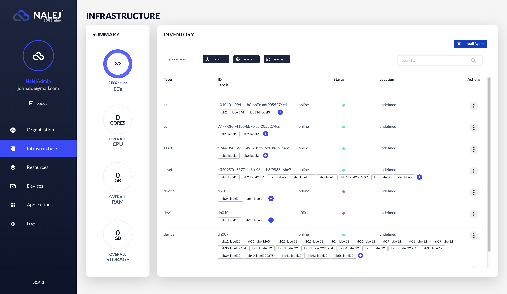

## What is an Edge Controller, and why do I need one?

An Edge Controller \(EC\) is a component installed in your organization. Its mission is to serve as an entry point for the Nalej Management Cluster, so it can receive data from the hardware installed there.

To do that \(to receive info from the hardware on the client's side\), we need a service in that hardware that sends it. That service is called an **Agent**.

As you can see in the diagram, the connection between the Nalej Management Cluster and the Edge Controllers in the customer's side is done through a VPN, thus securing the communications between them. This is the reason why the EC must have more logic than an Agent, and so it must be a \(light\) Virtual Machine.

## What is an Agent, then?

As stated before, an **Agent** is a service installed in a piece of hardware in the client's side. This agent is registered in an EC, and when it's live it sends a message saying so. The EC, then, replies with a set of operations this agent has to execute. When the agent finishes those operations, it sends the results to the EC, which then forwards them to the Nalej Management Cluster.

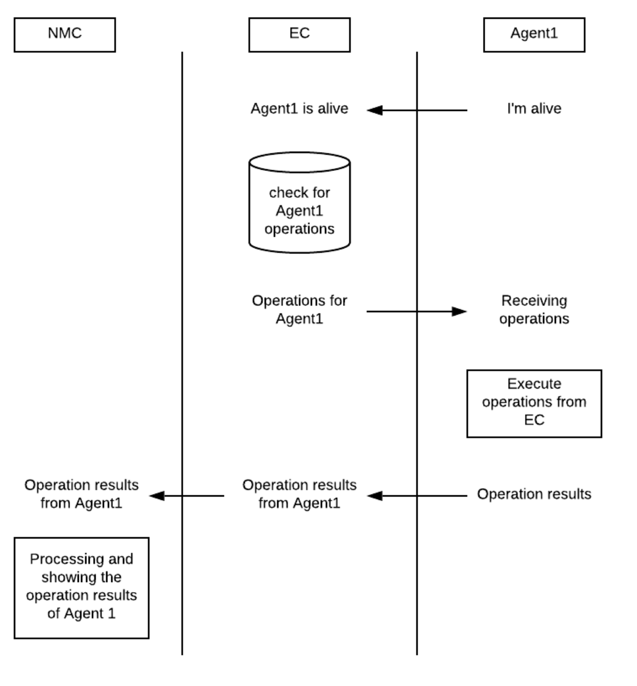

### What is the actual role of an Agent in the system?

An Agent will let the platform know about the client's hardware. This is useful for Nalej, because with this information it can obtain a hardware map from the client's side, and thus the managers can decide whether or not they want to use the assets they have available at any given time.

One of the services the Agent will have to execute is the monitorization of the hardware it's installed into, no matter if it's part of an application cluster or not. Thus, the Inventory view will be a collection of devices and assets in the client's company \(with their associated status and connectivity\), as well as the Edge Controllers that let us connect to said assets.

## Managing ECs

When in the Infrastructure view, we can use the **Quick Filters** available and click on the ECS filter. This will show a list of all the ECs in the organization.

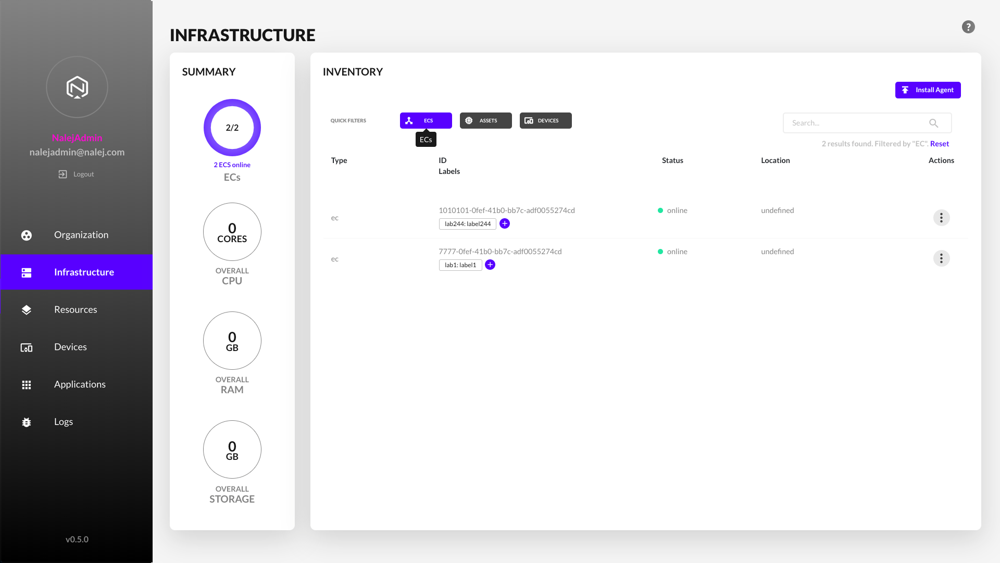

Once here, we can easily find the EC we want to manage, and:

* Check its basic information \(ID, geolocation, status\).
* Add or delete labels \(the same way as in the rest of the views\).

We can also access the **Actions** menu \(the three dots icon in the far right column\) 

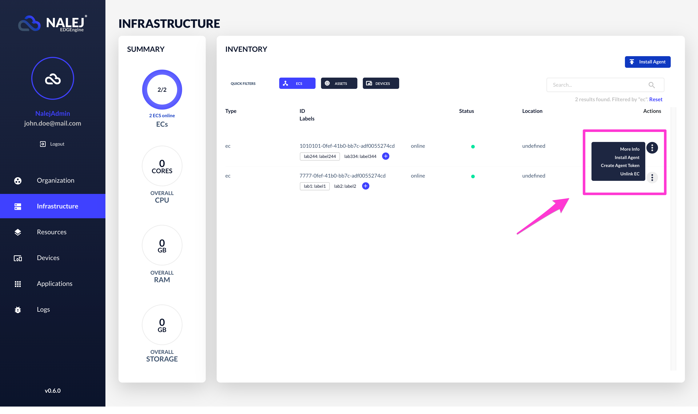

Here we will find several more options, like:

**More info**

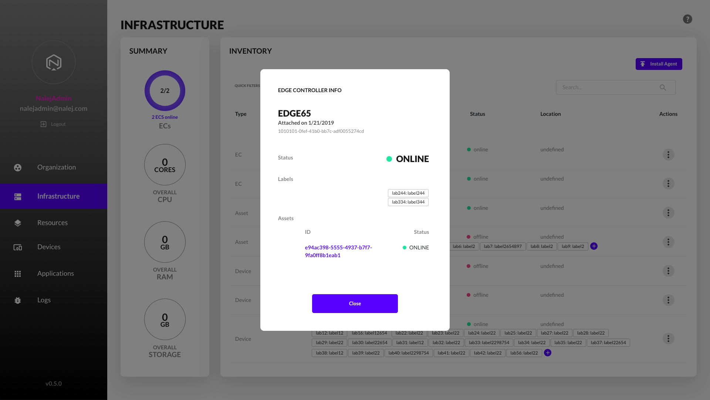

Here we can see, apart from the information we already had, the list of assets attached to a specific EC.

**Install agent**

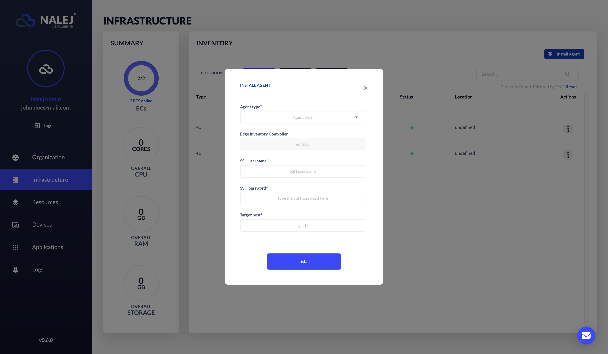

This allows us to install an agent directly from the EC. For this, we need:

* the agent **type**, which we can choose from the drop-down list.
* the **SSH username and password** that will grant us permission to install said agent.
* the **target host** where the agent will be installed.

**Create agent token**

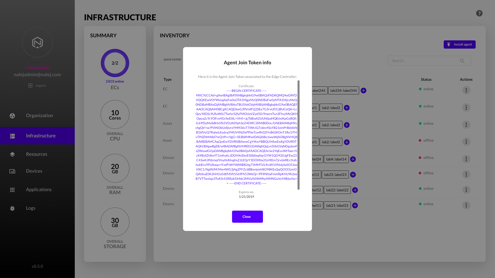

This view shows the certificate (and its expiration date) and the token needed for an agent to join this EC.

**Unlink EC**

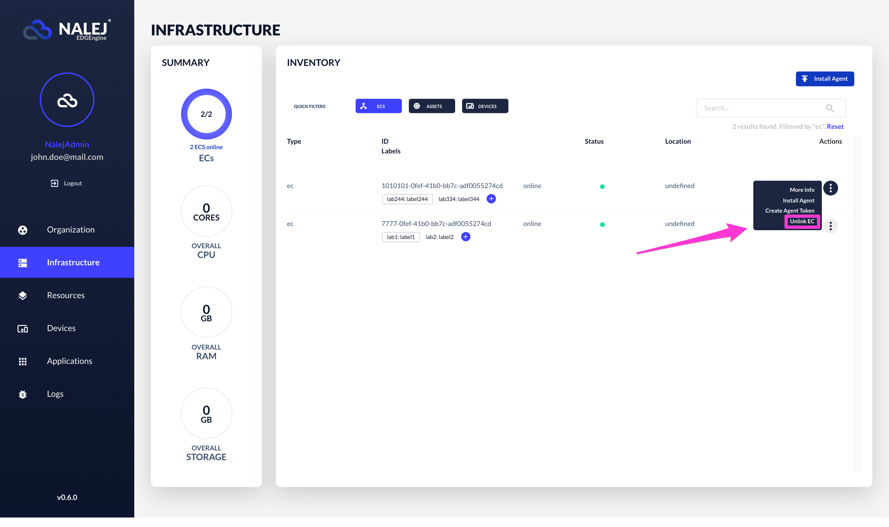

This option triggers a confirmation dialog, and when we confirm, it unlinks this EC from the Nalej Management Cluster.

## Managing Agents

The agents are managed a bit different than the ECs, since what we see is the asset where they are installed and not the agent itself. Nonetheless, let's see what we can do with them.

In the Infrastructure view, we will click on the **Quick Filter** made for the Assets, and so we will be able to see the list with all the assets installed in our organization. If we know the asset ID or other type of information \(for example, a specific label\), we can also filter by that in the **Search** box.

Once we find the asset where our agent is installed, we can:

* get the asset ID, its geolocation and its status \(in a first glance\).
* add and delete tags \(using the same procedure as in other parts of the web interface\).

Also, in the far right column we can click on the three dots icon to access the **Actions** menu.

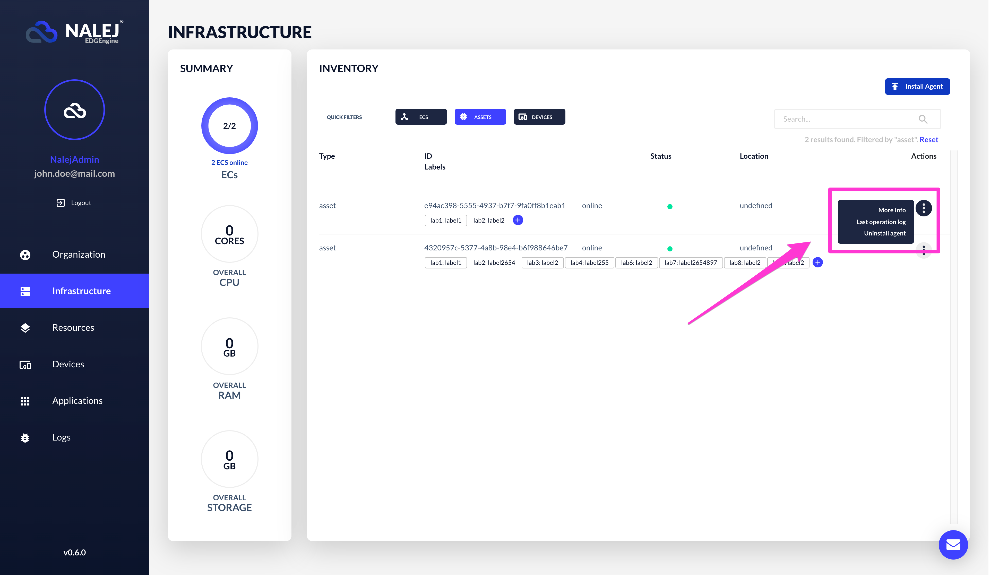

This enables the access to the following:

**More info**

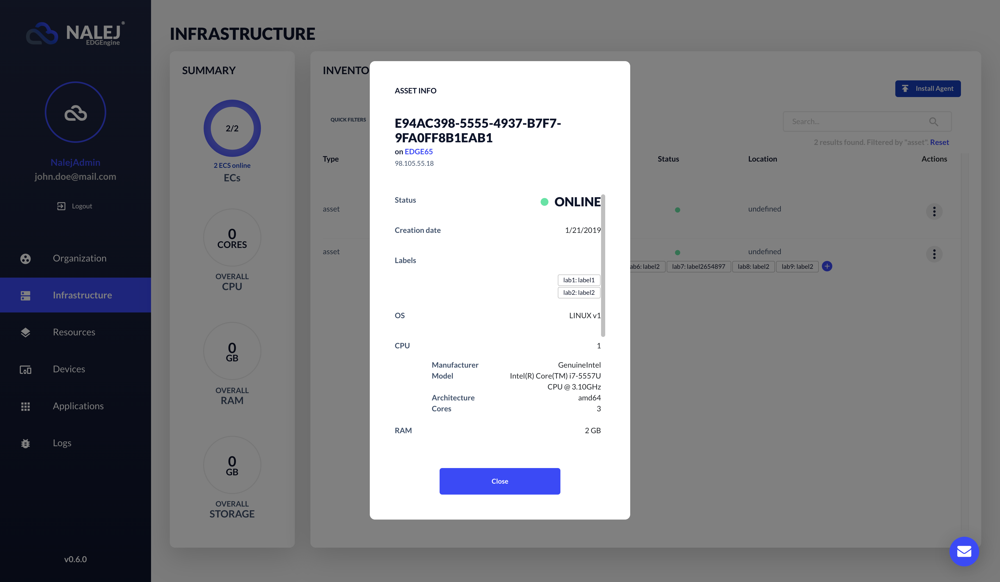

Here we can find an extensive list of data that may be relevant to define this specific asset, for example:

* the **Edge Controller** it is linked to.
* its **creation date**.
* its **OS**.
* the details of its **CPU**.
* its **RAM** capacity.
* its **Storage** type and capacity.
* its **networking specifications**.

**Last operation log**

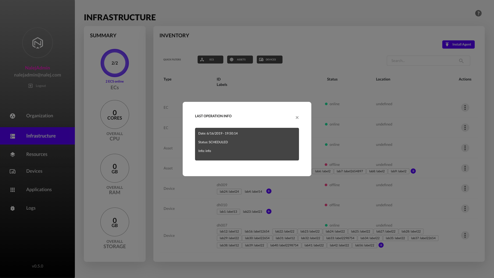

Here we can see the information obtained from the last operation the asset executed, with when it was, what was the status, and the extra info that went attached to it.

**Uninstall agent**

As with the ECs, this option prompts a browser dialog for us to confirm the action, and when we do, the agent gets uninstalled and the asset disappears from the list.

## Managing devices

You can also see the devices connected to the system here. As with the rest of the elements in this list, each device has an **Actions** menu.

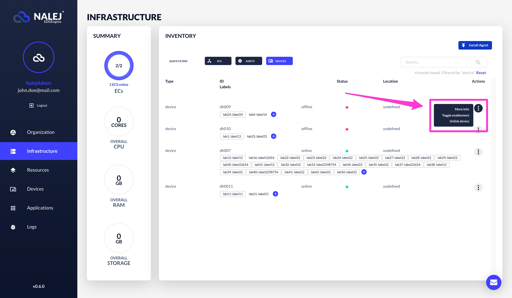

From this menu you can click on **More info** and check the extended information of the device:

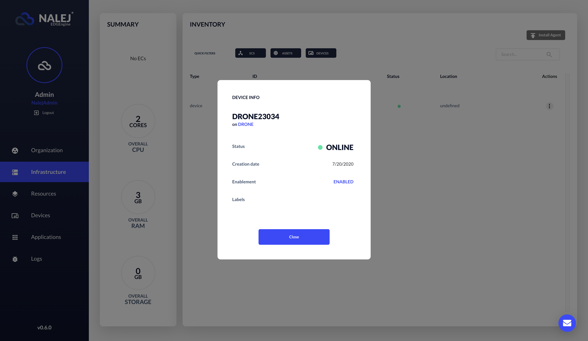

You can also click on **Toggle enablement**, which lets you enable or disable the device, and on **Unlink device**, which unlinks the device and the EC. Both these actions trigger a confirmation menu from the browser before executing.

