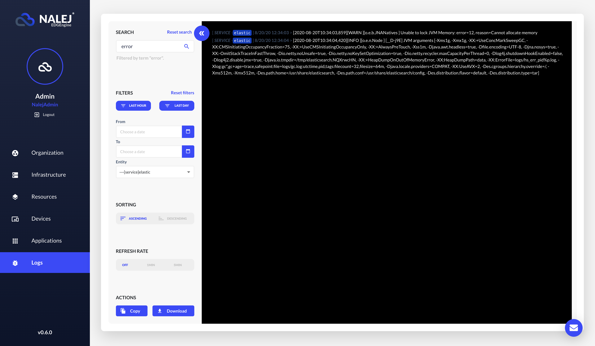
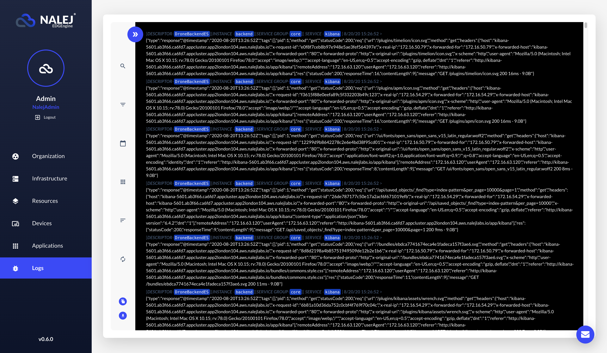
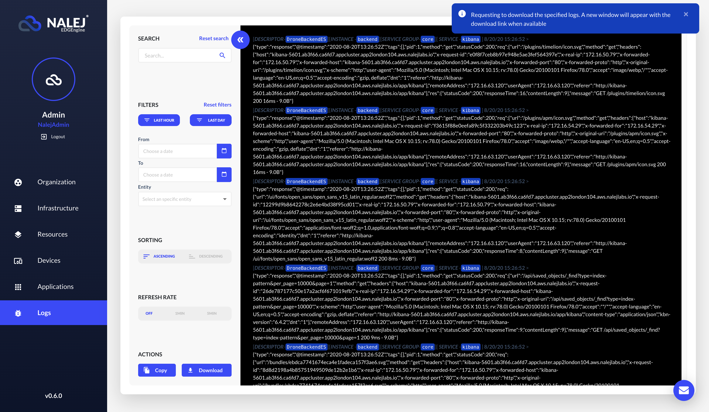

# The Unified Logging

So, you have an application instance running in Nalej platform, with several services in several service groups executing across several clusters. And then something goes wrong.

You are sure it's just a little \(and solvable\) error, but you have no way of knowing that for sure unless you check the instance logs. The only problem is that the logs are scattered through all the clusters where the application instance is executing, and it's impossible to know where the error might be hiding. What to do? Well, ask the **unified logging** feature, of course.

## What is **Unified Logging**?

**Unified logging** is a feature that retrieves all the logs generated by an instance in all the clusters, and presents them in a neat list. From that list, we can filter the logs by service group or by a _filter string_.

When the app instance is undeployed, the system deletes all the associated logs, so please be sure to check it while it is in the system!

## How do I use it?

The Logs view can be found at the very end of the list in the far left side of the screen.

Here you can find the logs of all the instances deployed in the organization you belong to. This is obviously unmanageable by itself, so we provide several tools to find your way through it. 

On the left side of the logs (which are in dark background) , you can find the **search and filters** menu. The **Search** option uses a _string_ as a parameter, and looks for that _string_ in the logs, the name of the services, instances and applications, the IDs... basically everywhere.

 

Beside the "Reset search" link there is a button with the symbol **<<**. Clicking on it will minimize the search and filter menu, and give all the spotlight to the logs section.

Clicking again in the same button, or in any of the menu icons, will restore the menu to its normal size, so you can interact with it comfortably.

You can also filter the log messages that come up by asking only for the messages from the last hour or from the last day, or choosing a specific period of time, or choosing the entity that generated them.

Another option is, once you have filtered your logs (or not), you can arrange them to have the oldest first (ascending) or the newest first (descending).

The refresh rate can also change, being **OFF** by default (whenever a log is generated, it appears on the screen), to intervals of 1 minute or 5 minutes.

Lastly, there are two main actions that can be done with this information.

- you can **copy** the logs to the clipboard, and then paste them wherever you deem appropriate.

- you can **download** the logs. This option will generate a downloadable file in the server. Depending on the size of the file, it may take a while to generate. The platform will announce it like this:

  

  After that time, a dialog with a link will appear in the middle of the screen, allowing you to download it.

  
