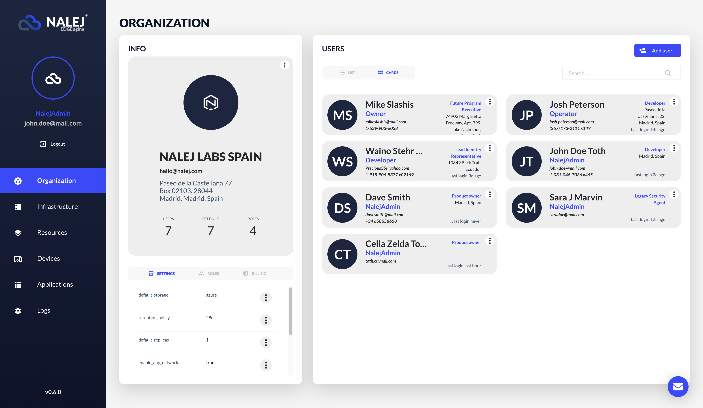
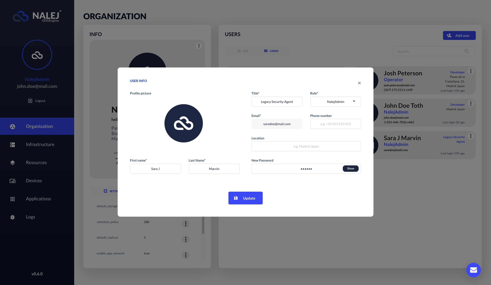
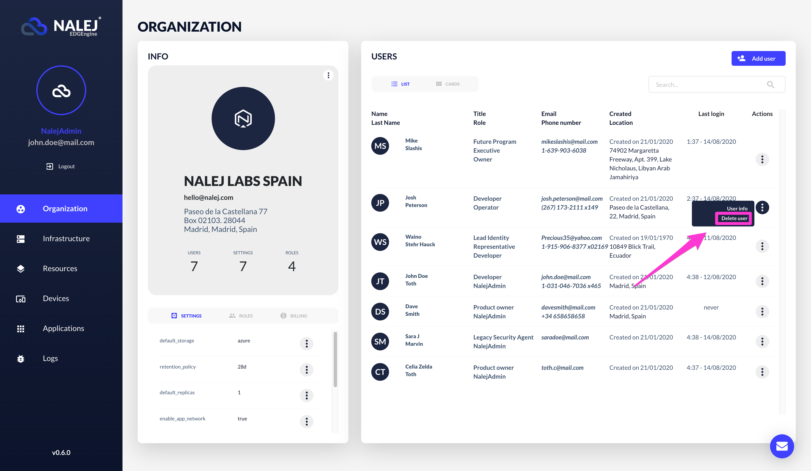

# Organization and user management

The Organization area contains all the information related to the organization and the management of its members. In this area you will be able to create, manage and delete users, as well as assign them different roles in the platform and create new roles if necessary.

!!! note
    The CLI responses are shown in text format, which can be obtained adding `--output="text"` to the user options. If you need the responses in JSON format, you can get them by adding `--output="json"` at the end of your requests, or as a user option.

## Getting the organization information

The Organization view is the first view presented to you after logging in. Just in case you have been navigating around, you only have to click the "Organization" menu option on the left column to go back to it.

Here, the information we can see depends on the role we have been assigned, and so, if the person logging in is categorized as Owner of the organization, the info shown is this:

* **Organization info card**. Here you can see the most relevant information related to your company: name, address, contact email, number of members, default settings for the company's applications, and how may user roles are available. Under the **Info** card we can find another one where there are more details about the default settings and the roles, and we can see and modify them. Also, there's a section for the billing information, which is read-only.
* **Users**. Here you can find all the members in your organization, with their information: name, role, phone and email, and what their actual position in the company is and where they are located. 

When clicking on the More Info button (the three dots button that changes color when you hover over it), we access a contextual menu with some actions available:

* _User info_: this button shows the member card, and gives us the option of editing the user information (password included).
* _Delete user_: here we can delete the user from the system.

## System roles

There are four default roles in the system:

* **Developer**: can add, deploy, manage and remove apps from the system, as well as use the Unified Logging feature. 
* **Operator**: can manage assets and devices using the Inventory feature, and can also list and update the available clusters.
* **Owner**: can manage apps, devices and resources, as well as update the organization information.
* **NalejAdmin**: has almighty powers in the system. This role is reserved for the Nalej field engineer associated to your organization. They can do whatever the owner can, and also add or delete users, deal with cluster provision tasks, and manage ECs and Agents.

Below you can see a chart with the managing permissions of each of the user roles in the system.

*This role is not available through the Web Interface.

Now that you know about the roles, let's see how the users are created in the system.

## Creating users

You need to be a **NalejAdmin** to be able to create or delete a user in the system. An **Owner** can update users and change passwords, but not create or delete users. 

In the Organization view, under the "Member list" there is an **"Add user"** button. If we click on that, a form appears.

As is common in forms everywhere, the fields marked with an asterisk are compulsory. You can save the information (thus creating a user) or discard it. You can also discard the information by clicking the cross in the upper right corner.

## Editing users

There are several operations you can do with the members who belong to your organization, if you're the Owner.

In the Users list, you can click on the Info option of the user you want to edit. The following dialog appears:

We can edit any of the fields, even the password (which has a button to show or hide its characters while editing). Once we hit "Save", a notification message appears in the upper right corner of the browser, confirming the changes that have been made.

## Deleting users

### Web Interface

To delete a user, click on the **Delete user** option of that user's contextual menu.

A message will appear on the browser asking you to confirm the action and, after confirming, another message will appear on the upper right part of the screen acknowledging the deletion.
