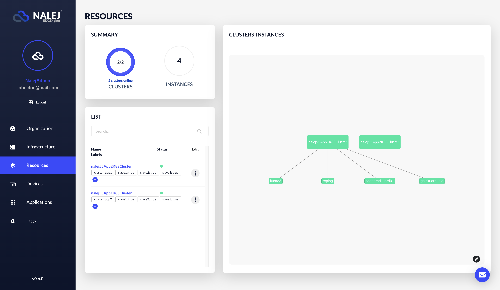

# Application cluster installation

## Previous structure in the system

This installation requires that there is already:

* a Kubernetes cluster available, where the structure for a Nalej application cluster will be installed.
* working connectivity between the Nalej management cluster and this brand new Kubernetes cluster.

The management cluster must know that an application cluster will be installed, and the user must log in the system with a role that allows them to execute the required actions.

Currently the platform supports adding Azure Kubernetes clusters as application clusters.

## Installation of an application cluster

The installation of an application cluster is only available through the API CLI. We encourage you to read the documentation related to it [here](../../cli/resources/appcluster_installation.md).

## Is the cluster running?

Just navigate to the Resources view.

Here, we can see the available application clusters in the system, and our brand new cluster should appear on the list and in the graph. For more information on how to manage this new cluster, please check the [Cluster monitoring](cluster_monitoring.md) section of the documentation.

