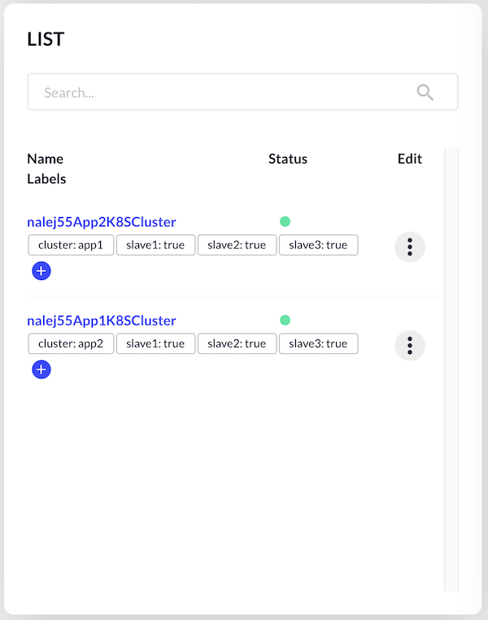
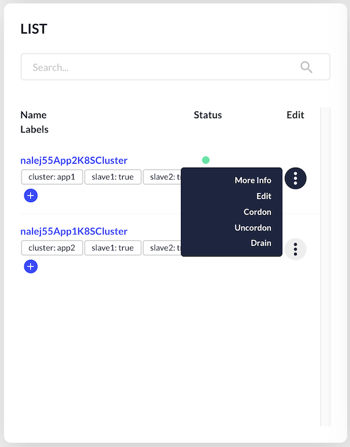
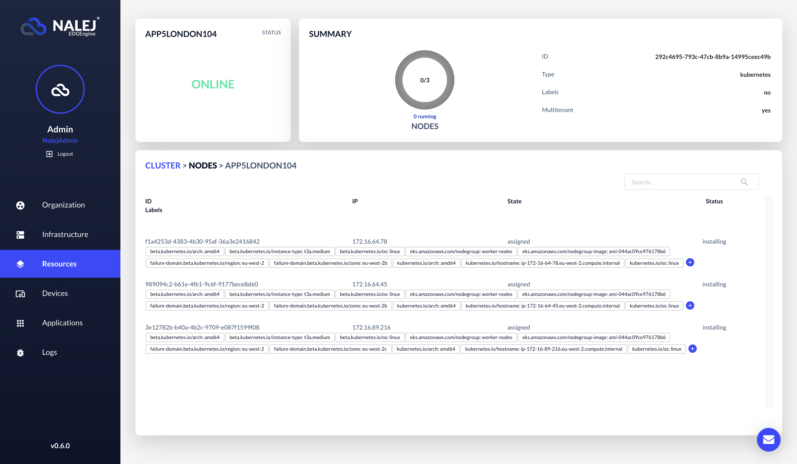

# Cluster monitoring

The application you're deploying will be deployed in a **cluster**. A cluster is a logical group of **nodes**, which are physical devices. When an application is deployed, the cluster will decide if there is a need to deploy it in one or several nodes, and will manage it accordingly.

### Label-related warning

In this document there will be references to **labels** in clusters and nodes. A label is a string that describes the component and helps the system manage them more efficiently.

These labels have internal meaning, and deleting labels from a node or a cluster may produce collateral damage. Also, Kubernetes uses labels for management, so adding new ones could be potentially dangerous too, since we could unknowingly add a label that Kubernetes interprets wrongly.

So, the general rule is: 

!!! warning ""
    **DO NOT touch the labels** unless you really know what you're doing.

## Cluster monitoring

You can display the Resources view by clicking on Resources on the far left column.

The right section displays a **clusters-instances graph**. On the left part of the screen we can see a **Summary card** that shows the number of clusters and instances, and a **List card** that shows a list of available clusters.

Each row of the list refers to a different cluster, with some information about it:

* **Name**.
* Its **status**. Clicking on the compass icon on the lower right corner of the screen will show the user the color code this information follows.
* A list of **labels** associated to each cluster, which we can manage (more on this below in the "[Managing labels](#managing-labels)" section). In the image, this cluster has no labels yet.

In the same list, on the far right, each cluster has an **Edit** button. When clicked, a menu appears, with the options **More Info**, **Edit**, **Cordon**, **Uncordon** and **Drain**.

In this document we will only see the first two options. The other three are related to cluster management, and they are explained in [this document](cluster_management.md). 

When the **Edit** option is clicked, a dialog appears where we can change the name of the cluster.

When we click on the **More info** option, or on the name of a cluster in the list, the view changes, and the information displayed refers to that specific cluster and its nodes.

In the upper part of the screen we can see the **status** of the cluster \(which is "ONLINE" only if all the nodes in it are running, and if not it shows the most serious problem in the clusters\), and a **summary** of the cluster information we saw in the previous list.

In the lower part of the screen we can see another list, this time of nodes. The information displayed is as follows:

* The **node ID**.
* The **IP** associated to it.
* The current **state** of the node.
* Its current **status**.
* The **labels** it has.

## Managing labels

Regarding the **labels** of the clusters and nodes, although adding and/or deleting them is not encouraged, we can do it easily, and the procedure for clusters and nodes is very similar.

At the end of the label list there is a `+` button to **add** new labels.

After clicking on that button, we can see a form where we can enter the name and value of the label, and we can save or discard this new information.

If, however, in the list of labels we click on one or more labels \(thus selecting them\), this `+` button changes its function to **delete**, and its image to one of a bin, so we can delete the selected labels.

As stated above, please handle these features with care.
