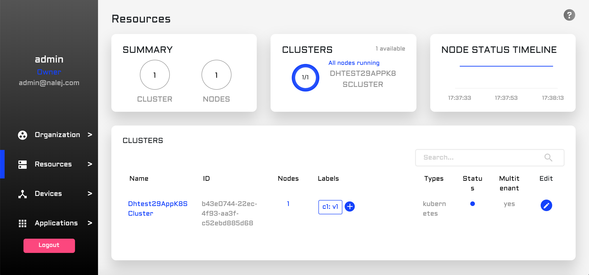
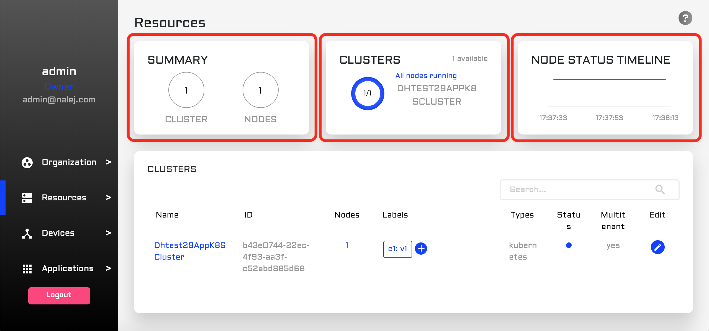
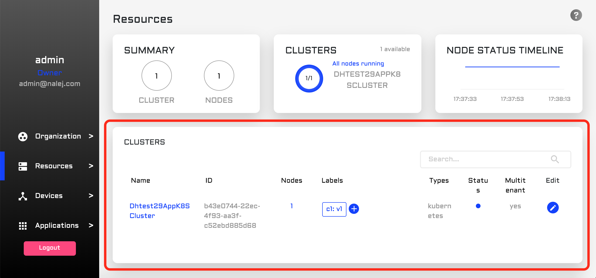
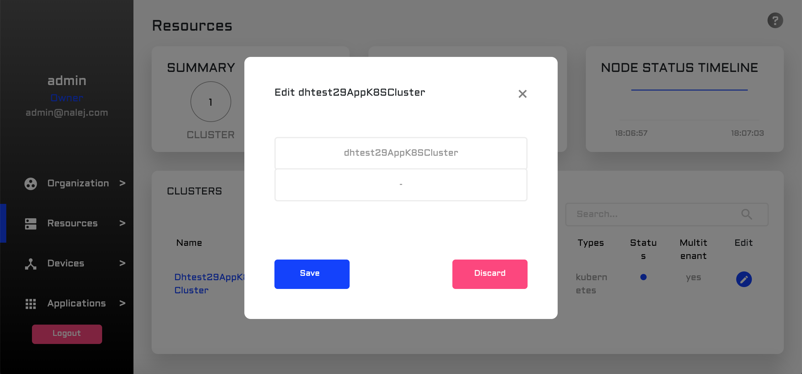
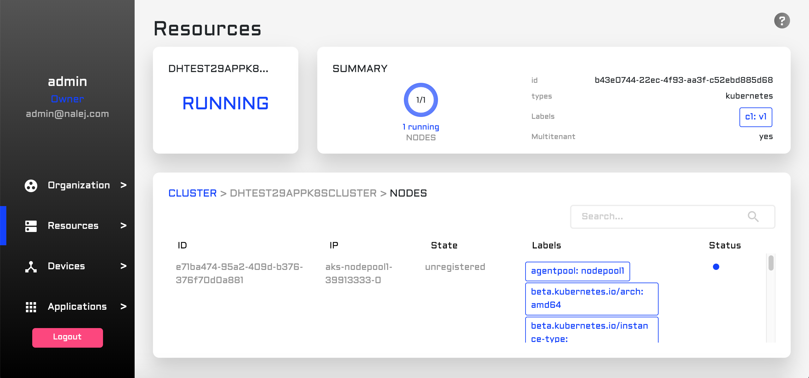
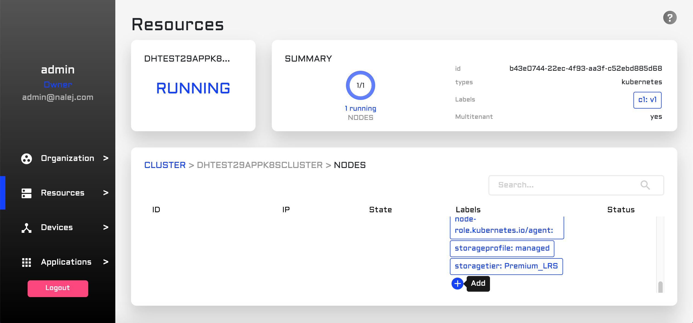
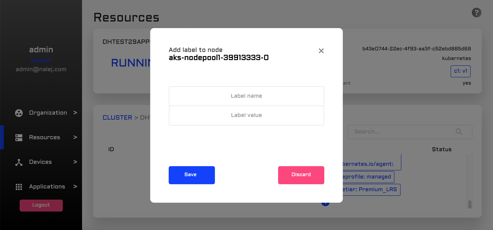
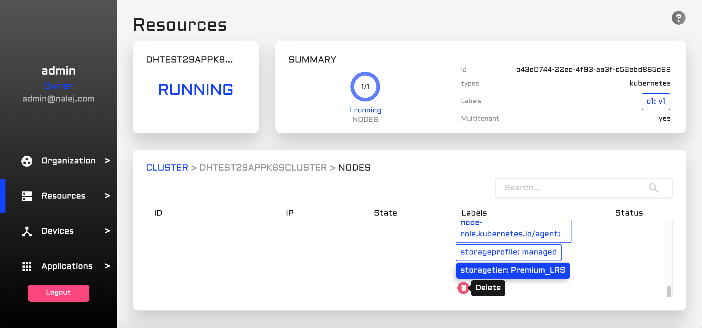

# Clusters and nodes

The application you're deploying will be deployed in a **cluster**. A cluster is a logical group of **nodes**, which are physical devices. When an application is deployed, the cluster will decide if there is a need to deploy it in one or several nodes, and will manage it accordingly.

### *Label-related warning*

*In this document there will be references to **labels** in clusters and nodes. A label is a string that describes the component and helps the system manage them more efficiently.*

*These labels have internal meaning, and deleting labels from a node or a cluster may produce collateral damage. Also, Kubernetes uses labels for management, so adding new ones could be potentially dangerous too, since we could unknowingly add a label that Kubernetes interprets wrongly.* 

*So, the general rule for labels is: DO NOT touch them unless you really know what you're doing.*

## Cluster monitoring

### Web Management Interface

In the web management interface, click on Resources on the left column, so the Resources view is displayed.



In the upper part of the screen we can see:



- **Summary card**: the number of clusters and nodes in the system.
- **Clusters card**: a carousel of charts with information about each cluster and the nodes in it (like how many nodes are running in the cluster).
- **Node status timeline**: a timeline of the status of all the nodes.

The lower section displays a **cluster list**. 



Each row of the list refers to a different cluster, with some information about it:

- its **name**.
- its **identifier**.
- the number of **nodes** it has inside.
- a list of **labels**.
- the **type** of cluster (the system only accepts *kubernetes* by now).
- the **status** of the cluster (it can be *running*, *processing* or *error*).
- [NOT ACTIVE] **multitenant**, a flag to say if the cluster belongs to more than one organization.

In the same list, on the far right, each cluster has an **Edit** button. When clicked, a dialog appears where we can change the name and the labels associated to the cluster.




When we click on the name of the cluster, the view changes, and the information displayed refers to that specific cluster and its nodes.



In the upper part of the screen we can see the **status** of the cluster (which is "RUNNING" only if all the nodes in it are running, and if not it shows the most serious problem in the clusters), and a **summary** of the cluster information we saw in the previous list.

In the lower part of the screen we can see another list, this time of nodes. The information displayed is as follows:

- The **node ID**.
- The **IP** associated to it.
- The current **state** of the node.
- The **labels** it has.
- Its current **status** (again, it can be *running*, *processing* or *error*).

Regarding **labels**, although adding and/or deleting them is not encouraged, there is an easy way of doing it through the web interface. At the end of the label list there is a `+` button to **add** new labels.



After clicking on that button, we can see a form where we can enter the name and value of the label, and we can save or discard this new information.



If, however, in the list of labels we click on one or more labels (selecting them), this `+` button changes its function to **delete**, and its image to one of a bin, so we can delete the selected labels.



As stated above, please handle these features with care.

### Public API CLI

We can also obtain information about our clusters and their nodes through the CLI. For example, a list of clusters can be obtained by executing:

```json
./public-api-cli cluster list
```

This command will return, as usual, a JSON with all the information the system has about the clusters in it:

```json
{
  "clusters": [
    {
      "organization_id": <org_id>,
      "cluster_id": <cluster_id>,
      "name": <cluster_name>,
      "cluster_type_name": "KUBERNETES",
      "multitenant_support": "YES",
      "status_name": "RUNNING",
      "labels": {
        <label1>: <value1>,
        <label2>: <value2>,
        ...
      },
      "total_nodes": <total_num_of_nodes>,
      "running_nodes": <num_of_running_nodes>
    }
	...
  ]
}

```

This information consists of:

- **cluster\_id**, the cluster identifier.
- **name**, the name given to the cluster.
- **cluster_type_name**, the type of cluster it is. Currently, the system only supports Kubernetes clusters.
- **multitenant_support**, a flag to say if the cluster is available for different organizations.
- **status_name**, the status of the cluster. It depends on the status of each node, and it can have the values *running*, *processing* or *error*.
- **labels**, with the labels of the cluster.
- **total\_nodes**, with the number of nodes in the cluster.
- **running_nodes**, with the number of running nodes in the cluster.

Once we know the cluster ID, we can list the nodes belonging to it.

```json
./public-api-cli nodes list --clusterID=<cluster_id>
```

This is the response to the command above:

```json
{
  "nodes": [
    {
      "organization_id": <org_id>,
      "cluster_id": <cluster_id>,
      "node_id": <node_id>,
      "ip": <ip_address>,
      "labels": {
        <label3>: <value3>,
        <label4>: <value4>,
        ...
      },
      "status_name": "RUNNING",
      "state_name": "UNREGISTERED"
    }
  ]
}
```

The new variables are:

- **node_id**, the node identifier.
- **ip**, the IP address of the node.
- **status_name**, the status of this node, which can be *running*, *processing*, or *error*. If one or more nodes have values other than "*running*", the cluster will show the most serious problem in its *status_name* variable.
- **state_name**, the current state of the node regarding its use. The values can be:
  - *UNREGISTERED*: the details of the node are in the platform, but we haven't perfomed any action with them yet.
  - *UNASSIGNED*: the node has been prepared, but has not yet been asigned to a cluster.
  - *ASSIGNED*: the node has been installed and is part of a cluster.


## Cluster installation commands

Currently the platform supports adding Azure Kubernetes clusters as application clusters, which will be used to deploy user applications. The system requires Kubernetes v1.11.5. 

> is the Kubernetes version updated?

To add a new cluster, use the following command.

```bash

./public-api-cli cluster install 
	--kubeConfigPath=<cluster_kube_config_absolute_path> 
	--targetPlatform=AZURE 
	--useCoreDNS=false 
	--ingressHostname=<app-cluster-fqdn>
```

Where:

- **kubeConfigPath**. KubeConfig path for installing an existing cluster. It points to a kubeconfig file with the credentials of the Azure cluster to be added as application cluster. Notice that the kubeconfig file must contain a single entry for the new cluster.
- **targetPlatform**. Indicates the target platform between `minikube`and  `azure` (default `minikube`). It must be set to `azure`.
- **useCoreDNS**. Indicates if CoreDNS is going to be used. If not, kubeDNS will be set (default true). When installing Kubernetes clusters, this flag must be set to `false`.
- **ingressHostname** corresponds with the FQDN of the application cluster.

> Parameters in the CLI Help that we haven't used....
>
> - --clusterID string          Cluster identifier
> - --ipAddressIngress string   Public IP Address assigned to the public ingress service
> - --nodes stringArray         Nodes (for clusters requiring the install of Kubernetes)
> - --useStaticIPAddresses      Use statically assigned IP Addresses for the public facing services      
> - --password string           Password (for clusters requiring the install of Kubernetes)
> - --username string           Username (for clusters requiring the install of Kubernetes)


Once the cluster is installed, you need to create a DNS entry in your domain pointing <app-cluster-fqdn> to the public API given by Azure. 

To obtain that information, use:

 ```BASH
$ kubectl 
--kubeconfig=<cluster_kube_config_absolute_path> 
-nkube-system get service nginx-ingress-controller

NAME TYPE CLUSTER-IP EXTERNAL-IP PORT(S) AGE
	nginx-ingress-controller 
	LoadBalancer 
	10.0.102.7 
	<public-ip> 
	80:32756/TCP, 443:32610/TCP 
	3d

 ```

Notice that Azure may take some time until a public IP is assigned to a load balancer and the external IP may be shown as <pending>. Once the public IP is assigned, create a DNS entry in your zone with

```
<public-ip> *.<app-cluster-fqdn>
```

You can check the result with:

 ```BASH
$ nslookup cluster.<app-cluster-fqdn>
...
Non-authoritative answer:
Name: cluster.<app-cluster-fqdn>
Address: <public-ip>

 ```

