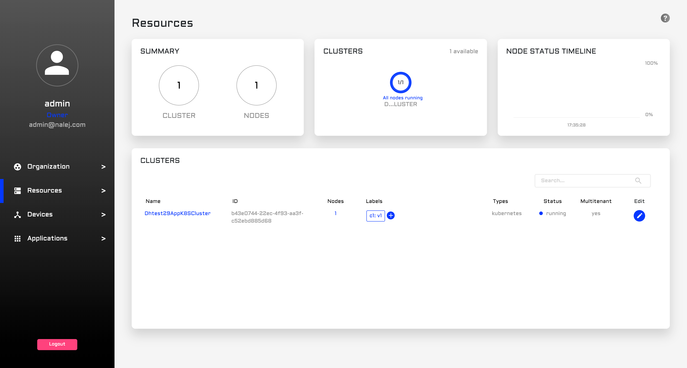
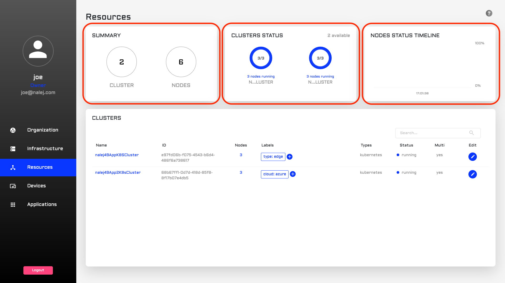
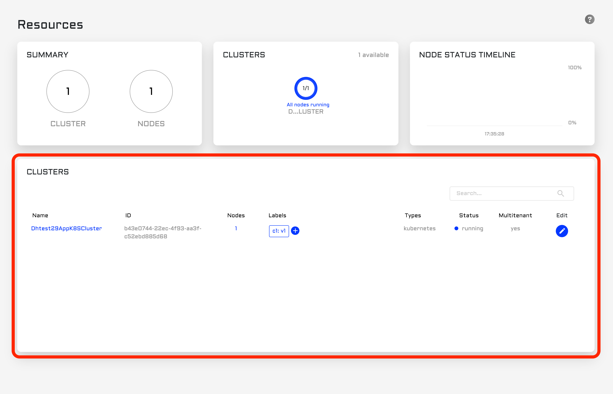
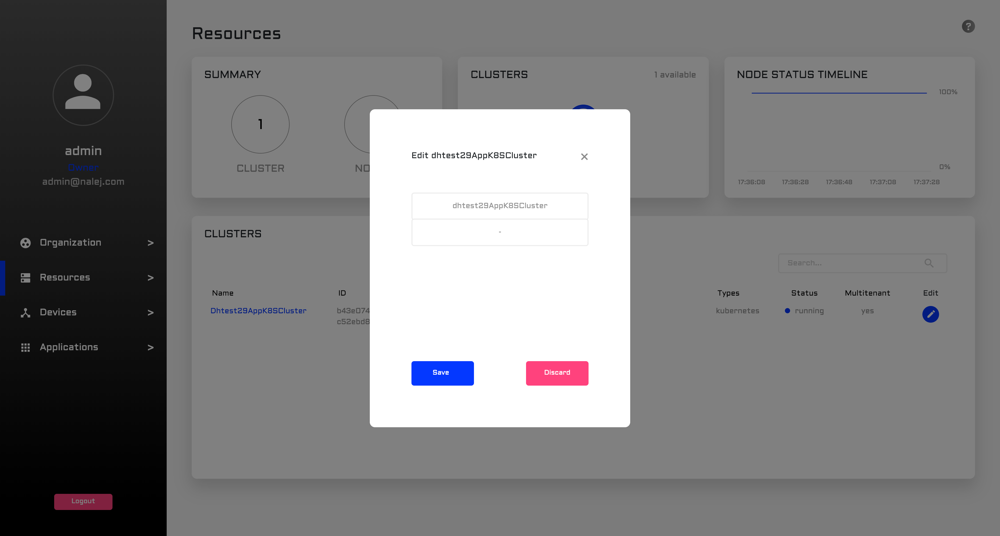
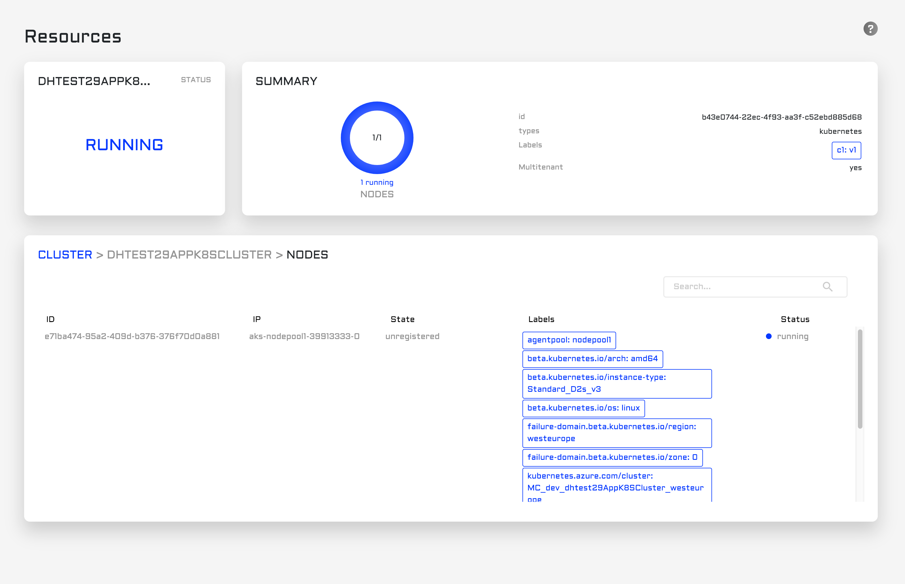
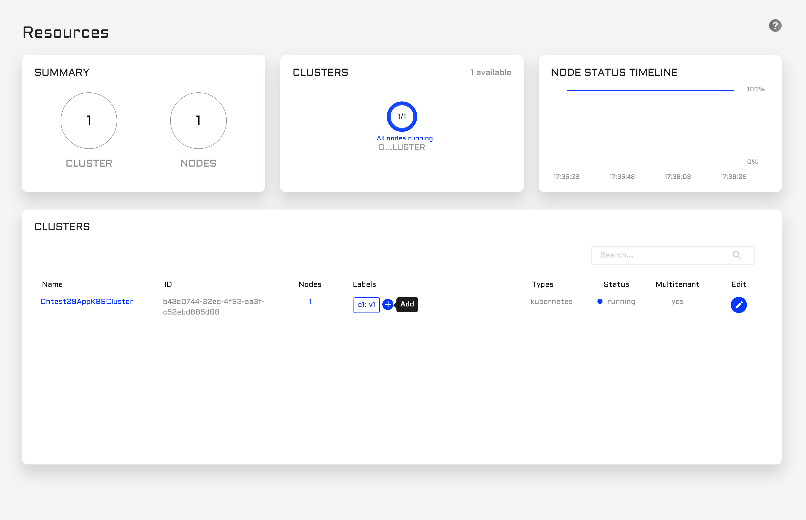
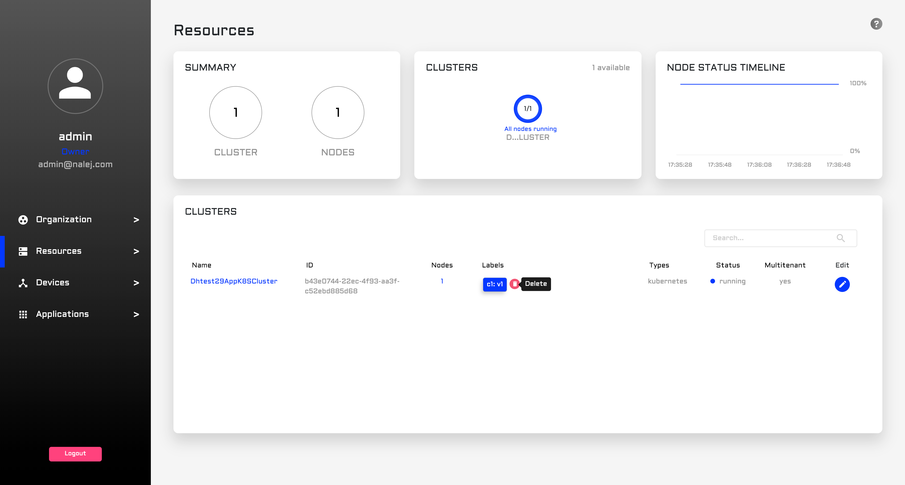

# Cluster monitoring

The application you're deploying will be deployed in a **cluster**. A cluster is a logical group of **nodes**, which are physical devices. When an application is deployed, the cluster will decide if there is a need to deploy it in one or several nodes, and will manage it accordingly.

### _Label-related warning_

_In this document there will be references to **labels** in clusters and nodes. A label is a string that describes the component and helps the system manage them more efficiently._

_These labels have internal meaning, and deleting labels from a node or a cluster may produce collateral damage. Also, Kubernetes uses labels for management, so adding new ones could be potentially dangerous too, since we could unknowingly add a label that Kubernetes interprets wrongly._

_So, the general rule for labels is: DO NOT touch them unless you really know what you're doing._

## Cluster monitoring

### Web Management Interface

In the web management interface, click on Resources on the left column, so the Resources view is displayed.



In the upper part of the screen we can see:



* **Summary card**: the number of clusters and nodes in the system.
* **Clusters card**: a carousel of charts with information about each cluster and the nodes in it \(like how many nodes are running in the cluster\).
* **Node status timeline**: a timeline of the status of all the nodes.

The lower section displays a **cluster list**.



Each row of the list refers to a different cluster, with some information about it:

* its **name**.
* its **identifier**.
* the number of **nodes** it has inside.
* a list of **labels**.
* the **type** of cluster \(the system only accepts _kubernetes_ by now\).
* the **status** of the cluster \(it can be _running_, _processing_ or _error_\).
* \[NOT ACTIVE\] **multitenant**, a flag to say if the cluster belongs to more than one organization.

In the same list, on the far right, each cluster has an **Edit** button. When clicked, a dialog appears where we can change the name and the labels associated to the cluster.



When we click on the name of the cluster, the view changes, and the information displayed refers to that specific cluster and its nodes.



In the upper part of the screen we can see the **status** of the cluster \(which is "RUNNING" only if all the nodes in it are running, and if not it shows the most serious problem in the clusters\), and a **summary** of the cluster information we saw in the previous list.

In the lower part of the screen we can see another list, this time of nodes. The information displayed is as follows:

* The **node ID**.
* The **IP** associated to it.
* The current **state** of the node.
* The **labels** it has.
* Its current **status** \(again, it can be _running_, _processing_ or _error_\).

Regarding **labels**, although adding and/or deleting them is not encouraged, there is an easy way of doing it through the web interface. At the end of the label list there is a `+` button to **add** new labels.



After clicking on that button, we can see a form where we can enter the name and value of the label, and we can save or discard this new information.

If, however, in the list of labels we click on one or more labels \(selecting them\), this `+` button changes its function to **delete**, and its image to one of a bin, so we can delete the selected labels.



As stated above, please handle these features with care.

### Public API CLI

_The CLI responses are shown in text format, which can be obtained adding_ `--output="text"` _to the user options. If you need the responses in JSON format, you can get them by adding_ `--output="json"` _at the end of your requests, or as a user option._

We can also obtain information about our clusters and their nodes through the CLI. For example, a list of clusters can be obtained by executing:

```javascript
./public-api-cli cluster list
```

This command will return, as usual, a table with some of the information the system has about the clusters in it:

```javascript
NAME                   ID                  NODES   
<cluster_name_1>       <cluster_id_1>     <total_num_nodes>
<cluster_name_2>       <cluster_id_2>     <total_num_nodes>
<cluster_name_3>       <cluster_id_3>     <total_num_nodes>

LABELS                                        STATUS
<label11>:<value11>,<label12>:<value12>        RUNNING
<label13>:<value13>,<label14>:<value14>        RUNNING
<label15>:<value15>,<label15>:<value15>        RUNNING
```

This information consists of:

* **NAME**, the name given to the cluster.
* **ID**, the cluster identifier.
* **NODES**, the number of nodes in the cluster.
* **LABELS**, the labels of the cluster.
* **STATUS**, the status of the cluster. It depends on the status of each node, and it can have the values _running_, _processing_ or _error_.

Once we know the cluster ID, we can list the nodes belonging to it.

```javascript
./public-api-cli nodes list --clusterID=<cluster_id>
```

This is the response to the command above:

```javascript
ID                    IP                    STATE      
<node_id_1>          <ip_address>        ASSIGNED
<node_id_2>          <ip_address>        ASSIGNED
<node_id_3>          <ip_address>        ASSIGNED

LABELS                                          STATUS
<label3>:<value3>,<label4>:<value4>,...        RUNNING
<label5>:<value5>,<label6>:<value6>,...        RUNNING
<label7>:<value7>,<label8>:<value8>,...        RUNNING
```

The new variables are:

* **ID**, the node identifier.
* **IP**, the IP address of the node.
* **STATE**, the current state of the node regarding its use. The values can be:
  * _UNREGISTERED_: the details of the node are in the platform, but we haven't perfomed any action with them yet.
  * _UNASSIGNED_: the node has been prepared, but has not yet been asigned to a cluster.
  * _ASSIGNED_: the node has been installed and is part of a cluster.
* **LABELS**: the labels of the node.
* **STATUS**, the status of this node, which can be _running_, _processing_, or _error_. If one or more nodes have values other than "_running_", the cluster will show the most serious problem in its _status\_name_ variable.

