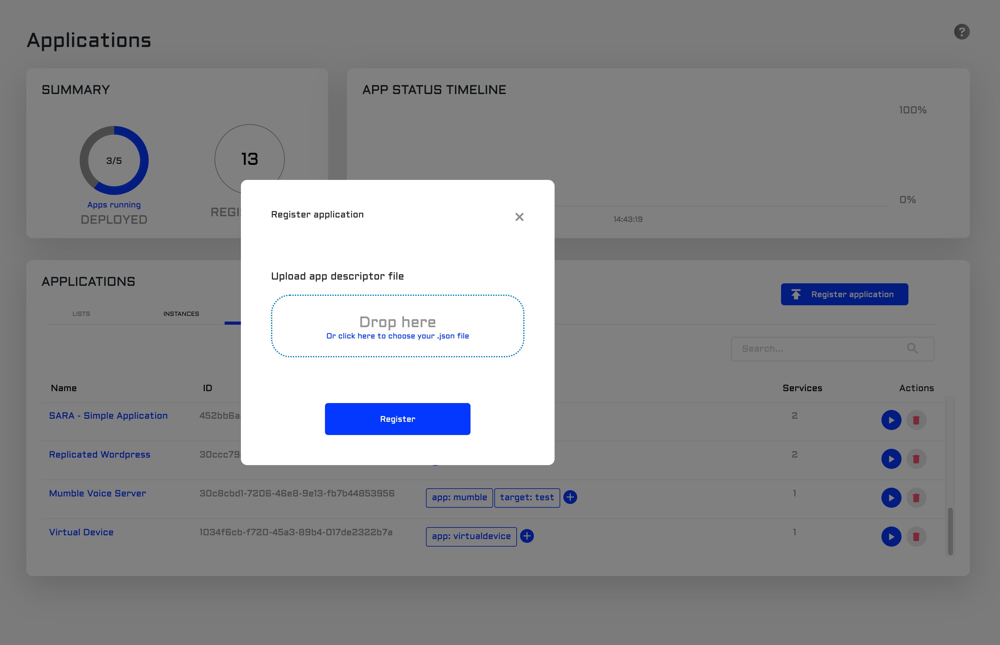
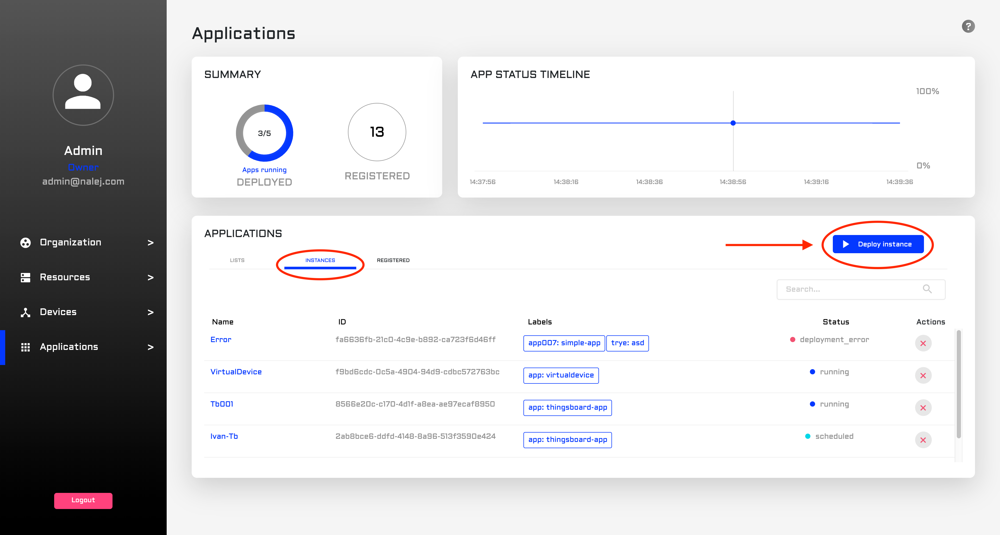
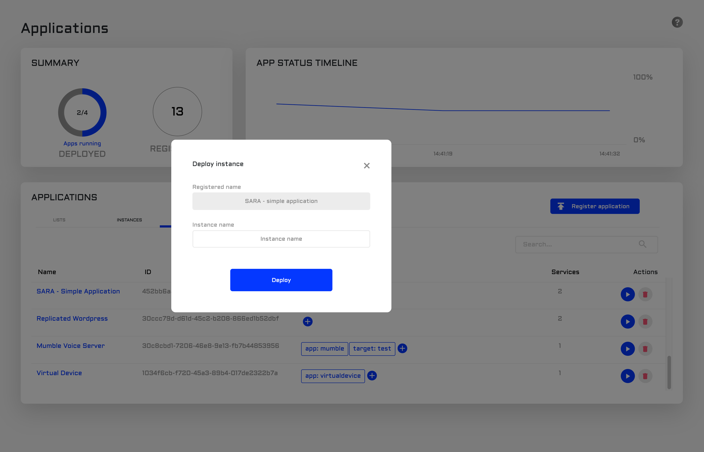
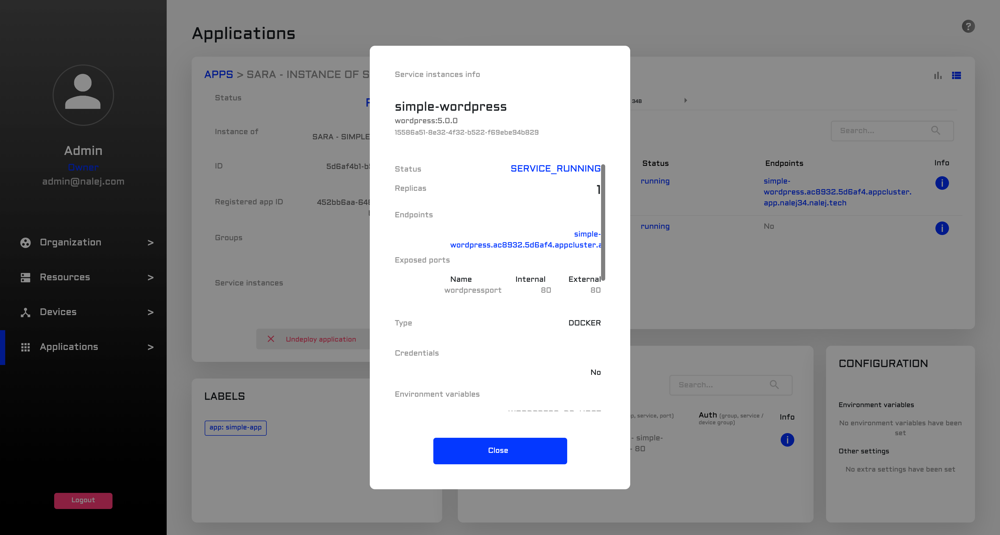
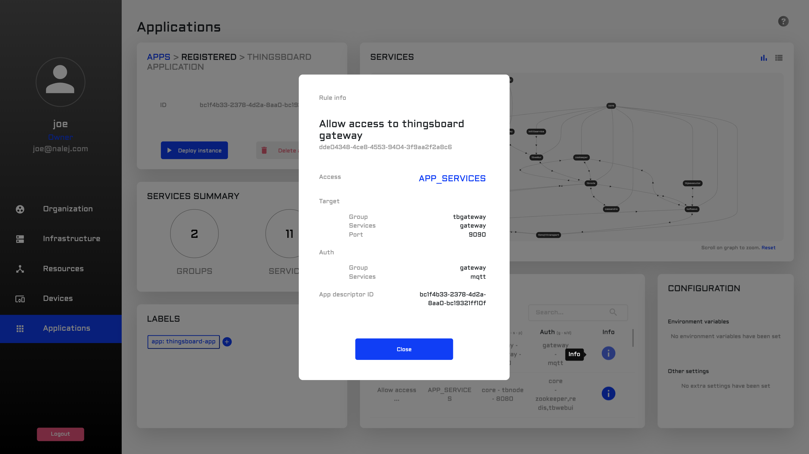
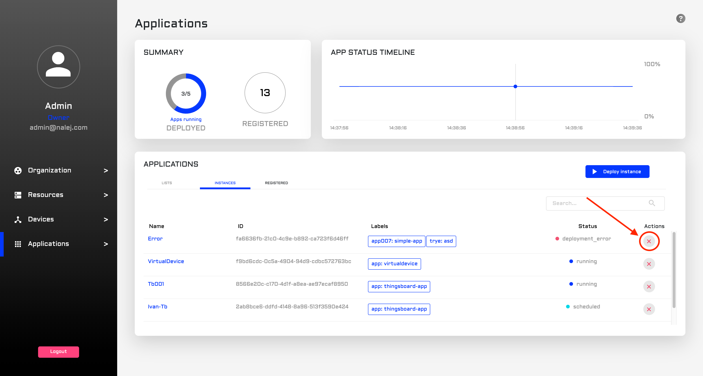
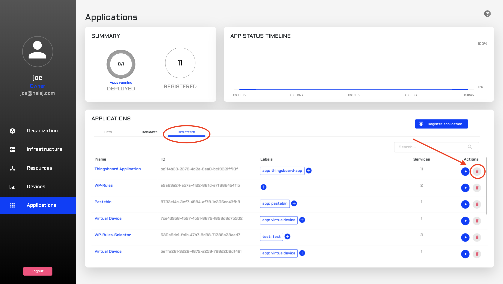

# Application Deployment

So, you just got Nalej and are itching to start working with it, but don't know where to start. No worries! This document will walk you through the process of deploying your very first application with Nalej.

### Environment setup

For this tutorial we are assuming that there is at least one deployed cluster, and that you are already registered in the system. Also, to use Nalej through the command-line interface you need to install the `public-api-cli` package that was sent to you by an administrator. This is what will allow us to interact with the system.

#### Setting your user options

Is this the very first time you log in the platform? There are some variables that are needed for each interaction, so establishing them before starting means we won't have to write them down in each request. These variables, or options, are the **certificate** you received, and the addresses of the **Nalej login server** and the **Nalej API server**. Gather all this data, go to the `public-api-cli/bin` folder in your computer and execute the following instructions:

```bash
./public-api-cli options set --key=cacert --value=/Users/youruser/.../certificate.crt

./public-api-cli options set --key=loginAddress --value=login.server.nalej.com

./public-api-cli options set --key=nalejAddress --value=api.server.nalej.com
```

To check if these commands have executed correctly and the options are in fact set, you can use the command:

```bash
./public-api-cli options list
```

Right now, the responses to the CLI commands will be JSON-formatted documents. If you want to see them in a format that's easier to read, you should add this other option:

```bash
./public-api-cli options set 
    --key=output 
    --value=text
```

This will return the responses in a more human-readable format. If, however, you happen to need the response of a specific command in a JSON document, just adding --output="JSON" will override this for that command.

### Login

Now you can log in with only your email and password:

```bash
./public-api-cli login 
    --email=user@nalej.com 
    --password=password
```

This command will exit successfully if you receive a response with your session info, like this one:

```javascript
EMAIL     ROLE           ORG_ID      EXPIRES
<email>   <role_name>   <org_id>    <session_expiration_date>
```

Congratulations! You're in the system. Now, the first thing you should do is create your own application descriptor. Then, you have to add it to the system, and after that the app will be deployed in what we call an instance. Let's go through this process.


### Creating an application descriptor

An **application descriptor** is a file with all the essential info to deploy a complex app on Nalej. A very basic application descriptor would look like this:

```javascript
{
  "name": "Sample application",
  "labels": {
    "app": "simple-app"
  },
  "rules": [
    {
      "rule_id": "001",
      "name": "allow access to wordpress",
      "target_service_group_name": "g1",
      "target_service_name": "2",
      "target_port": 80,
      "access": 2
    }
  ],
  "groups": [
    {
      "name": "g1",
      "services": [
        {
          "name": "simple-mysql",
          "image": "mysql:5.6",
          "specs": {
            "replicas": 1
          },
          "configs": [
        {
          "config_file_id": "1",
          "content": "SG9sYQo=",
          "mount_path": "/config/saludo.conf"
        },
        {
          "config_file_id": "2",
          "content": "QWRpb3MK",
          "mount_path": "/config/despedida.conf"
        }
      ],
          "storage": [
            {
              "size": 104857600,
              "mount_path": "/tmp"
            }
          ],
          "exposed_ports": [
            {
              "name": "mysqlport",
              "internal_port": <port>,
              "exposed_port": <port>
            }
          ],
          "environment_variables": {
            "MYSQL_ROOT_PASSWORD": <password>
          },
          "labels": {
            "app": "simple-mysql",
            "component": "simple-app"
          }
        },
        {
          "name": "simple-wordpress",
          "image": "wordpress:5.0.0",
          "specs": {
            "replicas": 1
          },
          "storage": [
            {
              "size": 104857600,
              "mount_path": "/tmp"
            }
          ],
          "exposed_ports": [
            {
              "name": "wordpressport",
              "internal_port": 80,
              "exposed_port": 80,
              "endpoints": [
                {
                  "type": 2,
                  "path": "/"
                }
              ]
            }
          ],
          "environment_variables": {
            "WORDPRESS_DB_HOST": <db_host:port>,
            "WORDPRESS_DB_PASSWORD": <password>
          },
          "labels": {
            "app": "simple-wordpress",
            "component": "simple-app"
          },
          "deploy_after": [
            "1"
          ]
        }
      ],
      "specs": {
        "replicas": 1
      }
    }
  ]
}
```

This example is the output of the following command:

```bash
./public-api-cli app desc help > appDescExample.json
```

It creates a basic application descriptor for you \(called `appDescExample.json`in this case\), with a Wordpress instance and a mySQL database associated to it. To learn more about them, please visit [this link](../applications/app_descriptors.md), where you can find an extensive tutorial on how to make your own.

### Adding the application descriptor to the system

#### Public API CLI

After creating the application descriptor, the next step is adding it to the system, which can be done with the following command:

```bash
./public-api-cli app desc add /pathtodescriptor
```

It returns a table like this:

```javascript
DESCRIPTOR                  ID          LABELS
SARA - simple application   <desc_id>   <label:value>

NAME                      IMAGE            LABELS
[Group] application        ===
simple-mysql            <serv1_img>      <l1:v1>,<l2:v2>
simple-wordpress        <serv2_img>      <l3:v3>,<l4:v4>
```

with an application **descriptor ID** inside, which we will need for deploying an instance of this application.

#### Web Interface

So, the descriptor is ready and you are already in the Application view of the web interface. Where to go from here? Great question!


In the Application view, we can see the already deployed applications in the lower part of the screen, in the Applications list. There, we need to click on the **Registered** tab, and then we can see the **Register application** button. Please click on it.



What we can see now is a special dialog where we can upload our application descriptor, so the application gets registered in the system. We can click on it to search the file in our file system, or we can just drag it and drop it in the designed area. After that, just clicking on the **Register** button will register the application in the system.

### Deploying the associated instance

And how would we deploy that instance? With this other command:

```bash
./public-api-cli app inst deploy 
    <desc_id>
    "<inst_name>"
```

Here, as you may have noticed, is also the moment where we name the app with a human-readable name. When this command exits, it returns a JSON with an application **instance** ID, which is what we will use to work with the deployed instance.

The response to this command will look like this:

```javascript
REQUEST        ID          STATUS
<request_id>   <inst_id>   QUEUED
```

Which contains the **request\_id** for the request we just did, the **instance\_id** of the instance we are trying to deploy, and the current **status** of the instance, which in the moment after executing the command is **QUEUED** for deployment.

#### Web Interface

Now that the application is registered \(and thus appears in the list at the **Registered** tab\), we can deploy an instance of it! There are two ways to access the deploying dialog, so let's see both.


One of the ways to do that is by clicking the blue _play_ button in the **Actions** column of the **Registered** tab.



The other way is to go from the **Registered** tab to the **Instances** tab. To deploy our application we only need to click on the **Deploy instance** button on the right part of the screen.

With both actions we arrive to the same dialog, which looks like this:



Here we need to write the name of the instance and choose the application we want an instance of \(if we clicked on the "deploy" button in the **Registered** list, the instance is already established, and we only have to write the name of the instance\). Then, the instance will appear in the list under the **Instances** tab.

### Working with the deployed instance: getting related info

#### Public API CLI

Now we can start working with the deployed instance, doing things like, for example, getting all the information related to it in the system.

```bash
./public-api-cli app inst get --instanceID=XXXXXXXXXX
```

This command responds with some information related to the instance we are checking, which looks like this:

```javascript
NAME                        REPLICAS          STATUS            
[Group] application        <num_replicas>    SERVICE_RUNNING   
<service_1>                <num_replicas>    SERVICE_RUNNING
<service_2>                <num_replicas>    SERVICE_RUNNING   

ENDPOINTS
"xxxx.xxxxx.appcluster.<yourcluster>.com"

simple-"xxxx.xxxxx.appcluster.<yourcluster>.com"
```

Here you can see several interesting things, like the user and password for the admin in this instance of MySQL, but one of the most important parameters is:

```bash
STATUS
SERVICE_RUNNING
```

Where it tells you the status of the current instance. Since it is "SERVICE\_RUNNING", we can start working with it immediately!

#### Web Interface

We can see the status of an instance directly in the **Instances** tab, in the colored button in the **Status** column of the list. We can also click on the instance to see all the information related to that specific instance. This takes us to a new view:


This view has several sections:

* First, we have the **summary** \(upper-left part of the screen\). This part will tell us the status of the instance, its application of origin, its ID, the service groups it has, and the service instances it has deployed. We have an **Undeploy application** button to undeploy the instance directly from here \(we will talk about this later in this document\).
* Then we have the **services** section. First we can see a diagram that shows us the relationship between the services in the instance, where we can zoom in in case it's necessary \(the color of each service depends on its status\). On the upper left part of this section we have the two perspectives we can toggle between. The other perspective is a text view with all the info about the service instances related to this application instance \(there is a tab with all the services, and then there is a tab for each service group\).
  * For each service we can see the number of **replicas** that are deployed, the general **status** of the service, the **endpoints** it has, and more info.
  * When we click on the **Info** button we open a dialog where we can see even more information, like the environment variables, the labels assigned to the service or the cluster it's deployed in. 



* Under the summary we have the **Tags** section, where we can see the tags associated to this app instance.
* Beside it, there's the **Rules** section, where the rules for the different service groups in the application are displayed. We can click on any of them and the full disclosure of the rule will appear.



* And finally, in the lower right corner of the screen, we can see the **Configuration** section, where we can find the environment variables and other settings.

### Navigating to the endpoint

The JSON obtained with `app inst get` has another piece of information that can be very useful for us, which is the **endpoints** where the instance is deployed. This information looks like this:

```javascript
ENDPOINTS
"xxxx.xxxxx.appcluster.<yourcluster>.com"

simple-"xxxx.xxxxx.appcluster.<yourcluster>.com"
```

This collection of addresses is where the instance is deployed, and you can access it from any browser and get more information about the instance and the services it uses.

### Getting logs from the instance

Once the application is running, it's generating logs and storing them in the system. To access these logs, we can use:

```bash
./public-api-cli log search --instanceID=xxxx > appLogs.json
```

This will return a \(most likely\) very long response, with the following format:

```javascript
TIMESTAMP           MSG
<msg_timestamp>        <logged_info>
```

Where each **entry** has a **timestamp** and a **msg** with the logged info related to the instance, which is completely dependant on the application that generates the log. Typically, the logged info contains the **log\_level**, which can be useful to differentiate an informative log from an error one. Please check the log message format of the application you're consulting before diving in this file.

### Undeploying the instance

#### Public API CLI

OK, so we finished working with this instance, and don't want it to be in the system anymore. In this case, we need to undeploy it:

```bash
./public-api-cli app inst undeploy --instanceID=xxxx
```

That may be all the cleanup needed if this application is something we will use again in the system, since we can deploy it again tomorrow with the same application descriptor.

This, if executed successfully, will return an acknowledgment:

```javascript
RESULT
OK
```

#### Web Interface

To undeploy an instance we just have to hit the red X in the **Actions** column in the far right of the Application instances list. This will delete the instance from this list, which will mean that it's no longer in the system.



### Deleting the app

This last step is optional, only needed if we want to delete a specific app from the system, and doesn't need to be done every time we undeploy an instance.

Also, the system won't let you delete an application while it has deployed instances of it in the system, so first we need to undeploy all the instances first and then delete the application from the system.

#### Public API CLI

But what if we just don't want the application to be available again? In that case, we need to delete the application from the system, undoing the `add` we executed before:

```bash
./public-api-cli app desc delete  --descriptorID=xxxxx
```

This, if executed successfully, will return an acknowledgment:

```javascript
RESULT
OK
```

#### Web Interface

To delete the application from the system, thus avoiding the generation of instances from it in the future, we just need to go to the **Registered** tab in the Application list, and look for the application. Then, we need to click the red bin under the **Actions** column.



## Troubleshooting

### Invalid credentials

_I tried to log in and there is a fatal error saying_ `Invalid credentials`, _what is going on?_

The email or password you entered is wrong, or you are simply not in the system yet. Double-check the email and password you entered, and if you are sure that they are correct, then talk to an administrator to see if you're already registered.

### Error loading CA certificate

_Ok, I got the credentials right, but now there is another error saying_ `Error loading CA certificate`. _Does the system hate me?_

No, it doesn't \(remember, it doesn't know you exist, since you're not logged in yet\). The problem now is that it can't find the certificate. The most common reason for this is that the path is incorrect.

### Unable to login into the platform

_I finally got the credentials and the certificate right, and there's a new error:_ `unable to login into the platform`. _What is happening now?_

There's a problem with the server address. Is it correctly written?

### Cannot load application descriptor

_I got in the system! But now there's something wrong with the application descriptor. The message is_ `cannot load application descriptor`. _What can it possibly mean?_

It can mean that the path to the application descriptor is not right. It can also mean that the application descriptor you're trying to use is empty. Check both possibilities, just in case.

### Cannot add a new application descriptor

_Now there's another error related to the application descriptor. The message now is_ `cannot add a new application descriptor`. _I'm sure about the path and the file has something in it, so it should work, right?_

Not necessarily. The format of the application descriptor must be correct. If there's something essential missing \(like the name of the appilcation to deploy, for example\), it won't work. Compare your application descriptor with the one shown above as an example, and check if there is something missing.

### Cannot deploy application

_I got the descriptorID! But when I try to deploy an instance of the app, there's a message that says:_ `cannot deploy application`. _Please tell me the truth, does the system hate me?_

I seriously doubt so \(but we will check its feelings matrix, just in case\). The problem may have appeared because the descriptorID is not correct. Copy and paste it exactly as it is returned from the `app desc add` command.

### Error 404 when trying to access the endpoint

_Everything went ok, and I fixed all the problems that have appeared until now. But as I was ready to access the endpoint, a_ `404 Not Found` _hit me from out of nowhere. I'm determined to do this. What's happening now?_

There are several variables that can be the issue here, but I'm sure you have already checked any connectivity problems that may be happening. If everything seems fine and it should be working, please get the instance info again with `app inst get` and check if the status is still `"RUNNING"`.

