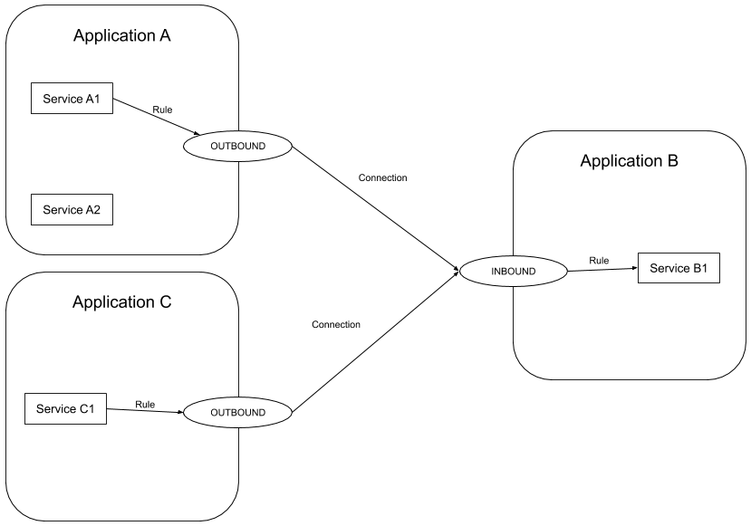
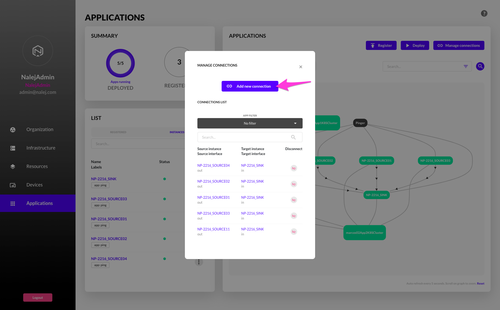
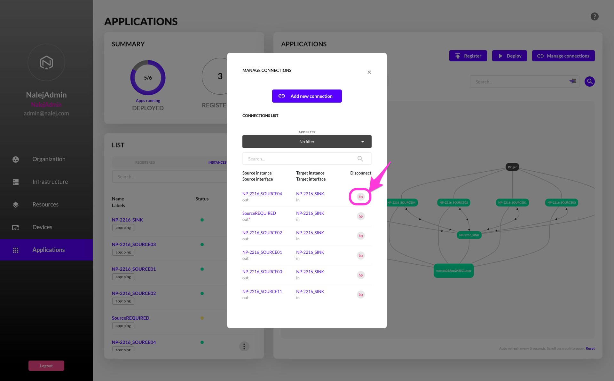

# Application Networking

The Nalej platform allows the user to create point-to-point secure connections between deployed applications. If you want to connect applications, this is your section.

## How this works



To create a private connection between service applications, the Nalej platform provides the Application Network solution. With this, you can establish point-to-point secure connections between services dynamically. Let's introduce the important terms to ramp up:

* Outbound network interface: A way to connect your application to another service. Think about it as a USB socket connected to the application.
* Inbound network interface: A way to allow your application to accept connections from other applications. Think of it as a USB hub connected to the application.
* Connection: The link between the outbound and the inbound network interfaces. Think about it as a USB wire that you use to connect an outbound interface to an inbound interface.

Even if the connections can go on both directions, the concept of the application network is that the requests go from outbound to inbound.

Imagine that you want to connect multiple Wordpress servers to the same database, multiple Java applications to the same Redis cluster, or multiple IoT sensors to a data lake. You could also create a service mesh using outbounds and inbounds on all your applications. Imagine that you want to create a service discovery through all your clusters using Consul or any other tool. You could connect all your services using this feature through a secure and reliable network managed by Nalej.

## Know how

### Show network interfaces

#### Public API CLI

You can list all the available \(connectable\) network interfaces through the CLI. Just use the commands `appnet outbound available` or `appnet inbound available` to get a list of all the available outbound or inbound interfaces in your organisation.

```bash
./public-api-cli appnet outbound available
```

Will show something like this:

```bash
INSTANCE_ID                            INSTANCE_NAME    OUTBOUND_NAME
eb945169-448e-4c4b-8f74-2f43c5fdca87   EXAMPLE_SOURCE   out_iface
```

```bash
./public-api-cli appnet inbound available
```

Will show something like this:

```bash
INSTANCE_ID                            INSTANCE_NAME   INBOUND_NAME
eb945169-448e-4c4b-8f74-2f43c5fdca87   EXAMPLE_SINK    in_iface
```

### Show connections

#### Public API CLI

To list the connections of an organisation, invoke the CLI with the command `appnet list`.

```bash
./public-api-cli appnet list
```

It will show something like this:

```bash
SOURCE_INSTANCE_ID                     SOURCE_INSTANCE_NAME   OUTBOUND   TARGET_INSTANCE_ID                     TARGET_INSTANCE_NAME   INBOUND   STATUS
058d0a7c-4b92-4c9d-9dbe-83c5c60c7bb1   NP-2216_SOURCE04       out        eb945169-448e-4c4b-8f74-2f43c5fdca87   NP-2216_SINK           in        ESTABLISHED
7cf8da85-4bc0-499e-bfb5-2c9f9b332f5a   NP-2216_SOURCE02       out        eb945169-448e-4c4b-8f74-2f43c5fdca87   NP-2216_SINK           in        ESTABLISHED
b3ded11e-ab1d-48d9-b74e-9592fa4adcca   NP-2216_SOURCE01       out        eb945169-448e-4c4b-8f74-2f43c5fdca87   NP-2216_SINK           in        ESTABLISHED
b778f3f1-542d-4f94-91d6-a8724b022e63   NP-2216_SOURCE03       out        eb945169-448e-4c4b-8f74-2f43c5fdca87   NP-2216_SINK           in        ESTABLISHED
f9849ded-23c6-44be-ab32-75b65b47d86f   NP-2216_SOURCE11       out        eb945169-448e-4c4b-8f74-2f43c5fdca87   NP-2216_SINK           in        WAITING
```

The possible statuses are:

* WAITING: The connection is waiting for all the components to connect to the private network.
* ESTABLISHED: All the components are connected and the network is ready to transmit.
* TERMINATED: When an application is being undeployed for any reason, this status will raise before deleting the connection.
* ERROR: If something failed when establishing the connection and the failure cannot be reversed or retry to connect.

#### Web interface

When you open the Applications view, the deployment graph will show the active connections as arrowed lines between applications.


If you click on the **Manage connections** button, it will show the **Manage connections** modal window.


The list will show all the connections. If the source interface name shows an asterisk `*`, that means that the outbound interface is marked as **required**.

### Create a new connection between applications

Some rules must be observed when creating a connection:

* A connection can only be created between an outbound net interface and an inbound net interface.
* An application instance can not be connected to itself.
* One outbound net interface can only be connected to one, and only one, inbound net interface.
* One inbound net interface can be attached to multiple outbound net interfaces.
* The target port listed in the rule that describes the interface will be the port opened for the connection.

#### Public API CLI

To create a new connection, you must invoke the CLI with the command `appnet add`. You will need to specify the following parameters:

* **source\_instance\_id**: The id of the source application instance, the one that describes the outbound interface.
* **outbound\_iface\_name**: The name of the outbound network interface that belongs to the source instance.
* **target\_instance\_id**: The id of the target application instance, the one that describes the inbound interface.
* **inbound\_iface\_name**: The name of the inbound network interface that belongs to the target instance.

```bash
./public-api-cli appnet add
    <source_instance_id>
    <outbound_iface_name>
    <target_instance_id>
    <inbound_iface_name>
```

Be aware that the request is asynchronous. The platform will answer with a `RESULT OK` message if the request was accepted and it will do its best to create the connection as soon as possible. Run the command `appnet list` to follow the connection status.

#### Web interface



On the **Manage connections** window, click on the **Add new connection** button to open the **Add new connection** dialog.


Here you can define the source instance, the outbound interface name, the target instance, and the inbound interface name. Then just click on the button **Add new connection** to send an asynchronous message to the platform to create the connection.

When the connection is established, the main graph will show the connection with an arrowed edge between the instances.

### Remove a connection

#### Public API CLI

To remove a connection, you must invoke the CLI with the command `appnet remove`. You will need to specify the following parameters:

* **source\_instance\_id**: The id of the source application instance, the one that describes the outbound interface.
* **outbound\_iface\_name**: The name of the outbound network interface that belongs to the source instance.
* **target\_instance\_id**: The id of the target application instance, the one that describes the inbound interface.
* **inbound\_iface\_name**: The name of the inbound network interface that belongs to the target instance.

```bash
./public-api-cli appnet remove
    <source_instance_id>
    <outbound_iface_name>
    <target_instance_id>
    <inbound_iface_name>
```

Be aware that the request is asynchronous. The platform will answer with a `RESULT OK` message if the request was accepted and it will do its best to remove the connection as soon as possible. Run the command `appnet list` to follow the connection status. If the outbound interface of the connection is marked as **required**, you will need to use the `--force` flag to remove it. Be aware that the connection was marked as required for some reason.

#### Web interface



On the **Manage connections** window, click on the **Disconnect** button to remove that connection. The platform will show a confirmation popup to avoid accidental remotions.

