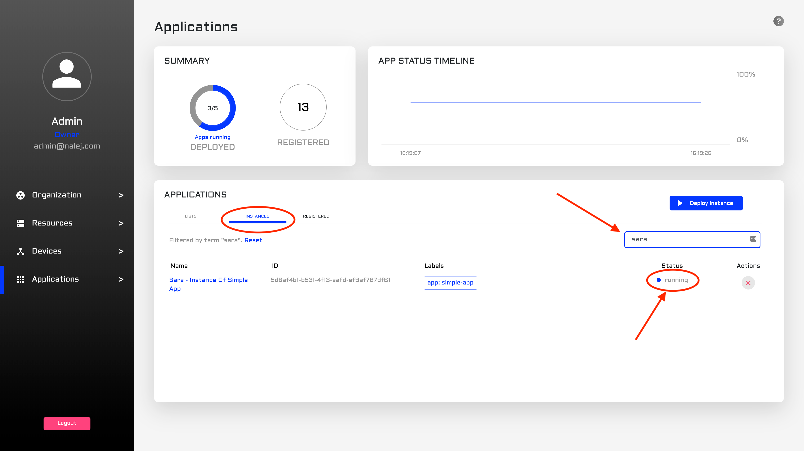

# Docker Compose application

You have Nalej as your system, but there are some apps that you have in Docker Compose and don't know how to deploy in Nalej. No worries! It's easier than it seems.

## The App Descriptor

The first thing that needs to be tackled is the app descriptor, which is what you need to include the app in the system.

[Do you remember how to create your own app descriptor?](../applications/app_descriptors.md) I'm sure you do. I'm also sure you still have nightmares from trying to get the correct structure for your application. The thing is, just by modifying and adding a couple of sections your descriptor will be good to go.

So, your app descriptor for a normal app would be something like this:

```javascript
{
  "name": "Sample application",
  "labels": {
    "app": "simple-app"
  },
  "rules": [
    {
      "name": "allow access to wordpress",
      "target_service_group_name": "g1",
      "target_service_name": "2",
      "target_port": 80,
      "access": 2
    }
  ],
  "groups": [
    {
      "name": "g1",
      "services": [
        {
          "name": "simple-mysql",
          "image": "mysql:5.6",
          "specs": {
            "replicas": 1
          },
          "configs": [
        {
          "config_file_name": "saludo",
          "content": "SG9sYQo=",
          "mount_path": "/config/saludo.conf"
        },
        {
          "config_file_name": "despedida",
          "content": "QWRpb3MK",
          "mount_path": "/config/despedida.conf"
        }
      ],
          "storage": [
            {
              "size": 104857600,
              "mount_path": "/tmp"
            }
          ],
          "exposed_ports": [
            {
              "name": "mysqlport",
              "internal_port": 3316,
              "exposed_port": 3316
            }
          ],
          "environment_variables": {
            "MYSQL_ROOT_PASSWORD": "pass"
          },
          "labels": {
            "app": "simple-mysql",
            "component": "simple-app"
          }
        },
        {
          "name": "simple-wordpress",
          "image": "wordpress:5.0.0",
          "specs": {
            "replicas": 1
          },
          "storage": [
            {
              "size": 104857600,
              "mount_path": "/tmp"
            }
          ],
          "exposed_ports": [
            {
              "name": "wordpressport",
              "internal_port": 80,
              "exposed_port": 80,
              "endpoints": [
                {
                  "type": 2,
                  "path": "/"
                }
              ]
            }
          ],
          "environment_variables": {
            "WORDPRESS_DB_HOST": "SIMPLE-MYSQL:3316",
            "WORDPRESS_DB_PASSWORD": "pass"
          },
          "labels": {
            "app": "simple-wordpress",
            "component": "simple-app"
          },
          "deploy_after": [
            "1"
          ]
        }
      ],
      "specs": {
        "replicas": 1
      }
    }
  ]
}
```

This is perfect... if this app wasn't in Docker. But it is, and we need to modify the descriptor so it fits our necessities.

### Declaring the use of a private image

So, we need to declare that we're going to use a private image, which is somewhere else, and we need to give the system a way to access this resource. This is established in a piece of the JSON that looks like this:

```javascript
{            
    "name": "performance-server",            
    "image": "myrepo/myorg/performance-server:v0.2.0",      
    "credentials": {         
        "username": <username>,         
        "password": <password>,         
        "email": <email@email.com>,         
        "docker_repository": "https://myrepo.url"       
    },        
 ...     
 },
```

Where:

* **username** and **password** are the credentials to log into the remote repository.
* **email** is the email of the user. Depending on the type of remote repository, use the email of the user required to log into the system.
* **docker\_repository** contains the HTTPS url of the remote repository.

This is the bare minimum and, depending on the application, the only thing you need to add to your already beautifully done app descriptor.

### Passing arguments to the images

Oh, but it's never that easy, isn't it. Your Docker app needs some arguments, and you are sure that we didn't think of _that_ situation, did we. Well, of course we did!

To pass arguments to the docker images, use the **run\_arguments** attribute as in the following example:

```javascript
{       
    "name": "Sample image accepting run arguments",       
    "image": "run-test:v0.1.0",       
    "run_arguments" : [
        "arg1", 
        "arg2", 
        ..., 
        "argN"] 
        ...     
 },
```

And that's everything you need for the application descriptor of your Docker app.

## Deploying the application

Now you have to deploy it in the system.

### Public API CLI

#### Adding the application descriptor to the system

After creating the application descriptor, the next step is adding it to the system, which can be done with the following command:

```bash
./public-api-cli app desc add /pathtodescriptor
```

It returns an application descriptor ID, which we will need for deploying an instance of this application.

#### Deploying the associated instance

And how would we deploy that instance? With this other command:

```bash
./public-api-cli app inst deploy 
    <descriptor_ID> 
    <name-app>
```

Here, as you may have noticed, is also the moment where we name the app with a human-readable name. When this command exits, it returns an application **instance** ID, which is what we will use to work with the deployed instance.

### Web Interface

#### Adding the app to the system

So, the descriptor is ready and you are already in the Application view of the web interface. Where to go from here? Great question!


In the Application view, we can see the already deployed applications in the lower part of the screen, in the Applications list. There, we need to click on the **Registered** tab, and then we can see the **Register application** button. Please click on it.


What we can see now is a special dialog where we can upload our application descriptor, so the application gets registered in the system. We can click on it to search the file in our file system, or we can just drag it and drop it in the designed area. After that, just clicking on the **Register** button will register the application in the system.

#### Deploying the associated instance

Now that the application is registered \(and thus appears in the list at the **Registered** tab\), we can deploy an instance of it! There are two ways to access the deploying dialog, so let's see both.


One of the ways to do that is by clicking the blue _play_ button in the **Actions** column of the **Registered** tab.


The other way is to go from the **Registered** tab to the **Instances** tab. To deploy our application we only need to click on the **Deploy instance** button on the right part of the screen.

With both actions we arrive to the same dialog, which looks like this:


Here we need to write the name of the instance and choose the application we want an instance of \(if we clicked on the "deploy" button in the **Registered** list, the instance is already established, and we only have to write the name of the instance\). Then, the instance will appear in the list under the **Instances** tab.

## Is the application up in the system?

Now an instance of the application should be up and running in Nalej. You can check its status through the API CLI and through the Web Interface.

### Public API CLI

_The CLI responses are shown in text format, which can be obtained adding_ `--output="text"` _to the user options. If you need the responses in JSON format, you can get them by adding_ `--output="json"` _at the end of your requests, or as a user option._

One of the things we could do to know if the instance is running is getting its information, which we can do with:

```bash
./public-api-cli app inst get 
   	<instance_ID>
```

This command returns a JSON with all the information related to the instance we are checking, which looks like this:

```javascript
NAME                        REPLICAS          STATUS            
[Group] application        <num_replicas>    SERVICE_RUNNING   
<service_1>                <num_replicas>    SERVICE_RUNNING
<service_2>                <num_replicas>    SERVICE_RUNNING   

ENDPOINTS
"xxxx.xxxxx.appcluster.<yourcluster>.com"

simple-"xxxx.xxxxx.appcluster.<yourcluster>.com"
```

Here you can see several interesting things, but one of the most important parameters is:

```javascript
STATUS
SERVICE_RUNNING
```

Where it tells you the status of the current instance. Since it is "SERVICE\_RUNNING", we can start working with it immediately!

### Web Interface

How can we know if the instance is already up? Well, the info is right there in the Application View. The list of instances may seem daunting, but all we have to do is use the **Search** box to find a string in the name of our app \(or in a tag, or anywhere really\), and there it is. And once we find it, the **Status** column will tell us the current status of the app. If it's "RUNNING", we're ready to go!



